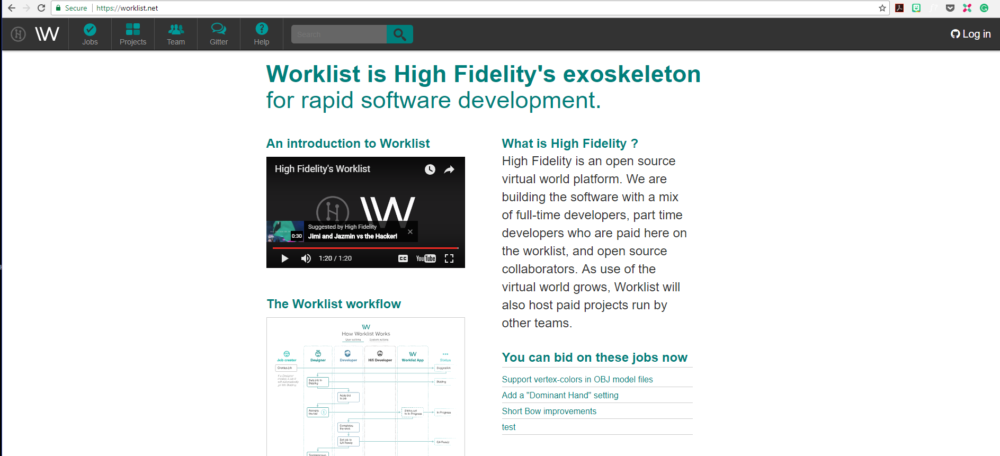
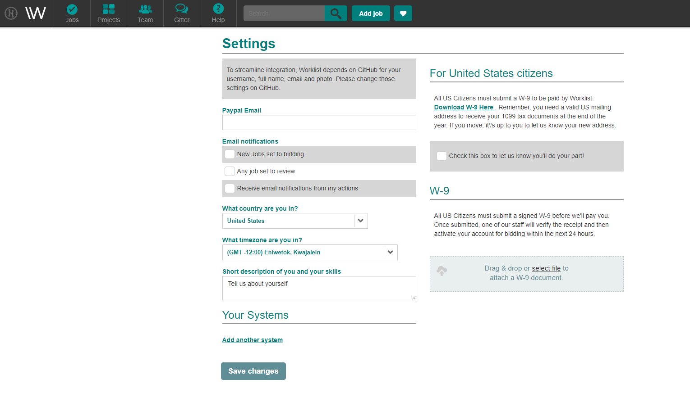
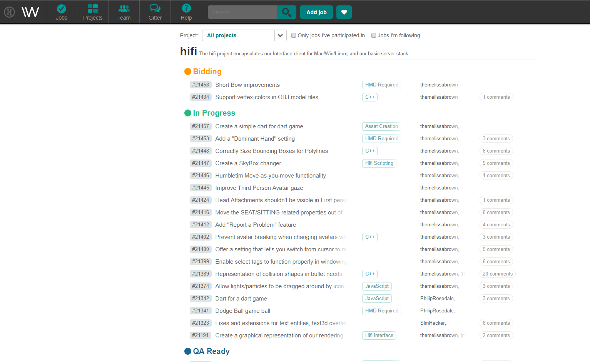
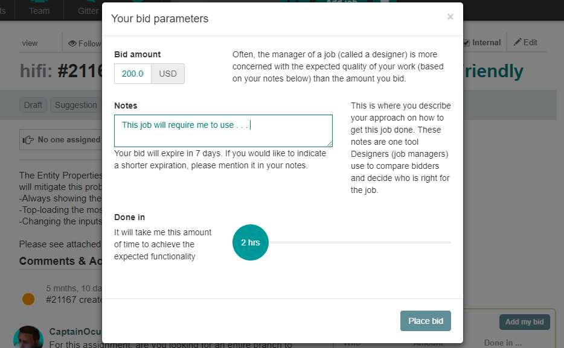
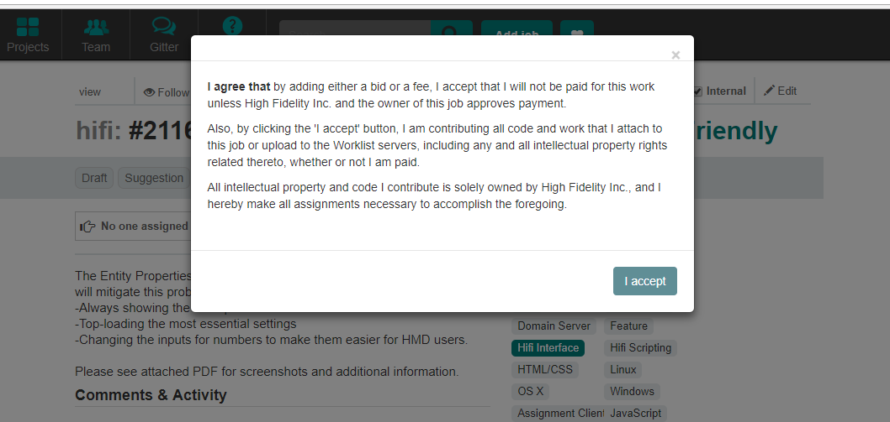
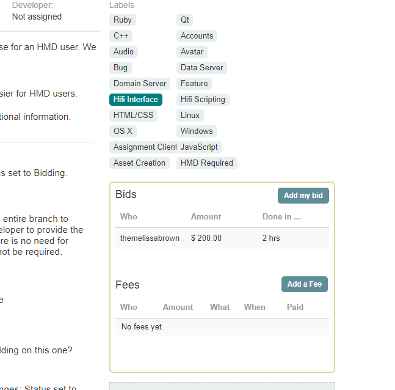

High Fidelity is completely open source. If you want to contribute to our current code, you can do so through our [GitHub repository](https://github.com/highfidelity/hifi). 

If you’d like to get paid for the work you do, you can use [Worklist](https://worklist.net/), our tool for tracking such contributions. Worklist is integrated with Github and lets us track the work you’ve done!

### Here’s how Worklist works:

* Before you start using Worklist, ensure that you’ve downloaded and installed High Fidelity or built it through [Github](https://github.com/highfidelity/hifi). 

* Open Worklist, and log in using your GitHub credentials. You will need to confirm your email address. 

* To get paid, you need to verify your PayPal address and upload a completed W-9 form. You can do this by clicking on your username on the top-right corner. Click on settings to verify your PayPal address and upload your W-9 form. 

* Once you’ve confirmed your details, you can go to Worklist and view the page where we regularly post jobs. Jobs are categorized into: 

  * **Bidding**: These are available jobs. If you’re interested in any of the projects listed here you can bid on it. Click on a project you’d like to bid on, and in the page that opens, click bid. You can bid for the amount you’d like, and we will let you know if we’ve accepted your bid for you to start working.  You can also add notes in the form that open up to justify the amount you have entered in your bid.  

  * **In-Progress**: Once your bid has been accepted, you can change the status of your project to In-Progress. 

  * **QA Ready**: Once you’ve completed the work, you can change the status to QA ready so that we can check your code. 

  * **Needs Review**: You can change your project’s status to Needs Review once you have a PR ready. Remember to mention your PR in a comment so that we can verify and pay you once we merge your work to the repository. 

  * **Merged**: We will change the status to merged once we have completed reviewing your work and merged it with the main repository. 

    ​

    Once this process is complete, we will be paying you based on your bid!