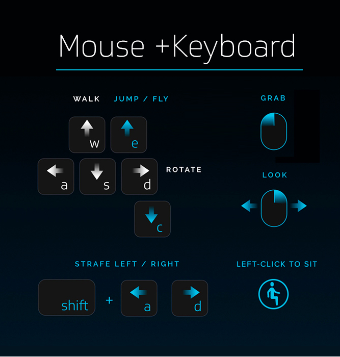

*Learn the controls for High Fidelity*

## Overview

This page will take you through the basic controls and teach you how to fly in High Fidelity.

### Basic Controls

#### Mouse & Keyboard

If you're in Desktop mode and are using your keyboard and mouse, use the following controls to move and grab objects in High Fidelity:

#### Oculus Touch and HTC Controllers

If you're in HMD mode and are using either Oculus Touch or HTC controllers, use the following controls to move and grab objects in High Fidelity:

#### Gamepad

If you're using a gamepad, use the following controls to move and grab objects in High Fidelity:

### Fly in High Fidelity

To fly in High Fidelity:

* **Enable Advanced Movements:** Enable advancements so that you can use your controllers, gamepad or keyboard to fly. 
* **Oculus Touch and Vive:** Use the following controls to fly in High Fidelity if you're using Oculus Touch or HTC Vive controllers. 
* **Gamepad and Keyboard:** If you use a gamepad or your keyboard, use the following controls to fly. 

