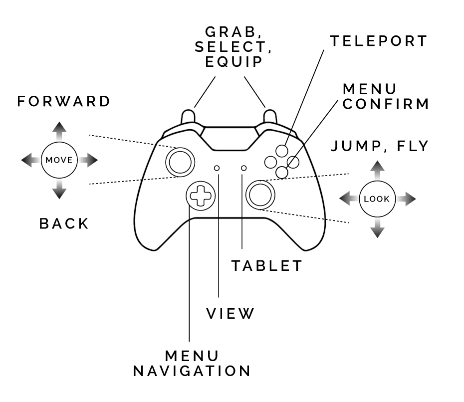

*Learn the controls for High Fidelity*

## Overview

This page will take you through the movement controls and other useful shortcuts for in-world actions.

[Movement Controls](#movement-controls)

&nbsp;&nbsp;&nbsp;[Mouse and Keyboard](#mouse-and-keyboard)

&nbsp;&nbsp;&nbsp;[Oculus Touch, HTC Vive, and Microsoft MR Controllers](#oculus-touch-and-htc-controllers)

&nbsp;&nbsp;&nbsp;[Gamepad](#gamepad)

[Other Shortcuts](#other-shortcuts)

### Movement Controls
##### Mouse and Keyboard
Use the following controls to move around and manipulate objects with a mouse and keyboard:

| Movement  | Key | Alternate Key |
| ------------- | ------------- | ------------- |
| Walk Forward | <kbd class="keyboard">W</kbd>  | <kbd class="keyboard">Up Arrow</kbd>  |
| Walk Backward  | <kbd class="keyboard">S</kbd>  | <kbd class="keyboard">Down Arrow</kbd>  |
| Strafe Left | <kbd class="keyboard">Q</kbd>  | Right Click + <kbd class="keyboard">A</kbd>   |
| Strafe Right  | <kbd class="keyboard">E</kbd>  | Right Click + <kbd class="keyboard">D</kbd>   |
| Turn Left | <kbd class="keyboard">A</kbd>  | <kbd class="keyboard">Left Arrow</kbd>   |
| Turn Right | <kbd class="keyboard">D</kbd>  | <kbd class="keyboard">Right Arrow</kbd>   |
| Jump | <kbd class="keyboard">space</kbd> |   |
| Fly | <kbd class="keyboard">space</kbd> (sustained for 2-3 seconds)  |   |
| Fly Down | <kbd class="keyboard">C</kbd> |   |
| Alternate Jump/Fly  | <kbd class="keyboard">PgUp</kbd> |   |
| Alternate Jump/Fly Down | <kbd class="keyboard">PgDn</kbd> |   |
 

| Manipulation  | Key | Alternate Key |
| ------------- | ------------- | ------------- |
| Far-Grab Dynamic Entity | Mouse Left-Click  |   |
| Far-Grab Move Entity (x/z plane)  | Mouse Left-Click + Drag  |  |
| Far-Grab Move Entity (y axis) | <kbd class="keyboard">Shift</kbd> + Mouse Left-Click + Drag  |    |
| Far-Grab Rotate Entity   | <kbd class="keyboard">Ctrl</kbd> + Mouse Left-Click + Drag Forward/Backward |   |
| Far-Grab Rotate Entity (y-axis) | <kbd class="keyboard">Ctrl</kbd> + Mouse Left-Click + Drag Left/Right  |   |
| Equip Hand-Equipped Entities | Mouse Left-Click  |    |
| Unequip Hand-Equipped Entities | <kbd class="keyboard">U</kbd> |   |
 

##### Oculus Touch, HTC Vive, and Microsoft MR Controllers

Use the following controls to move around, fly, and manipulate objects with your controllers:

>>>>>In order to Fly in VR, you must enable it under Settings > Controls > VR Movement.

##### Gamepad

Use the following controls to move around, fly, and manipulate objects with your gamepad:

>>>>>While the use of a gamepad is supported, High Fidelity is best experienced with hand controllers like the Oculus Touch, HTC Vive, and Microsoft MR controllers.

#### Other Shortcuts
Here are some other useful shortcuts for High Fidelity:

| Edit/Create Mode | Key |
| ------------- | ------------- |
| Select | Mouse Left-Click  |
| Select Multiple  | <kbd class="keyboard">Shift</kbd> + Mouse Left-Click  |
| Translate on X/Z Plane | Mouse Left-Click + Drag |
| Translate on X/Z Axes | <kbd class="keyboard">Shift</kbd> + Mouse Left-Click + Drag |
| Undo | <kbd class="keyboard">CTRL</kbd> + <kbd class="keyboard">Z</kbd> |
| Redo | <kbd class="keyboard">CTRL</kbd> + <kbd class="keyboard">Shift</kbd> + <kbd class="keyboard">Z</kbd>  |
| Focus on Selected Entity or Edit Camera View | <kbd class="keyboard">F</kbd> |
| Align Grid to Bottom of Entities | <kbd class="keyboard">G</kbd> |
| Delete | <kbd class="keyboard">Delete</kbd> |
| Deselect | <kbd class="keyboard">CTRL</kbd> + <kbd class="keyboard">D</kbd> |
| Toggle Local/World Space | <kbd class="keyboard">T</kbd> |
| Duplicate | <kbd class="keyboard">Alt</kbd> + Mouse Left-Click + Drag |
| Snap Rotations | <kbd class="keyboard">CTRL</kbd> + Mouse Left-Click rotation rings |

 

| In-World Actions  | Key |
| ------------- | ------------- |
| Away Toggle | <kbd class="keyboard">ESC</kbd>  |
| Handshake  | <kbd class="keyboard">X</kbd>  |
| Inspect Entity | Mouse Right-Click (over inspectable entity)  |
| Mute Mic Toggle | <kbd class="keyboard">CTRL</kbd> + <kbd class="keyboard">M</kbd> |
| Open Tablet | <kbd class="keyboard">Tab</kbd> (Only when 'Desktop becomes toolbar' is checked) |
| Open Browser | <kbd class="keyboard">CTRL</kbd> + <kbd class="keyboard">B</kbd>  |
| Open Stats | <kbd class="keyboard">/</kbd> |

 

| Media Capture  | Key |
| ------------- | ------------- |
| Screenshot | <kbd class="keyboard">P</kbd>  |

 

| Avatar Manipulation | Key |
| ------------- | ------------- |
| Decrease Avatar Size | <kbd class="keyboard">-</kbd>  |
| Increase Avatar Size  | <kbd class="keyboard">+</kbd>  |
| Reset Avatar Size  | <kbd class="keyboard">=</kbd>  |

 

| Change Camera View  | Key |
| ------------- | ------------- |
| First Person | <kbd class="keyboard">1</kbd>  |
| Third Person  | <kbd class="keyboard">3</kbd>  |
| First Person -Third Person Scroll | 	Mouse Wheel Forward/Backward  |
| Mirror | <kbd class="keyboard">2</kbd> |
| Mirror View Scroll Inward/Outward | 	Mouse Wheel Forward/Backward |
| Mirror View Rotate (Mouse look) | Right Mouse Click + drag  |
