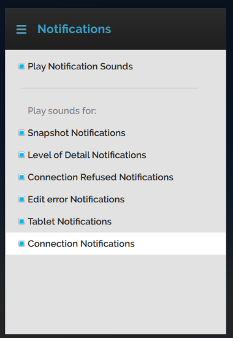

*Learn how to manage your notification settings.*

##Overview

This page talks about the default script in Interface that generates and manages notifications. 

## Notifications Generated

When you first start [Interface](../../../../get-started/what-is-high-fidelity/how-it-works#interface), it runs a number of [default scripts](../../../all-about-scripting/default-scripts) designed to improve the experience. One of these scripts, `notifications.js`, generates notifications about system changes. It also adds a new menu item, **Tools > Notifications**, that allows you to play a sound when a specific type of notification is received.

By default, you'll receive notifications when:

- The  snapshot app is used.
- If there are errors when you're editing in a domain.
- The level of detail that can be rendered falls below a certain threshold.
- A network connection has been refused.
- When the tablet needs your attention.
- When you make a new connection or receive notifications from your connections. 

Notifications appear as text on a semi-transparent panel.

These notification panels disappear after a few seconds, but they can also be immediately dismissed by clicking the X in the upper right hand corner of the notification.

## Play Notification Sounds

You can specify if you want notification sounds to be played. Go to **Tools > Notifications > Play Notification Sounds**. If notification sounds are enabled, **Play Notification Sounds** will be checked.

Using the **Tools > Notifications** menu, you can also select which types of notification will generate a sound when received. A check next to the notification type indicates that a sound will be played.
