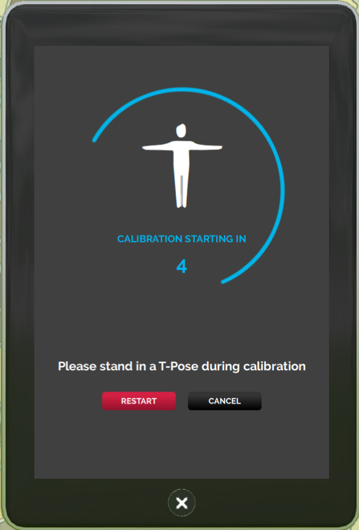

*Learn how you can set-up motion capture (mocap) in High Fidelity using Vive trackers.*

## Overview

This page guides you through the process of configuring and calibrating Vive trackers for motion capture (mocap) in High Fidelity. Even if you only have one HTC Vive Tracker, you can use it to control your Avatar!

## Introduction

You will need to purchase [Vive trackers](https://www.vive.com/us/vive-tracker/) to set-up a mocap system for yourself in High Fidelity. Depending on what kind of motion capture you’re looking for, the number of trackers needed differ.

- Only feet: 2 Vive trackers.
- Feet and hips: 3 Vive trackers.
- Feet, hips and chest: 4 Vive trackers.
- Feet, hips and shoulders: 5 Vive trackers.

To use the trackers, you need to strap them on to different parts of your body. You can purchase straps of different lengths for different purposes from here:

* [Foot and Shoulder Straps](https://rebuffreality.com/products/trackstrap)
* Hip Strap: Drill a hole in the back of a belt and attach the puck using a 1/4" screw. 
* [Chest Strap](https://www.amazon.com/gp/product/B00PQ6B5SY/ref=oh_aui_detailpage_o02_s00?ie=UTF8&psc=1)
* [Hand Straps](https://www.amazon.com/SublimeWare-Degree-Rotation-Session-SJ4000/dp/B01H18TY2S/ref=sr_1_2?ie=UTF8&qid=1492804865&sr=8-2&keywords=go+pro+arm+mount)
* [Head Straps](https://www.amazon.com/EEEKit-Kidizoom-Action-EK7000-DBPOWER/dp/B019SXPF3G/ref=sr_1_1?ie=UTF8&qid=1492795518&sr=8-1&keywords=EEEKit+Head+Strap+Mount+for+VTech+Kidizoom+Kids+Cam%2C)

### Configure Your Mocap System

Once you’ve purchased the number of trackers and the straps for your requirements:

- Make sure your Vive headset, hand controllers, and Vive trackers are properly connected to SteamVR.

- Securely attach the Vive trackers to your body as shown in the image.

- Start Interface in HMD mode and pull up you tablet.

- Go to **Settings > Controller Settings** (this menu is only available to Vive users).

  

- Set your tracker configuration to one of the following options:
  - Head: Track your head with a head tracker instead of the HMD.
    - Offset: Adjust the offset of the position of the tracker from your avatar’s head joint.

  - Hands: Track your hands with hand trackers instead of the hand controllers.
    - Offset: Adjust the offset of the position of the trackers from your avatar's hand joints. 

  - Feet: Track your feet with two trackers. 

  - Hips: You'll need to have two feet trackers and one hip tracker to track your hips (3 total). 

  - Chest: You can track your chest using one chest tracker, one hip tracker and two feet trackers (4 total).

  - Shoulders: Track your shoulders with two trackers on your shoulders, one tracker for your hip, and two for your feet (5 total).

    

- Click "Apply and Calibrate".

- Stand in a T-Pose until the timer counts down to zero:
  - Feet together

  - Arms out

  - Head looking straight ahead. 

    

- Check to see that each tracker is tracking the corresponding joint on the avatar.

You have completed configuring your trackers. Now, you have to calibrate them.

### Calibrate Your Mocap System

Once you’ve applied your desired configuration, you can use a shortcut to calibrate your trackers without having to bring up your tablet again. To calibrate on the fly, stand in a T-Pose and hold the following four buttons together for 1 second: 

- Left trigger
- Right trigger
- Left menu button
- Right menu button

Check if you’ve calibrated your trackers by moving the corresponding joint and determine if your avatar moves the same joint. Check to see that each tracker now tracks its corresponding joint on the avatar.

You can press the same buttons together for a second to remove your calibration from the trackers.

> > >  Use Vive Devices in Desktop Mode: Check this box if you have a head tracker and want to use your trackers in desktop mode without having to wear your Vive headset.

## Troubleshooting & Common Issues

* Calibration failed!

  * Make sure all your trackers are properly connected in SteamVR.
  * Make sure you selected the correct configuration in your tablet and that you have enough number of trackers to support that configuration.

* My sensor is jiggling a lot!

  * Make sure the straps on the sensor are tightened.

* My sensor keeps losing tracking.

  * If it’s the hip puck, make sure your shirt is tucked in and isn’t covering the puck. Also make sure your headphone cord isn’t covering the puck. 
  * Make sure one of the base stations can clearly see the tracker.
  * Make sure the signal from the base stations is not conflicting with another Vive setup nearby.
  * Make sure there are no reflective surfaces nearby (ie. picture frames, whiteboards, shiny tables).
  * Make sure lighting is consistent across the room (minimal outdoor lighting).
  * Try restarting SteamVR.

* My avatar’s feet keep going underground!

  * This is a known issue we are working on. To avoid this from occurring frequently, don’t jump around too much. For a quick fix, just drive forward or teleport using the controller. 

  ​