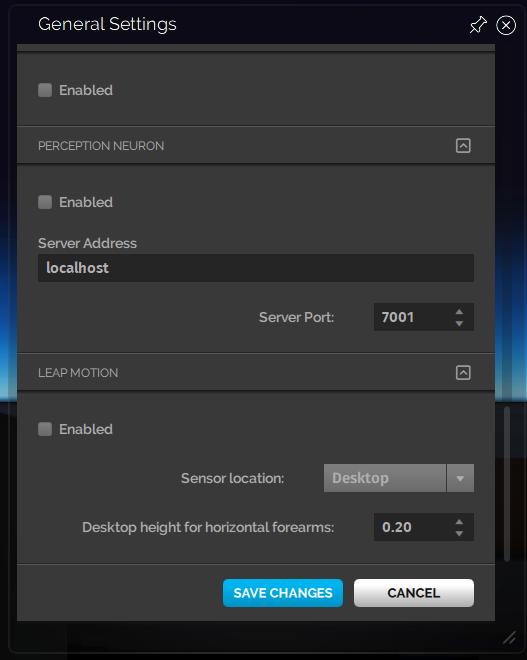

*Configure your hand-controllers.*

##Overview
High Fidelity supports the HTC Vive, Oculus Touch, Razer Hydra, Leap Motion and XBOX One Controllers. You can check out the system requirements [here](../../../../get-started/requirements).

## Basic Controller Configuration

Although navigation and limited interaction can be accomplished with a keyboard/mouse, fully interacting with in-world objects in High Fidelity requires a hand controller.

### Razer Hydra or HTC Vive Hand Controllers

You can enable a Razer Hydra or an HTC Vive hand controller by:

1. Going to **Settings > General**.

> > > > > Note: Vive users should have SteamVR running before starting Interface.

Once enabled, you should be able to use the hand controller to navigate and grab objects. If it is not working, select **Edit > Running Scripts** or press **Ctrl + J** to open the *Running Scripts* panel and check to see if the `handControllerGrab.js` script is running. It should be running by default.

### Leap Motion Orion

If you're using Leap Motion:

1. Ensure you have the release version of the Leap Motion SDK installed. (We don't support the Orion SDK yet).
2. Go to **Settings > General**.
3. Check the box "Enabled" under **Leap Motion** to start using your Leap Motion controllers.
4. Save your changes.

### XBOX One Controller

You can enable an XBOX One controller by:

1. Going to **Settings > General**.

*Note: If you are using Mac OS, and are having issues with using an XBOX controller, see Xbox 360 Controller (OS X) for more information.*

## Razer Hydra for Power Users

### Setting up the Razer Hydra (Mac Users)

1. Download the Sixense SDK from [https://www.sixense.com/downloads/](https://www.sixense.com/downloads/).
2. Copy lib/osx_x64/release_dll/libsixense_x64.dylib to Applications/Interface/Contents/Frameworks.

### Calibration

Using Interface with `defaultScript.js` running for calibration.

For the best results, the Hydra orb should be placed on a flat surface to the left of where your hands would be on the keyboard. It should be oriented so that the two cables are on the back. To measure your arm-span, hold your arms straight out to either side in a “T” pose, then press and hold the two bumper buttons for one second and let go.

### Cursors

Each controller has its own cursor, drawn as a cyan dot-plus-circle. These act like a normal mouse cursor. You move them by adjusting the pitch and yaw of your controllers:

- **Bumper button**: Left-click.
- **Trigger**: Right-click.
- **Developer > Hands > Sixense > Enable Sixense Mouse Input**: Enable/disable the controller cursors.
- **Preferences > Invert Mouse Buttons**: Swaps the left- and right-clicks.
- **Preferences > Reticle Movement Speed**: Adjusts the sensitivity of the cursor movement.
- **Your right-hand controller can also control the normal mouse pointer**: enable/disable this control by pressing button 0 on the right-hand controller (the small skinny one between buttons 1 and 2).

### Controller Graphics

Manage your controller's graphics using the below menu options:

* **Developer > Show Hand Info**: Draws a red disc plus sphere and pointer that depicts your controller orientation. These coincide with your "palm" positions if you have Preferences > Avatar Scale = 1.0; if you don't, then they are drawn some distance away. Your avatar's hands will not necessarily coincide with the "palm" positions.
* **Developer > Show Hand Targets**: Draws a wire mesh ball the position of your "finger tips," if Show Hand Info is enabled. These are 0.3m away from your "palm" position.
* **Developer > Avatar > Show Skeleton Collision Shapes**: If your avatar scale != 1.0 then you'll see green balls drawn at your avatar's "palm" positions.
* **Developer > Hands > Sixense > Enable Sixense UI Lasers**: Shows/hides cyan "lasers" emanating from the position of the red disc-plus-sphere-and-pointer.

### Movement

**Left joystick**: Moves you forwards/backwards in the direction you're looking, and left/right.

**Right joystick**: Rotates your view up/down and left/right.

**Button 4 on either controller**: Press and hold, then:

- Tilt and horizontally rotate your controller to tilt and rotate your view.
- Move your controller backwards/forwards/left/right/up/down to move in that direction.

### Model Editing

When you enable model editing (right-hand toolbar's cube) a pair of lasers is drawn.

* **Left- or right-bumper**: Toggle lasers red/blue.
   * Red: Mode 0
   * Blue: Mode 1
* **Single-laser editing**: Make one of your lasers intersect with a model then "grab" it by pulling and holding the relevant controller's trigger.
  * Mode 0: The model rotates around your controller's location, keeping the model "looking at" the controller, and changing position with changes in your controller's position.
  * Mode 1: The model rotates about its axis as you rotate your controller, and moves position as a multiple of changes in your controller's position.
* **Dual-laser editing**: Make both your lasers intersect with a model then "grab" it by pulling and holding both controllers’ triggers.
  * Mode 0: Move and scale the model according to your controllers' rotations.
  * Mode 1: Rotate model according to your controllers' relative positions.

### Miscellaneous

* **Left-bumper + left-trigger**, or **right-bumper + right-trigger**: Show/hide UI.
* **Button 3 on either controller**: Show/hide magnification window in VR display mode.
* **squeezeHands.js**: This script makes your avatars' hands clench as you pull the Hydra's triggers.
