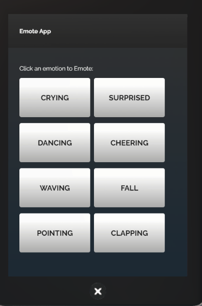

*Learn how to use the Emote app in the tablet.*

## Overview

The Emote app will now be automatically available on your tablet. This page details how to use it. 

## Introduction

You can get your avatar to express different types of emotions in the Desktop and HMD modes using the Emote app. 

* Pull up your tablet and go to **Emote**. 
* The Emote app window enables you to pick an emotion from a list. 
* Click one of the emotions to Emote. For example, click Surprised to see your avatar react in surprise. 
