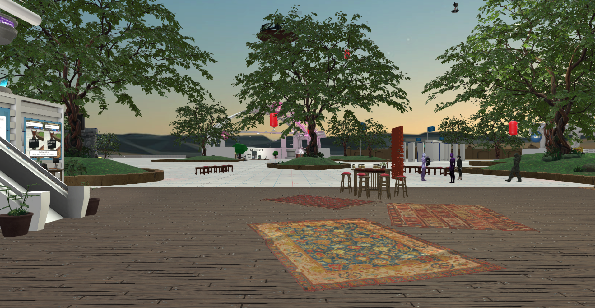

The **Interface** is our client. This means that when you launch Interface, you can explore VR worlds created in High Fidelity and interact with other users. You can visit your friend's VR world, meet people, attend events and even go for a class on avatar creation. It's an immersive and interactive experience with realistic visuals and audio.

If you're in Desktop mode, you'll start your High Fidelity journey in a tutorial that will walk you through the basic controls in High Fidelity. Here, you will learn to: 

* Move around
* Grab objects
* Change your avatar
* Navigate the menus
* Create a privacy bubble
* Travel between domains

