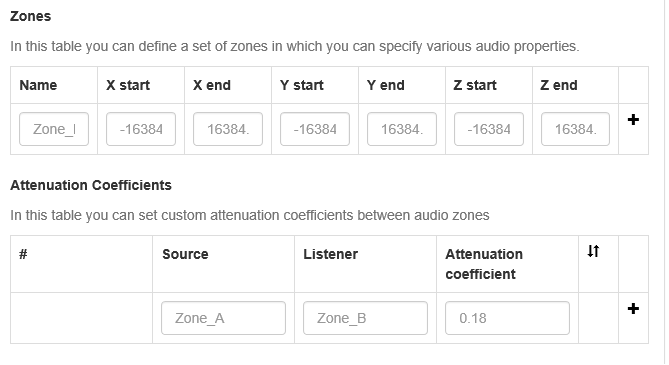
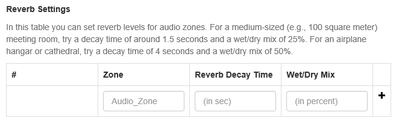
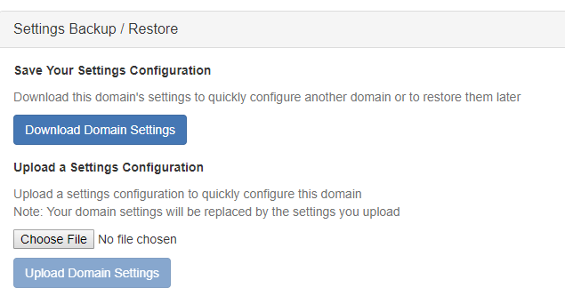
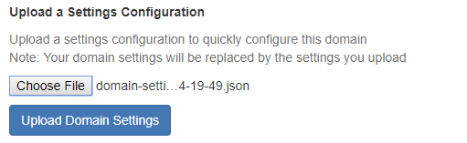
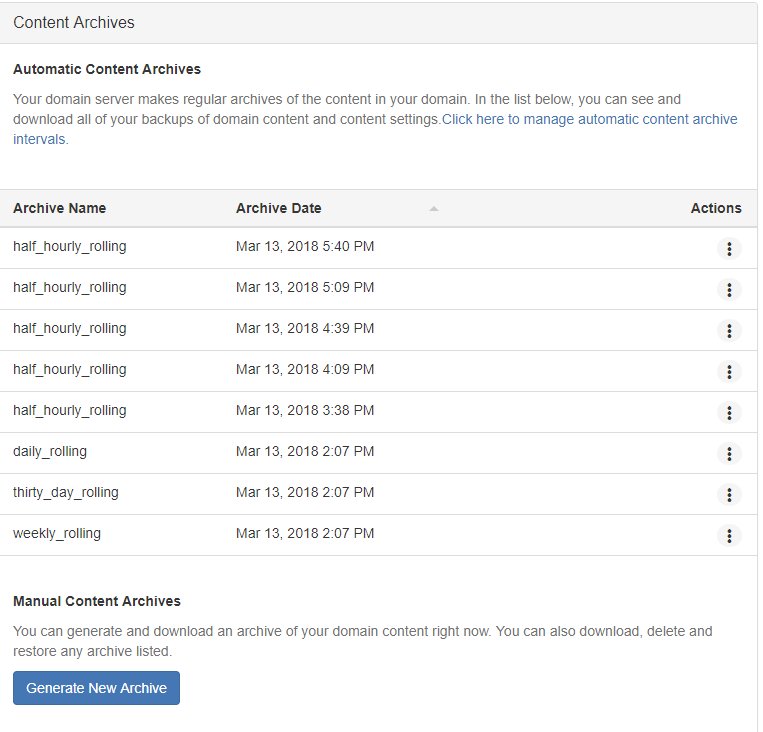
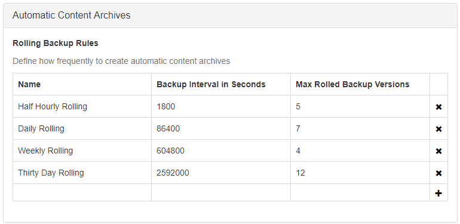

*Learn how to modify the server settings for your domain.*

##Overview
Once you've finished setting up your home domain, you can now start exploring server settings that would best meet your needs.

This page covers how you can:

* Access your server settings.
* Enable your updated settings.
* View your Metaverse/Networking settings.
* Add a description for your account, select users who can share your domain, and set hours of operation. 
* Manage the security of your domain.
* Define the scripts that run in your home domain.
* Manage the audio settings in your sandbox.
* Manage the Automatic Content Archive's settings.
  ​

> > > > > This document assumes that you already have Sandbox running on your local machine. If you don't, check out how you can install and set up your sandbox [here](../set-up-your-sandbox).

## Access Your Server Settings

Launch your sandbox by clicking the icon in the system tray (Windows) or in the top menu bar (OS X) and clicking Go Home.

To view the settings page click on the **Settings** option.

This opens the server settings page ([**http://localhost:40100**](http://localhost:40100)) in your default web browser.

You can navigate to specific settings using the **Content** and **Settings** dropdown menus. By default, only the basic settings can be viewed. To see advanced settings, click the **Advanced Settings** dropdown beneath each option.

## Enable Updated Settings

If you modify your settings, you'll need to save and restart for the new settings to be reflected. You can do this by clicking **Save** and then restarting your server by clicking **Restart** once you're done with your modifications. This saves your settings and restarts your domain server.

## Metaverse/Networking

You can configure your domain ID and networking settings using the Metaverse/Networking settings. Go to **Metaverse/Networking** in the **Settings** dropdown menu.

Before you edit these settings, you have to be logged in to your High Fidelity account. If you don't already have one, you can [sign up for a High Fidelity account](https://highfidelity.com/signup) now.

### Connecting to Your High Fidelity Account

Once you log in to High Fidelity, you can generate an access token. You can do this by:

* In the Metaverse/Networking settings, click **Connect High Fidelity Account**.
  
  If you aren't already logged into your High Fidelity account, the login page will open in a new tab in your browser. Login using your High Fidelity username and password.
  
* Once you've logged in, you will be prompted to generate an access token. Click **Create token**.
  

>>>>>You can enter a **Name** here for the token to help you remember what this token is for.

* A pop-up window appears with a new token. Highlight and copy the token to your clipboard and click **I've copied the token**.
	

>>>>>Clicking **I've copied the token** does NOT copy the token. You must copy the token by highlighting it and using **command-C** (Mac) or **Ctrl-C** (Windows).

* Go back to the settings page. You should see a Connect Account pop-up window. Paste the token there and then click OK.
  
* The domain server will restart and you should now see the Metaverse/Networking settings to edit the domain ID and the network settings.
  

### Domain ID

When you run sandbox, it generates a domain ID and a temporary place name for you.

To change the domain ID, you can click on the **Advanced Settings* dropdown under **Metaverse/Networking**. Learn more about domain ids and place names [here](https://docs.highfidelity.com/create-and-explore/start-working-in-your-sandbox/place-names).

### Automatic Networking

You can choose one of the following network settings for your domain:
* full
* ip
* disabled
>>>>>Changing the domain's automatic networking settings will update this settings in the High Fidelity database.

## Places / Paths

A *place name* is a domain's unique name within the High Fidelity Metaverse and it is one of the easiest ways for other users to reach your domain.

You can [purchase a place name](https://docs.highfidelity.com/create-and-explore/start-working-in-your-sandbox/place-names) of your choice for your domain.

## Description

You can use the Description settings to describe your account and set the operating hours. Navigate to **Description** from the **Settings** dropdown menu, then click on the **Advanced Settings** dropdown menu to make changes.

>>>>> These setting are a framework and are still in development.

### Creating a Description for Your Account

To create a description for your account, fill in the following fields:

* **Description**: A description of your domain in less than 256 characters.
* **Maturity**: A maturity rating for your domain. You can choose **Everyone**, **Teen(13+)**, **Mature(17+)**, and **Adult(18+)**.
* **Tags**: Common categories under which your domain falls.

### Name Users That Can Show Your Domain to Others

You can specify users who have permission to show your domain to other users. Enter their High Fidelity usernames Hosts.

### Set Operating Hours

You can specify operating hours for your domain using the Operating Hours fields.

## Security

You can use the Security settings to define who can can visit your domain, edit your domain, and add entities to your domain. In the **Settings** dropdown menu, go to **Security**.

### Basic Security

To have a basic level of security for your domain settings, simply put in your username in **HTTP Username** and any password in **HTTP Password** field.

Everytime, you or any user tries to access your server settings, you'll be prompted to enter your username and password.

### Maximum User Capacity

You can limit the number of users connected at a time to your domain using the Maximum User Capacity field.

If you set this to 0, it means there is no limit to the maximum number of users who can connect to your domain at one time. If you set this to 1, it means only one user will be able to visit your domain at one time. Avatars connected to the same local machine are not restricted by this limit.

### Domain-Wide User Permissions

You can define who visits your domain and their rights using the security settings. These settings also enable you to assign rights to parameter-level groups (anonymous users, users on the local host, users that are logged in and users specified by username).

For each user or group specified, you can set the following permissions:

* **Connect**: Sets whether a user can connect to the domain.
* **Lock/Unlock**: Sets whether a user can change the locked property of entities (either from on to off or off to on).
* **Rez**: Sets whether a user can create new entities.
* **Rez Temporary**: Sets whether a user can create new entities with a finite lifetime.
* **Write Assets**: Sets whether the user can make changes to the domain's asset-server assets.
* **Ignore Max Capacity**: Sets whether a user can connect even if the domain has reached or exceeded its maximum allowed agents.

Permissions assigned to a specific user supersede any parameter-level permissions that also apply to the user. Additionally, if more than one parameter is applicable to a single user, the permissions given to that user will be the sum of all applicable parameters. For example, if only *localhost* users can connect and only *logged in* users can lock and unlock entities, if a user is both logged in and on a local host, the user will be able to both connect and lock/unlock entities.

>>>>>Note: For entities with a finite lifetime, the maximum lifetime defaults to 3600 seconds. This default can be changed by clicking **Show Advanced** on the sidebar and looking in the **Entity Server Settings** section. The field is labeled **Maximum Lifetime of Temporary Entities**.

## Scripts

You can define the [scripts](https://docs.highfidelity.com/create-and-explore/all-about-scripting) you want to run when you launch and host your home domain from the **Scripts** entry in the **Content** dropdown menu:

* Enter a URL accessible to your Sandbox (and not a *file:* URL).
* Press the + button.
* Click Save and Restart.

>>>>>Scripts are cached. If the content on the URL host changes, you may want to use some cache-defeating trick, such as specifying a URL with query parameter such as http://whatever.com/path/file.js?version=17*

## Audio Environment

The audio settings affect how sound is transmitted and received throughout the domain.

### Default Domain Attenuation

The first parameter, **Default Domain Attenuation**, allows you to set the degree to which things get quieter as you get further away from them. High Fidelity domains default to a distance attenuation curve roughly like the real world. If you see two avatars talking in the distance, you can hear them, but not very well. If you approach them, they become more audible in a manner that approximates what you're likely to be used to.

A domain's default attenuation can be changed in the **Audio Environment** section of the **Content** dropdown menu, so that no matter how far away a sound source is, it still plays at full volume (attenuation = 0). Likewise, the default attenuation for a domain can be set very high (to a max value of 1), making only things very near to you audible.

### Noise Muting Threshold

The **Noise Muting Threshold** sets up a "Noise Gate", so that when the sound of an audio source is below the set level, no audio is transmitted. If someone is in an environment with a lot of background noise, this feature will suppress the background noise except when the person speaks at a volume loud enough (i.e., above the set threshold) to "open the gate". The higher this threshold is set, the louder someone has to speak to be heard. Setting the value to zero effectively disables the features, allowing audio (noise and otherwise) through to the audio mixer.

### Low-pass Filter

The **Low-pass Filter** reduces high-frequency bands (i.e., "treble" for old stereo enthusiasts) when sounds come from above or behind us, which is what our oddly-shaped ears do for us in the real world. If you enable this feature and spin in place with someone speaking to you, you'll note they sound a bit muted when they're behind you.

### Zones

The concept of audio zones enables you to define specific parcels of space in 3D space. These zones can then be set with rules for how audio is mixed and rendered. Each zone has a **Name** and is defined using start and end X, Y, and Z coordinates.

**Attenuation Coefficients** can be used to designate how a zone transmits sound to another zone. Each profile needs two zones for one-way communication, a **Source** and a **Listener**.

#### Example: Building a Stage

Another common example is to build a stage environment for performances. To do this, complete these steps:

1. Create two new zones, call them "Stage" and "Audience".
2. Set the **Attenuation Coefficients** to zero with Stage as the source and Audience as the listener. That way, anyone in Audience will hear anyone on Stage at maximum volume. Everybody in Audience has the best seat in the house!
3. If you want to minimize Audience people from hearing one another in the Audience zone, set up another **Attenuation Coefficients** pair with Audience as both source and listener, and set the distance attenuation very high--e.g., to 1.0. That way, you'll only hear people very close to you like your friend on your right, but won't hear the guy coughing 10 rows back.

Go [here](https://docs.highfidelity.com/create-and-explore/start-working-in-your-sandbox/setting-up-a-theater-domain#attenuation-settings) for more information about setting up audio zones.

### Reverb Settings

The **Reverb Settings** in the **Audio Environment** section of the **Content** dropdown menu are used to create the natural ambient reflections we would hear when a sound fires in a real space. It can give the effect of sounding like you are in a large empty room, deep inside a large cave, or inside a tiny room like a tiled shower.

The reverb settings are:

- **Zone**: The user-defined zone where the reverb effect will occur.
- **Reverb Decay Time**: This is how long the reverb "tail" lasts. Zero decay time means no reverb at all (like outside in a field). 1-2 seconds is a good range for normal rooms. Longer times like 5 seconds give a deep hall/cave sound, and longer than that sounds like you're inside an oil tanker.
- **Wet/ Dry Mix**: This is the percentage mix of the reverb tail relative to the original "dry" signal.

Keep the Wet/ Dry Mix value around zero or prepare to have your ears assaulted. Levels of between 5-25% will generally give you useful results. For a very thick reverb, you might try a value as high as 50% where the reverb is nearly as loud as the original signal.

## Settings Backup / Restore

You can also download your domain settings on their own. To do so, click **Download Domain Settings**. This will download a .json file onto your computer. 

You can upload a settings configuration file to quickly configure a domain. Click on **Choose File**, choose the configuration file from your computer, then click **Upload Domain Settings**. An "Are you sure?" pop-up window will appear. Click on **Restore settings**. Your domain will then restart.
 

## Advanced Settings

Additional settings for the Asset Server (ATP), Audio Buffers and Avatar Mixer are available by selecting the **Advanced Settings** dropdown from each section. Advanced setting parameters are subject to change. Documentation to come once stabilized.

## Content Archives

Your domain server makes regular archives of the content in your domain. Content archives include Models.json, content settings, and assets in [ATP](https://docs.highfidelity.com/create-and-explore/start-working-in-your-sandbox/assignment-clients). You can upload and download content archives onto your computer. From **Content Archives** in the **Content** dropdown menu, you can see and download all of your backups of domain content and content settings. These backups can be used to restore your domain to a previous version or to share your archive and settings info with another user. 

To manage automatic content archive intervals, go to **Automatic Content Archives** in the **Settings** dropdown menu or follow the link provided. For more information, see [Automatic Content Archives](https://docs.highfidelity.com/create-and-explore/start-working-in-your-sandbox/server-settings-for-your-domain#access-your-server-settings). 

You can create a content archive manually by clicking **Generate New Archive**. You should see a "Generate a content archive" pop-up window. Type in a name for your new archive, then click **Generate Archive**. 

To share your domain content and content settings, simply download a copy of the archive you wish to share and send it to the other user. You can download any archive by clicking the three buttons on the right. 

Finally, you can import a content archive you have stored on your computer by clicking on **Choose File** under Upload Content, selecting the archive .zip file, then clicking **Upload Content**. 
An "Are you sure?" pop-up window should appear confirming that your domain content will be replaced. Click **Restore Content**. Your domain server will restart. 

## Automatic Content Archives

These are the rules for automatic backups. The four preset rules set as default are shown in the image below.

Each rule has three variables:

- **Name:** A name for the rule so you recognize it.
- **Backup Interval in Seconds:** How often the backs up occurs, in seconds.
- **Max Rolled Backup Versions:** How many backups are kept before it re-saves as the first one.

For example, the "Half Hour Rolling" preset rule will save every half hour until there are 5 backups, then the 6th backup will overwrite the first one and so on. You will always have 5 backups for the last 2 1/2 hours.

If you want to add a new rule (e.g., every two hours) you can add it below. Click the **+** button and fill out the three variables.
