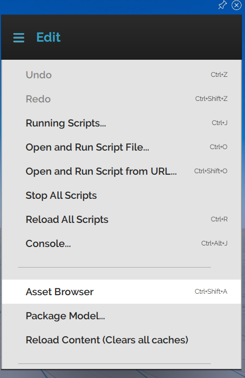
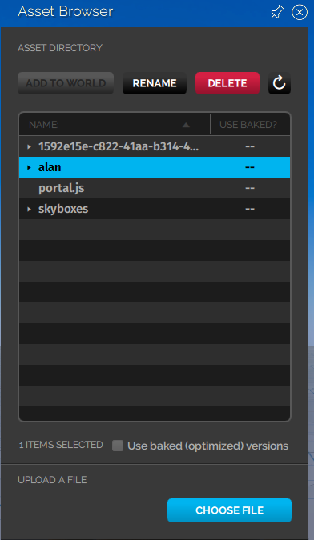
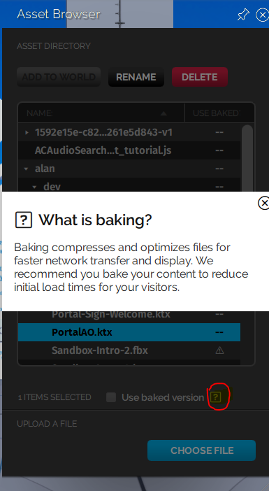
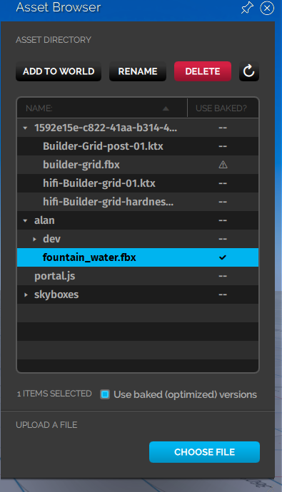
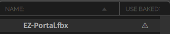
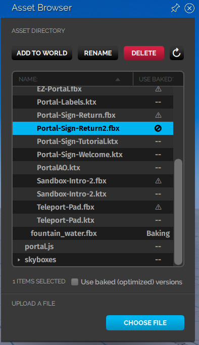
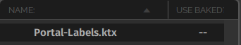
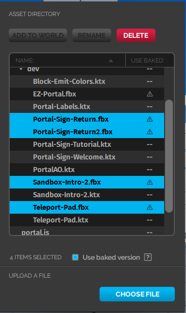
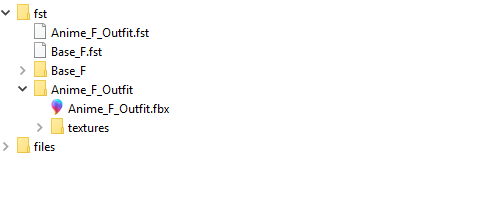

*An introduction to baking and how to bake (compress) assets using the asset browser.*

##Overview

This page discusses what baking (texture and mesh compression) is and how you can bake your assets using the asset browser. 

##Introduction

When you upload a model or load a domain, you are rendering your model's (or domain's assets') geometric meshes and textures. A geometric mesh (more commonly known as a polygon mesh) is a collection of vertices, edges, and faces that together define the shape of a model in 3D graphics and modeling. Textures help in defining high frequency detail, color or surface textures. Loading models in High Fidelity involves real-time rendering (drawcalls), which means images are produced and analyzed in real time. Depending on the complexity of the models, the drawcalls can differ. You can reduce the drawcalls and optimize the rendering process using baking. 

Baking optimizes the rendering process by compressing the poly meshes and textures in an asset. A baked model loads the smaller meshes first, cutting down on the load time. Baked textures are often larger than the original texture because they contain textures with different resolutions. 

In High Fidelity, baking helps in improving the efficiency with which models are stored and transmitted. Our baking process allows us to progressively stream assets to any users in a domain, allowing for faster rendering and an improved experience. 

###Baking in Your Asset Browser

* Go to **Menu > Edit > Asset Browser** to access your asset browser. 
>>>When you first launch your asset browser with the baking feature, all assets that can be baked will start baking. This might show up as heightened CPU usage. This is a one-time process.

* Add a model to your asset browser by clicking "Choose File". The uploaded model immediately begins baking. Any .fbx model will take less than a minute, while skyboxes will take longer. You will need to reload Interface to use the baked version. 
* Once your model has finished baking, a check mark will appear under the "Use Baked?" column. 
>>>>> You can only bake objects that have the extension .fbx, in domains where you have create access. You cannot bake .fbx objects referencing external textures. Only .fbx objects with embedded textures can be baked. 

* You can check if the assets in the domain have been baked by checking the "Use Baked" column next to each asset in the asset browser. 
  * An asset that has already been baked will have a triangular sign under the "Use Baked" column, signifying that it has already been baked and cannot be baked again. This symbol also shows up when there have been errors while baking an asset. 
  * When you uncheck the "Use baked version" checkbox for assets that have already been baked, they will have a stop symbol in the under "Use Baked" column. After you uncheck the checkbox, you have to reload Interface to use the unbaked version. 
  * When an asset cannot be baked, it will have two dashes next to it under the "Use Baked" column. 

When you first launch your asset browser with the baking feature, all assets that can be baked will be baked. This is a one-time process. Any models or skyboxes you add to your domain afterwards, will be baked on upload. 

>>> You can select multiple files in the Asset Browser by right clicking each file. After selecting multiple files, you can click 'Use Baked' to bake them at one go (if they aren't baked).  

#### Baking an Avatar

Avatars are usually not uploaded to the asset server in a domain. This is because an avatar uploaded to the asset server would only be available in that particular domain and not anywhere else. 

But, if you wish to have an avatar available only in a particular domain and you have permissions to upload files to the asset server in that domain, you could do so. To upload an avatar to the asset server, you have to upload the avatar's .fst and .fbx files. 

Your avatar's folder usually contains an .fst file, an .fbx file and a texture directory (the folder named textures in the image below). 

 

The texture directory (texdir) contains the textures for your avatar. You can also create avatars that have textures embedded within the .fbx file. Such avatars do not have a texdir. 

>>>>> Sometimes, even avatars that have textures embedded in their .fbx files can end up having a texure directory. 

Your avatar's .fst file is linked to the .fbx file and also contains the texdir if the textures are not embedded in the .fbx file. 

If you decide to upload an avatar to the asset server, here are some points to keep in mind before baking the avatar:

* When you bake the .fbx file of an avatar (.fst) that has a texdir, the textures for the baked avatar will fail to load. To load the avatar with its textures, you can either:
  * Not bake the avatar by unchecking the box "Use baked version" in the Asset Browser. 
  * Embed the textures in the avatar's .fbx file, ensure that the .fst file doesn't contain the texdir, and then upload it to the asset server for baking. 

#### Baking a JavaScript File

Now, when you load your asset server, all unbaked JavaScript (JS) files in the asset server will be automatically baked. This happens only the first time. Later, anytime you upload a JS file, it will be baked. 

Baking a JS file involves removing white spaces and comments in the script to shrink its size. A baked script is transmitted and interpreted faster because of its smaller size. 

You will still have the option to use the unbaked version of the JS file in the Asset Browser. 

> > > > > A baked JS file will not be very easy to read as all the white spaces and comments will be removed. If you wish to read and understand any JS files that have been baked, you will need to use its unbaked version.

