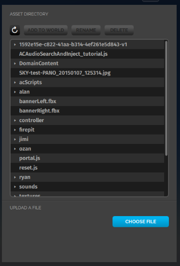

*An introduction to the asset server*

##Overview

Here, we talk briefly about the asset server assignment client. 

##Introduction

The Asset Server is an assignment client in your domain that you can use to reliably serve files referenced by entities or scripts in your domain. The protocol that is used to transfer files to/from the Asset Server is called the Asset Transfer Protocol (ATP). With the Asset Server, you can easily add models, sound effects, and other objects from your local machine into your domain.

You can access the asset server in a domain where you have the permission to create assets. Go to **Create > Open This Domain's Asset Server** to view the asset browser. You can manage the files stored in your asset server using the asset browser.

From the Asset Browser you can:

- Upload new files to your Asset Server.
- Remove existing files from your Asset Server.
- Rename existing files in your Asset Server.
- Add an existing model from your Asset Server to the world in front of you.
- Organize your assets into folders to help you find and reference them quickly.

Once files have been uploaded to your Asset Server they can be referenced by any entities or scripts in your domain using their ATP URLs.

Assets in your asset server are only available inside your domain. It is best used to host the content used by entities and scripts in your domain. Your avatar mesh would not be an ideal use case for an ATP asset, since it is not likely to be available under the same mapping from the Asset Servers in the other domains you visit.

### ATP URLs

ATP URLs have the following syntax:

`atp:/$FILENAME`

If you have a file in the root of your Asset Server named `chair.fbx`, the ATP URL would be `atp:/chair.fbx`. If you have a file in your Asset Server at the path `content/sounds/boom.wav` the ATP URL is `atp:/content/sounds/boom.wav`. Don't forget the leading slash!
