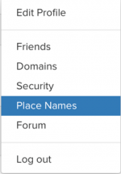
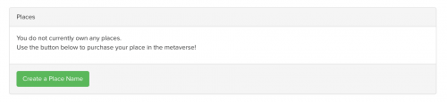
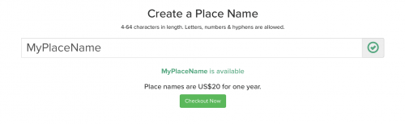
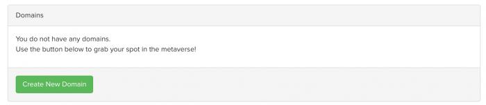
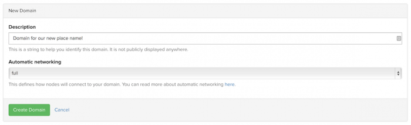
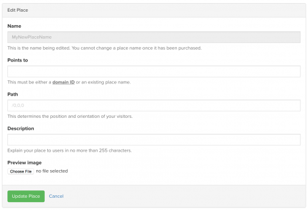
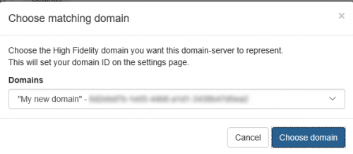

*Learn how you can purchase a Place Name and assign it to your domain.*

##Overview

A *Place Name* is a domain's unique name within High Fidelity. One of the easiest ways for other users to reach your domain is to use the domain's Place Name. We'll walk you through how you can purchase a Place Name of your choice and assign it to your domain.

##Introduction

When you [set up your domain](../set-up-your-sandbox), it is assigned a randomly generated and temporary Place Name.

You can obtain a Place Name of your choice (one that better represents you or your business) for your domain by purchasing a Place Name from High Fidelity.

>>>>>A High Fidelity account is required to purchase and manage Place Names.

## Purchasing a Place Name

A Place Name costs $20.00 USD for one year and you can pay via PayPal or credit card.

To purchase a Place Name:

1. Log in to [High Fidelity](https://highfidelity.com/) using your High Fidelity account username and password.  After you have logged in, the login menu item at the top-right of the [High Fidelity](https://metaverse.highfidelity.com/) website will be your username.

2. Click Places in the top navigation bar.
   .

3. If you have never purchased a Place Name, you will see an empty table titled Places and a button prompting you to create a Place Name. If you have set up a domain and received a temporary Place Name, it won't be listed as only purchased Place Names are listed here.
   

3. Click **Create a Place Name**.

4. Enter the Place Name you want to purchase. Place Names must be 4-64 characters in length. Letters, numbers and hyphens are allowed. If the Place Name you have entered is already taken, you will receive an error message. If the name you entered is available, you will see the Checkout Now button.
   

5. Click **Checkout Now**.

6. Enter your credit card number, PayPal account information or a coupon code to complete the purchase.

You are now the proud owner of a Place Name in the Metaverse! You can point this Place Name to a domain or point it to another Place Name.

## Pointing a Place Name to a Domain

To point a Place Name to your domain, you need to complete these steps:

1. If you don't already have one, add a domain ID to your High Fidelity account.
2. Point the Place Name to the domain ID.
3. Configure your domain server to use the domain ID the Place Name points to.

The following sections cover these steps in more detail.

### Add a Domain ID to Your Account

To add a domain ID to your account, complete the following steps:

1. On  [High Fidelity](https://highfidelity.com/), click on your username in the top menu bar and select Domains. If you don't see your username, you aren't logged in. Login to see your username on the top-right corner of the website. 
2. If you don't have any domains associated with your account, you will see an empty table titled Domains and a button prompting you to create a new domain.
   
3. Click **Create New Domain** to add a new domain to your account.
4. In the New Domain view: Enter a label in the Label field and in the Automatic networking drop down, select Full. 

>>>>>Changing the automatic networking setting for the domain ID here won’t force the domain to use automatic networking. It must be set to full in the [server settings](../server-settings-for-your-domain) for the domain to use full automatic networking. If you change the domain's automatic networking to full from the domain server settings, the domain will update this setting in the High Fidelity database.

5. Click  **Create Domain** . You'll see the *Domain* view with the new domain listed.
   

You can now point a Place Name at the domain ID you just added.

### Point a Place Name to a Domain ID

To point a Place Name to a domain ID, complete the following steps:

1. Open the *Domain* view by clicking username in the top menu bar on the [High Fidelity](https://metaverse.highfidelity.com/) website and selecting **Domain** from the pull-down menu. 
>>>>>Note: If you don't see your username, you aren't logged in.

2. Copy the domain ID you want to point the Place Name at from the ID column.

3. Open the *Place Names* view by clicking on your username in the top menu bar on the [High Fidelity](https://metaverse.highfidelity.com/) website and selecting **Place Names** from the pull-down menu.

4. Click on the pencil icon to the far right of the Place Name you want to associate with the domain. This opens the *Edit Place* view.

5. In the Points to field, paste the domain ID you copied in step two.
   

6. Enter a **Path**, **Description**, and **Preview Image** (optional).
   The **Path** field specifies the position and orientation of visitors when they first come to your domain. A path is defined in this format: `/x,y,z`. For example, `/23,42,125`. The `x`, `y`, and `z` values are the coordinates of the user's position. These values can be approximated manually, or by placing an avatar in the desired location and copying its path. For more information, see [Get Path For Landing](../set-path-in-your-domain).

7. Click **Update Place** to save your changes.

The Place Name now points to a domain ID.

### Configure Your Domain Server to Use the Domain ID the Place Name Points to

To configure your domain server to use the domain ID for your Place Name, complete the following steps:

1. Open the [Server Settings](../server-settings-for-your-domain). To open server settings, assuming Sandbox is running, click on the High Fidelity icon in your system tray (Windows) or in the top menu bar (OS X) and in the menu that opens, select **Settings**.
   This opens the server settings page in your default web browser at [**http://localhost:40100**](http://localhost:40100/).

2. Select **Metaverse / Networking** from the side menu.

3. If you aren't already connected, connect to your High Fidelity account. You will be required to generate an authorization token. Follow the instructions on screen to create and use the token.

4. Once authenticated and connected to your High Fidelity account, on the server settings page, under MetaVerse/Networking select **Choose from my domains**.
  

5. In the dialog box that appears, select the domain ID that the Place Name points to and click **Choose domain**.
  

You and other users will now be able to access your domain using Interface by typing the Place Name into the *Address Bar*. You may also use the URI `hifi://` in this manner `hifi://MyPlaceName`.

## Pointing a Place Name to Another Place Name

To point a new Place Name at an existing Place Name— meaning a Place Name that was previously purchased — complete these steps:

1. In the *Place Names* view, click on the pencil icon to the far right of the Place Name that you want to point to another Place Name.
2. In the *Edit* view, enter the existing Place Name in the **Points to** field.
   *Note: A Domain ID is not necessary if you have entered a target Place Name.*
3. Transfer or add other relevant place information, such as **Path**, **Description**, and **Preview Image**.
   The **Path** field specifies the position and orientation of visitors when they first come to your domain. A path is defined in this format: `/x,y,z`. For example, `/23,42,125`. The `x`, `y`, and `z` values are the coordinates of the user's position. These values can be approximated manually, or by placing an avatar in the desired location and copying its path. When pointing a new Place Name to a different one, any path information for the new Place Name will override the path specified in the original. Likewise, if the path for a new Place Name is left blank, it will inherit the path of the Place Name it points to.
4. Click **Update Place** to save your changes.

Assuming the Place Name you point to points to a domain ID used by a domain, you and others should now be able to access your domain using Interface by typing the Place Name into the *Address Bar*. You may also use the URL  `hifi://MyPlaceName`.

## Sharing a Place Name as a URL

Pasting a link to a High Fidelity location does not work well for everyone when using the `hifi://` style link. While this issue is still being considered, an interim solution of a specifically formatted URL is available.

The syntax for the link is **http://hifi.place/''playa''/''10''/''10''/''10''**, with your domain name in place of "playa" and the coordinates in place of the three numbers.
