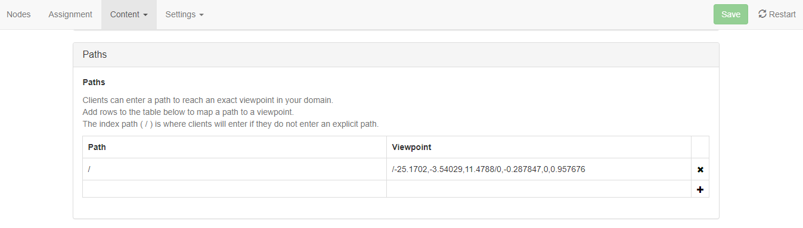

*Set a path for your domain.*

## Overview

Learn how to set a path in your domain that will dictate where a user will appear and which direction they'll face when entering your domain.

## Introduction

Define where a user will appear and which direction they face when they enter your domain by setting the **Path** in either the [server settings](../server-settings-for-your-domain) or by setting the **Path** property when [managing your place names](../place-names).

A path is defined in this format: `/x,y,z`. For example, a path could be `/23,42,125`.

The `x`, `y`, and `z` values are the coordinates of the user's position. These values can be approximated manually, or by placing an avatar in the desired location and copying its path.

To find your avatar's path in the Interface:

1. Navigate to the location where you wish to find the path.
2. Select **Navigate > Copy Path to Clipboard**.

Here is an example of path copied to the clipboard:

`/-25.1702,-3.54029,11.4788/0,-0.287847,0,0.957676`

This path is a bit more complex than `x`, `y`, and `z` as it contains both position and orientation values. This type of path is tedious to approximate and enter manually, making **Copy Path to Clipboard** the more practical method of defining a path.

To add this path as the user direction and rotation when entering your domain:
1. With the path copied to your clipboard, go to [place names](../place-names) and open the edit view. Paste the copied path into the **Path**.
2. You can also access your [server settings](../server-settings-for-your-domain), open the **Content** tab, and select **Paths** from the dropdown menu. In the **Paths** table, click the **+** and paste your path under **Viewpoint**.

Here is an example of the path entered as the default user direction/rotation when entering this domain:

You're able to add multiple user directions and rotations using this table. Exactly like a website URL, if a user will be going to `example-domain` and enters it by typing in `example-domain/taco`, they will appear with the direction and rotation of the `/taco` path.
