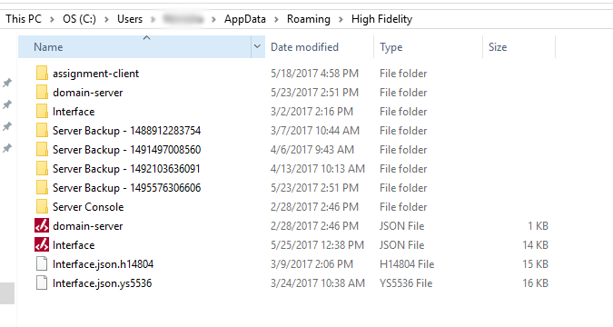

*Learn how to migrate the entities in your sandbox, or your entire sandbox from your computer to another.*

## Overview

This page details how you can migrate your sandbox from one computer to another.

##Introduction

You can migrate the information about the entities in your sandbox or your entire sandbox to another machine.

###Migrate Only Entities

To migrate only the entities in your sandbox from one machine to another:

1. In your web browser, visit [http://localhost:40100/](http://localhost:40100/). This opens up the domain-server settings. 
2. Click ‘Content’ in the main menu. 
3. The links listed in this window show you where your entities are located on your machine. 
4. Transfer these entities to the new machine.

###Migrate Your Sandbox

To migrate your entire sandbox to another machine:

1. Quit Sandbox in both machines.
2. Transfer the following folders from one machine to the other:
   * C:\Users\username\AppData\Roaming\High Fidelity\assignment-client
   * C:\Users\username\AppData\Roaming\High Fidelity\domain-server
   * C:\Users\username\AppData\Roaming\High Fidelity\Server Console
     
3. You’ve completed migrating your sandbox to the new machine.

>>>>> The username in the paths is your username in the computer you are using.
