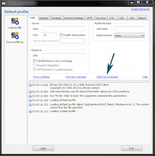
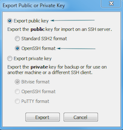
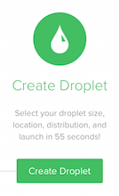
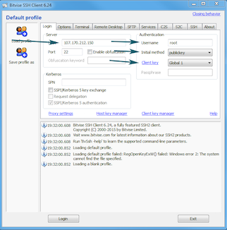

*This is an archived page. We are keeping the page for any users who might find the following information useful. *

## Introduction

To use the process outlined below, sign up for a [DigitalOcean](https://www.digitalocean.com/?refcode=41620a880f3e) account, if you already do not have one. 

When you sign up using the link above you start out with $10.00 of free credit. However, you will need to add valid billing information for verification.

### Installing BitVise - For Windows Users

[BitVise](http://www.bitvise.com) is a handy little program the enables you to connect to your virtual private server from DigitalOcean, as there is nothing built into Windows to connect to an external system.

[Download and install BitVise](http://www.bitvise.com/ssh-client-download) on your Windows system. 


### Configure a Keypair

#### Windows Users

For security purposes, let's configure this server to use a special keypair instead of a password to login to our serve. Here's how you can do that: 

* Click on *Click Key Manager* link in the main BitVise window.
* Next on the window that pops up, click the *Generate New* button.
* Accept the defaults on the *Generate New Keypair* window by clicking the *Generate* button.
* Your *BitVise Client Key Manager* window will now have your key in it.
* Select the listed keypair and now click on the *Export Button* and make sure "**Export Public Key**" is checked and also underneath it you have "**OpenSSH Format**" selected then hit *Export*.
>>>>> Note down the place where the file generated is saved. 

* Double click on the file generated. Open this file using **Notepad**.
* Next with Notepad open, go to your account on DigitalOcean to set this key in your account.

#### Mac Users

* Go to **Applications > Utilities > Terminal**.to open terminal.
* This command is an all-in-one - it checks if you have a key pair in the proper place and if there isn't, a key pair will be generated for you. Copy this command and paste it into your Terminal window then hit Enter.
```
[-f ~/.ssh/id_rsa ] && { pbcopy < ~/.ssh/id_rsa.pub; } || { ssh-keygen -t rsa -f ~/.ssh/id_rsa -P ""; pbcopy < ~/.ssh/id_rsa.pub; }
```

### Setting the Key in Digital Ocean

* Open **Settings** from the top right, in Digital Ocean
* Click the **Security** tab and click  **Add SSH Key**.

#### Windows Users

Copy and paste your key from Notepad.

#### Mac Users

Back on the DigitalOcean page, add a *Name* for your SSH Key then in the box labeled *Public SSH Key*, paste the key from your clipboard.

Now your key is stored DigitalOcean for when you create the Virtual Machine!


### Setting Up Our First Virtual Machine

* Click the green button on the DigitalOcean page labeled **Create Droplet** and you are taken to the DigitalOcean Control Panel.
* In the **Name** box set a simple name, such as your Place Name in High Fidelity.
* For **Select Size** click on the $10.00/m configuration which is for **1 GB** of RAM.
* **Region:**  you can add your preferred region.
* Under **Select Image**, click the box labeled **Ubuntu** and make sure from the drop down it shows **15.04 x64**
* Select your SSH key under **Add SSH Key**.
* Click **Create Droplet** and wait for the setup.


### Connecting to your Droplet

After your new Droplet is created (Droplet is another word for your DigitalOcean Virtual Machine) you will now see a screen like this:


At the very top you will see the name you set for your droplet, system information and most of all your IP. The IP in this case is **159.203.240.56**, so that is what you will use when we connect to the server.

#### Windows Users

* Using the BitVise software we setup before, you will now put the IP from DigitalOcean into the box labeled **Host**. Next move over to **Username** where you put in **Root**, underneath that set **Initial Method** to **publickey** and last set **Client Key** to **Global 1**. You will see each of these sections highlighted with a pointer in this image:
* Now just to make it easy to load up your settings next time you want to connect, you are going to click **Safe Profile As** on the left hand side menu of BitVise. Store this file in a place you will remember it because you will use **Load Profile** later to connect next time.
* Once all of that is complete just click the **Login** button on the bottom of BitVise.


You will now be working from the terminal window--another word for the black window used to send commands to your Droplet. This is what it looks like:


#### Mac Users

In terminal, type `ssh root@IP-OF-DROPLET`. For instance, for this example we would type `ssh root@107.170.212.150`

The first time you connect it will ask if you are sure you want to connect; type `yes`

You will notice your prompt (the words before the area you type in) has changed. That's when you know you are connected to your server.


### Compiling and Running High Fidelity

The rest of this tutorial is pretty much automated and done by running a single command that runs through and installs everything needed to run a High Fidelity domain.

>>>>> The script used here is a separate project maintained by Coal and is for Ubuntu 15.04 x64 only. 

Copy these commands to your clipboard and paste it into the terminal one by one (to paste into the terminal just right click in the black window and you will see the text show up).

`apt-get update && apt-get upgrade -y && apt-get install curl -y` `bash <(curl -Ls https://raw.githubusercontent.com/nbq/hifi-compile-scripts/master/ubuntu-compile-hifi.sh)`

You should now have a running High Fidelity Domain Server. Just go to a web browser and put in the address *http://IP-OF-DROPLET:40100* to access the Domain Server control panel.


### Setup Completed

#### Windows Users

In the BitVise main window you can click **Logout**.

#### Mac Users

Type the word `exit` and hit Enter. You will notice you are now back on your home computer as the prompt has changed back to your Mac's prompt.


### Next Steps

Since the Domain Servers do not have to be updated as often as Interface, you can usually get away with only updating once a week or when you visit your domain and you get the message stating the Domain Server is running a different version than Interface.

When you need to update your Domain Server, just load up your connection details using **Load Profile** on BitVise. Click **Login**

Once you have the terminal window open, type this command"

`recompilehifi`

It goes through the entire process automated to check if there is an update, and if there is, it pulls the new code and compiles it.
