*Learn how you can host your High Fidelity domain on DigitalOcean.*

## Overview

Learn how you can host your domain on the cloud with DigitalOcean.

## Introduction

You can now host your High Fidelity domain either on your local machine or server, or on the cloud with DigitalOcean.

#### Connecting Your DigitalOcean Account

- Log in or sign up with your High Fidelity username and password on [https://highfidelity.com](https://highfidelity.com).

- Hover over your username to see the various menu options. Click **Cloud Domains**. You can also go to [https://highfidelity.com/user/cloud_domains](https://highfidelity.com/user/cloud_domains).
  

- You'll be redirected to the Cloud Domains. You can click **Create New** to create a new cloud domain.
  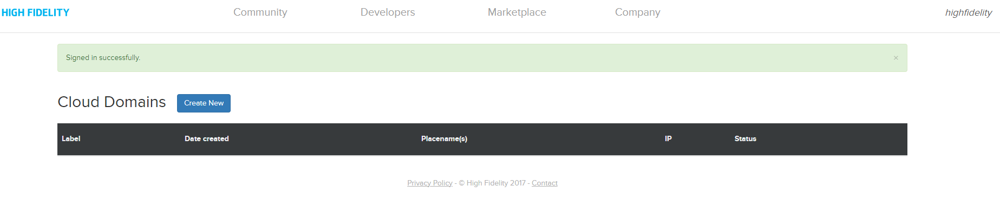

- Before you set up a cloud domain, you need to connect your DigitalOcean account. If you don't have one, you can sign up now.
  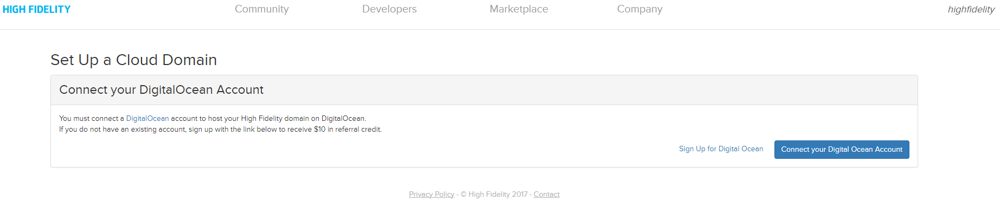

- You will be redirected to the DigitalOcean authorization page. Once you've signed in, you will see the following window, where you can choose the virtual machine you want to host your domain on.
  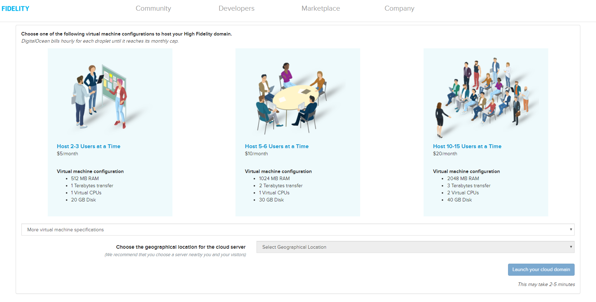
  
  The specifications and prices are listed as per user requirements. Once you select a type of virtual machine, you can select the geographical location you would like your server to be located at, from the dropdown menu. The table below outlines the recommended configuration based on numbers of users.
  
  | Users | DigitalOcean Droplet | Estimated Price |
  | ----- | -------------------- | --------------- |
  | 10-15 | 8 GB Memory, 4 vCPUs, 80 GB SSD, 5 TB Transfer | $40/mo |
  | 25-30 | 16 GB Memory, 6 vCPUs, 320 GB SSD, 6 TB Transfer | $80/mo |
  | 40-50 | 32 GB Memory, 8 vCPUs, 640 GB SSD, 7 TB Transfer | $160/mo |
  |  160  | 64 GB Memory, 32 vCPUs, 400 GB SSD, 9 TB Transfer | $640/mo |

- Click **Confirm** on the confirmation pop-up window.
  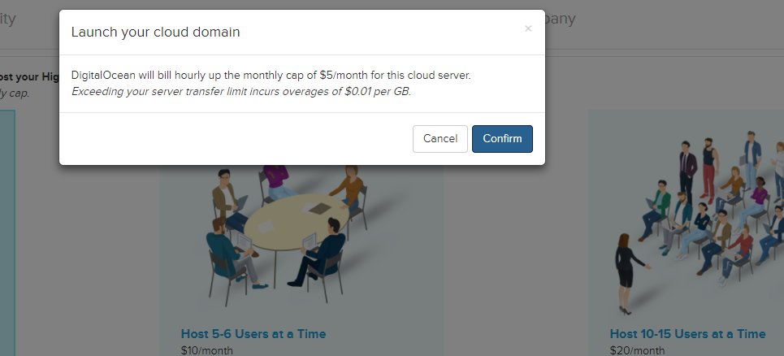

- You will be redirected to your Cloud Domains page, where the domain server you just created will be getting configured.
  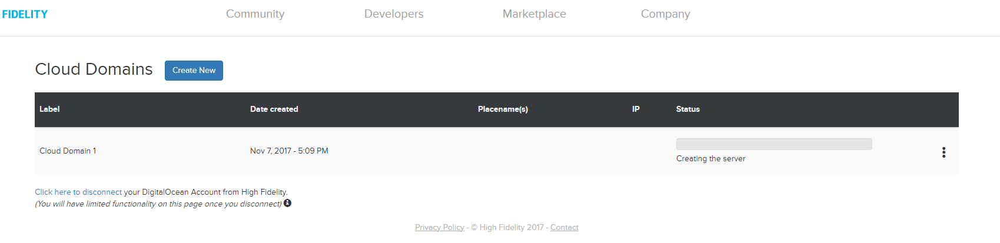
  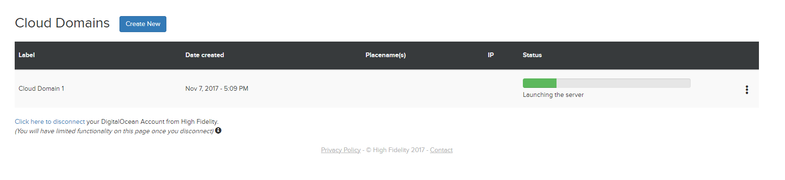

- You can set up your domain settings by selecting from the menu for each cloud hosted domain.
  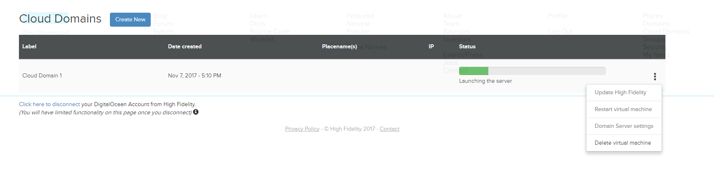

- Click Domain Server Settings. You will go through the Setup Wizard to quickly setup your domain and basic permissions.

- Choose a custom Place Name, or use your temporary Place Name or IP address to let visitors enter your domain.
  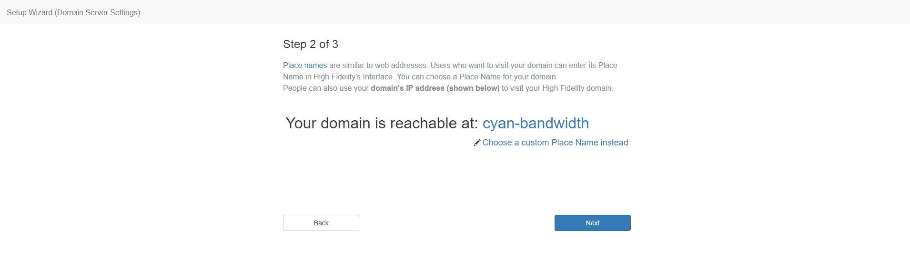

- Next, you can set permissions for your domain. You can set who can visit your domain and who can create items in your domain.
  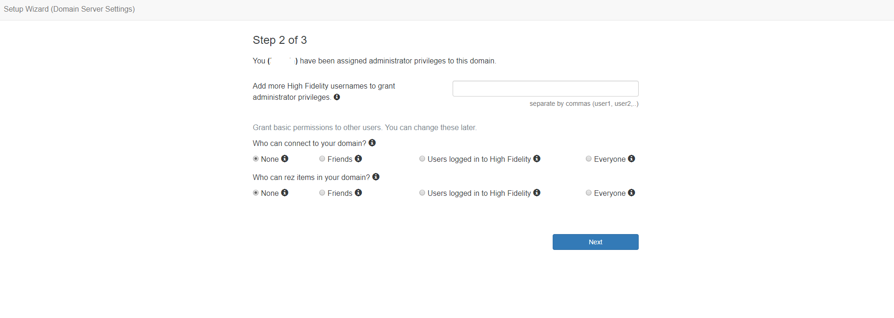

- In the last step, you need to add a username and password to secure access to your domain server settings.
  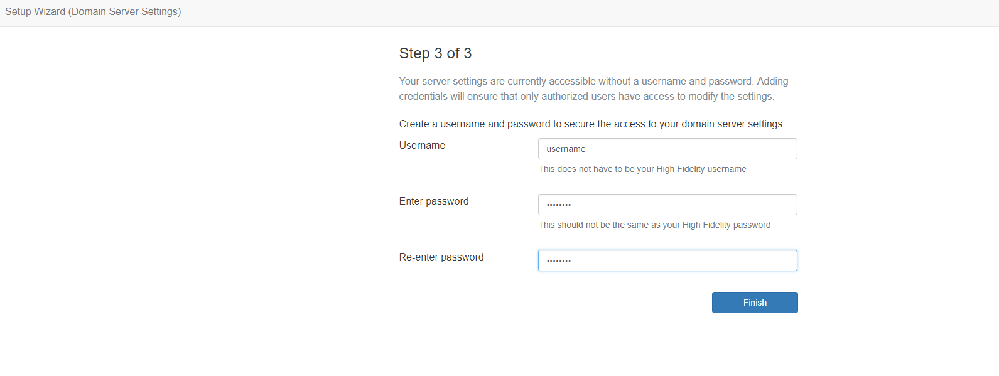

- You have completed configuring your cloud hosted domain. You can visit your domain in High Fidelity (VR) or access the domain server settings.
  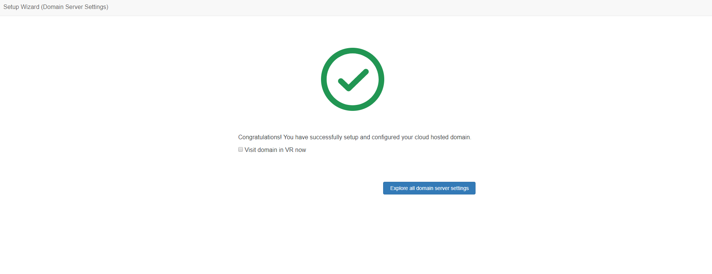

>>>>> Learn how to backup everything you have on your virtual machine/droplet [here](https://www.digitalocean.com/help/technical/backup/).
