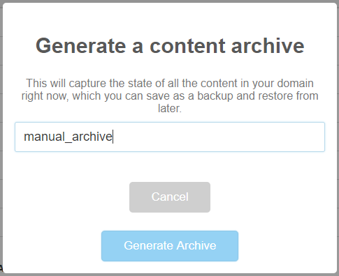
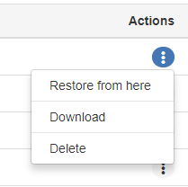
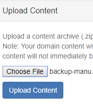
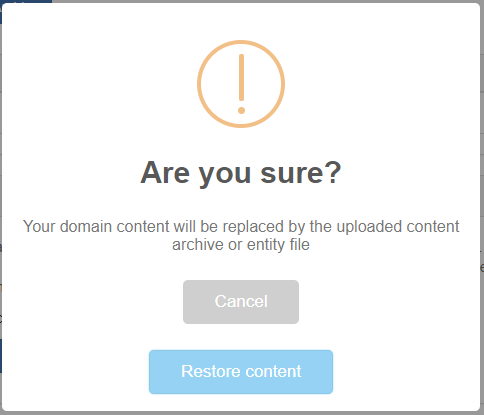

*Learn how to only backup the entities in your sandbox.*

###Content Archives

Your domain server makes regular archives of the content in your domain. Content archives include Models.json, content settings, and assets in [ATP](https://docs.highfidelity.com/create-and-explore/start-working-in-your-sandbox/assignment-clients). You can upload and download content archives onto your computer. From **Content Archives** in the **Content** dropdown menu, you can see and download all of your backups of domain content and content settings. These backups can be used to restore your domain to a previous version or to share your archive and settings info with another user. 

To manage automatic content archive intervals, go to **Automatic Content Archives** in the **Settings** dropdown menu or follow the link provided. For more information, see [Automatic Content Archives](https://docs.highfidelity.com/create-and-explore/start-working-in-your-sandbox/server-settings-for-your-domain#access-your-server-settings). 

You can create a content archive manually by clicking **Generate New Archive**. You should see a "Generate a content archive" pop-up window. Type in a name for your new archive, then click **Generate Archive**. 

To share your domain content and content settings, simply download a copy of the archive you wish to share and send it to the other user. You can download any archive by clicking the three buttons on the right. 

Finally, you can import a content archive you have stored on your computer by clicking on **Choose File** under Upload Content, selecting the archive .zip file, then clicking **Upload Content**. 
An "Are you sure?" pop-up window should appear confirming that your domain content will be replaced. Click **Restore Content**. Your domain server will restart. 
