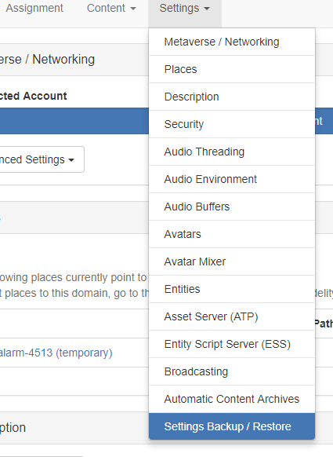

*Learn how you can backup your entire sandbox.*

###Backup Your Sandbox 

To back up your entire sandbox, first launch your sandbox by clicking the icon in the system tray (Windows) or in the top menu bar (OS X) and clicking Go Home.

To view the settings page click on the **Settings** option.

This opens the server settings page ([**http://localhost:40100**](http://localhost:40100)) in your default web browser.

Navigate to **Settings Backup / Restore** in the **Settings** dropdown menu. 

You can save your domain's settings by clicking **Download Domain Settings**. This will download a .json file onto your computer. 

You can upload a settings configuration file to quickly configure a domain. Click on **Choose File**, choose the configuration file from your computer, then click **Upload Domain Settings**. An "Are you sure?" pop-up window will appear. Click on **Restore settings**. Your domain will then restart.
 