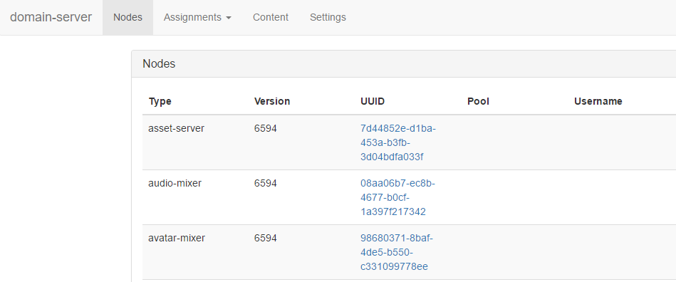
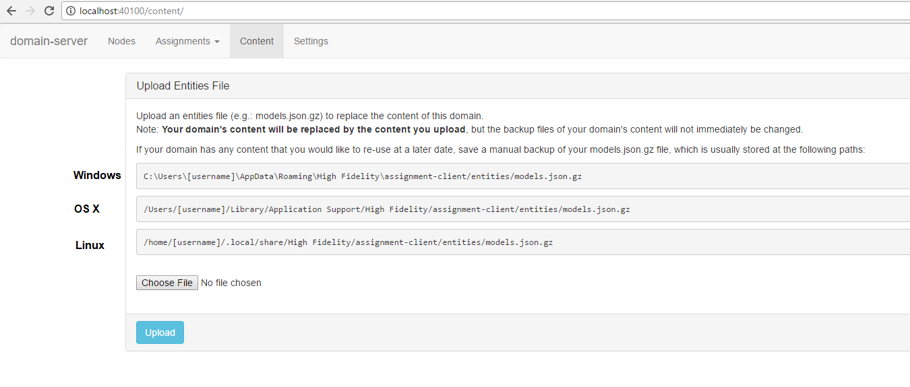

*Learn how to restore the entities in your sandbox, or your entire sandbox from your computer to another.*

## Overview

This page details how you can back up and restore your sandbox content. 

##Introduction

If you have content that you want to save in your sandbox to restore from at a later date, you can create backups and restore them from the file system.

###Backup Only Entities

To backup only the entities in your sandbox:

1. In a web browser on your sandbox machine, visit http://localhost:40100/. This opens up the domain-server settings. 
2. Click ‘Content’ in the main menu. 
3. The links listed in this window show you where your entities are located on your machine. 
4. Save a copy of the models.json.gz file (and any backups you'd like to keep) to a safe location on your computer or externally

The backup files are configured in your domain settings, and will not immediately be replaced. Older copies of your backups will be overwritten based on your domain server backup settings. 

###Backup Your Sandbox

To back up your entire sandbox: 

1. Quit Sandbox on your machine
2. Transfer the following folders out of your AppData folders into a new location on your machine or externally:
      * C:\Users\username\AppData\Roaming\High Fidelity\assignment-client
      * C:\Users\username\AppData\Roaming\High Fidelity\domain-server
      * C:\Users\username\AppData\Roaming\High Fidelity\Server Console
        

>>>>> The username in the paths is your username in the computer you are using. 

###Restore your Sandbox

To restore your sandbox from your backed up content:

1. Quit Sandbox
2. Navigate to the folders above and replace the contents with your stored content
	* If you are restoring only entities, make sure that your .json.gz file is named models.json.gz
	* If you are restoring your entire Sandbox, copy everything into their corresponding AppData folders
