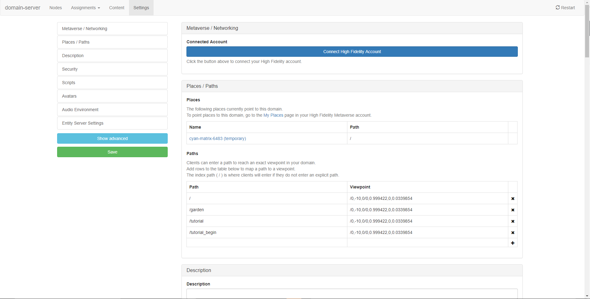
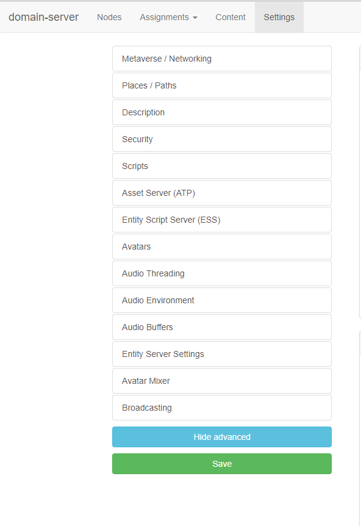

*Learn how to broadcast from your domain.*

## Overview

This page shows you how to broadcast from your domain.

##Introduction

If you're holding an event and cannot support many users visiting your domain, you can broadcast the events in your domain to other domains. 

### Prerequisites

When you broadcast from your domain, you are essentially broadcasting information about your [audio mixer and your avatar mixer](../../../get-started/what-is-high-fidelity/architecture#functions-of-the-assignment-clients). Your audio mixer conveys all the audio information in your domain. Your avatar mixer contains information about how your avatar is moving in a domain. 

You need to broadcast your audio and avatar mixers for people in other domains to see and hear what's happening in your domain. Before you work with the broadcasting settings, you have to assign specific ports to your audio and avatar mixers. The ports are usually randomly assigned by your Sandbox. These ports change every time you save any new settings. This means that the randomly assigned port you include in your broadcasting settings will be different when you click "save". 

To work around this, you can assign specific ports for your mixers if you launch them using your command line terminal:

```
// Launch 1 domain server:
./domain-server

// Launch 1 assignment client for each type:
// replace $TYPE with the type number and $PORT with the port
// List of the types:
//     AudioMixerType = 0,
//     AvatarMixerType = 1,
//     AgentType = 2,
//     AssetServerType = 3,
//     MessagesMixerType = 4,
//     EntityScriptServerType = 5,
//     EntityServerType = 6,

./assignment-client -t $TYPE -p $PORT
```


### Broadcasting Settings

To ensure that any event you hold is being broadcast to the right domains, you need to modify broadcasting settings for both - your domain and receiving domains. 

- Start Interface and Sandbox. 
- Go to http://localhost:40100/settings/ to view your sandbox settings.
- Click "Show Advanced" on the left hand navigation bar to see the advanced topics under **Settings**. 
- Go to **Broadcasting**. 
- Add the server address and ports for the broadcasting server's (your domain's) audio and avatar mixers. 
- Add the server address and ports for the receiving server's (your domain's) audio and avatar mixers. 
- Add usernames to broadcast specific users (for example: when hosting a music night, you can broadcast only the band and not the audience). This acts as a whitelist: if you don't add any users, you will broadcast nothing. 


