## Overview

The following is a step-by-step guide to securing your newly-made domain.
1. Installation of Sandbox
    - Our domain setup application that runs concurrently with Interface, our main application
2. Adding new content and locking down existing content
3. Using domain server settings “Content” and “Settings” tabs
    - These contain useful filters and tools to manage which users can enter and make edits

## Creating a Domain
1. Download Sandbox as an external application - [Sandbox](https://highfidelity.com/download/sandbox)
2. Open Interface and navigate to “localhost” from the Go-to search bar to see your domain  
    *If you also downloaded Interface with Sandbox, you will automatically start in your domain*
    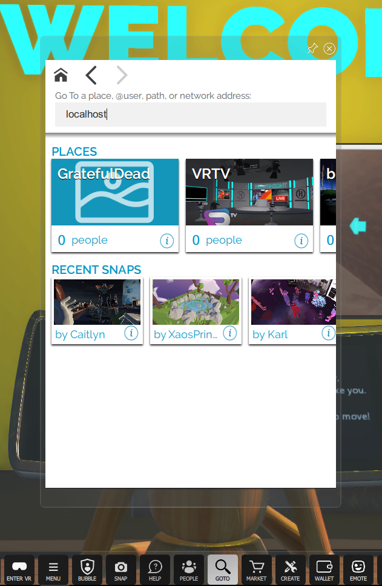
3. Select the “Create” icon from the toolbar to view various options for adding content to your domain
    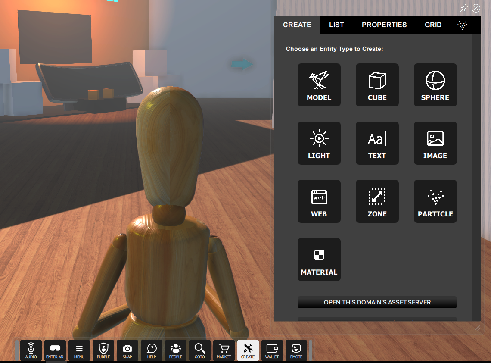
4. Let’s add a “primitive” - a simple 3D object that can be used to build larger structures
    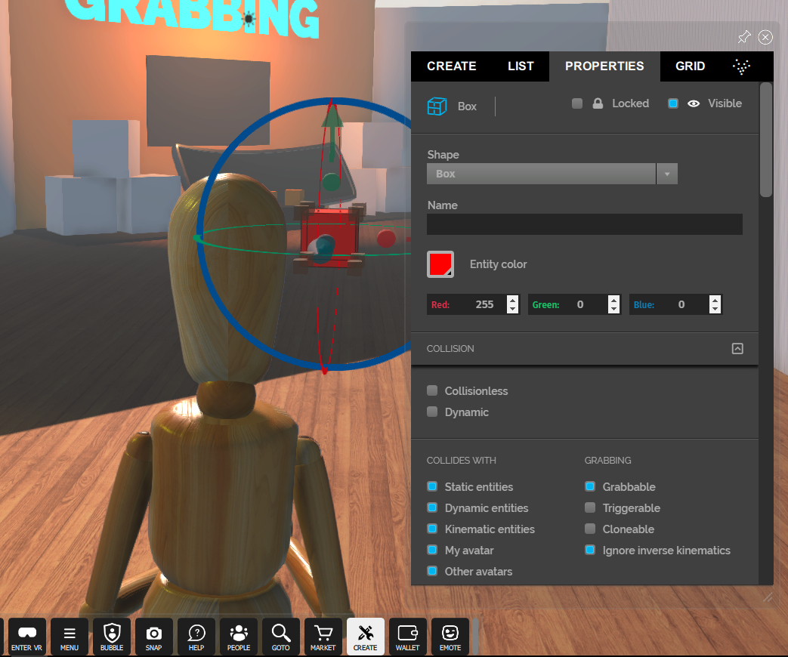
5. There are many properties that can be modified in an entity, such as:
    - color
    - name
    - shape type
    - interactivity (e.g. grabbable, triggerable, cloneable)
    - scripting behavior  
	*All of these options are available in the “Properties” submenu when an entity is selected*
 	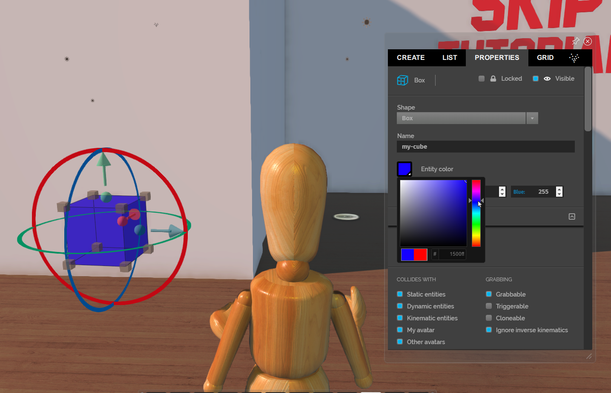
6. Switch to the “List” submenu to search for your newly created entity using the filter bar  
    - You can disable editing, deleting, or moving the entity for everyone by choosing the lock icon from this menu or the “Properties” submenu
    - Unlock it to re-enable editing
    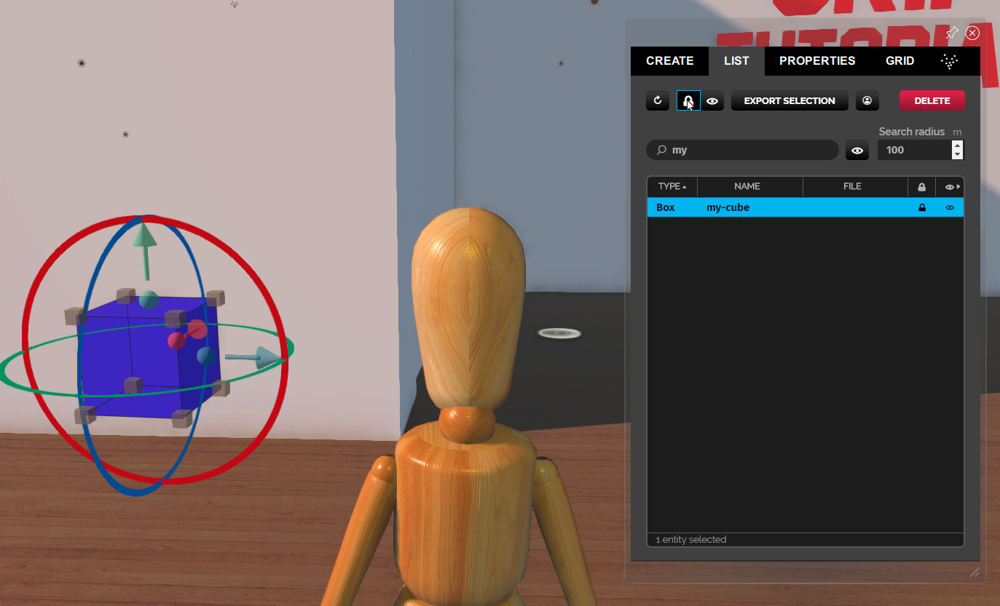

## Adjusting your Domain Server Settings
1. Sandbox settings are accessible via browser. You can get to them by right-clicking your hidden icons list or by going to [your server settings URL](http://localhost:40100/settings/)
	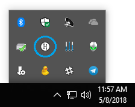
2. Open your domain server settings by right-clicking on this icon
	
3. The following screen will appear in your default browser
	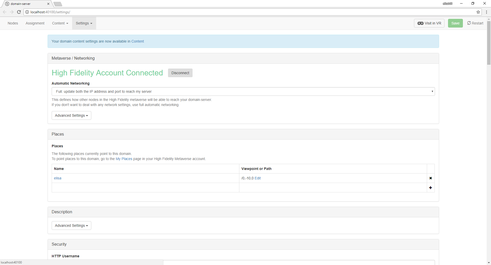
4. In Domain Settings, you can:
	- update place names (i.e. the metaverse equivalent of a URL)
	- add a description of your domain
	- update your security settings
	- access or update your content archives
5. Update your **Domain Server Settings** username and password here
	*This username and password is not connected to your High Fidelity account*
	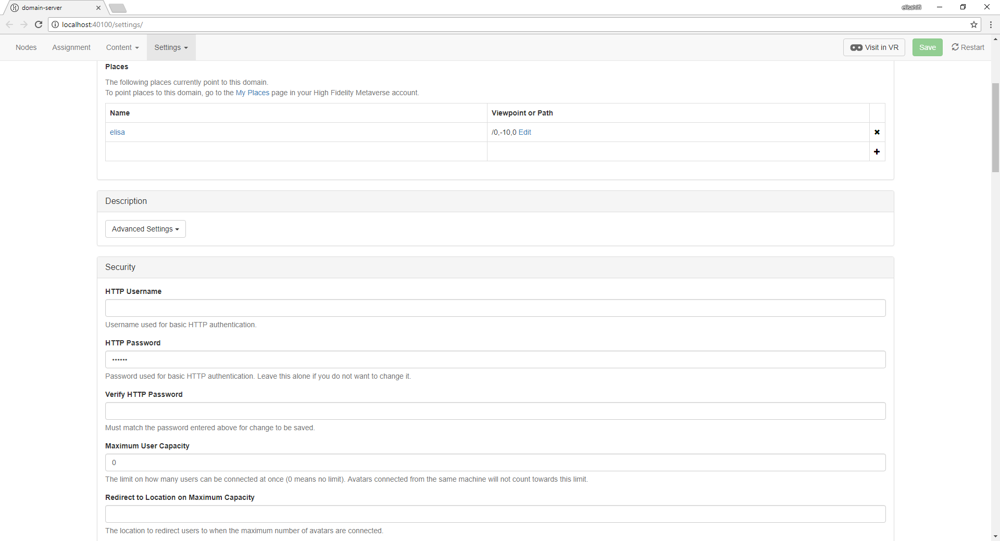
6. Update the standard permissions to specify who can come in and change your domain
	
7. You can also grant permissions to specific users under the "Permissions for Specific Users" table by inputting their usernames
8. Types of users:
	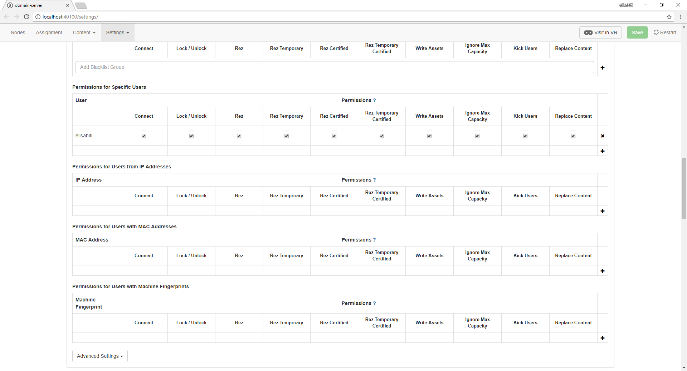
	- An **anonymous** user is a person who is not logged in and is using an instance of High Fidelity's Interface (the "client")
		- This is the default user type for someone who has downloaded Interface for the first time
	- A **friends** user is someone that you have connected with by shaking hands with their avatar and clicking on the "Friends" checkbox in your "People" app
		- **Connections** are different than **friends**. Friends are highlighted in green and by default have more rights in your domains than connections highlighted in purple that are treated like anonymous users in your server
	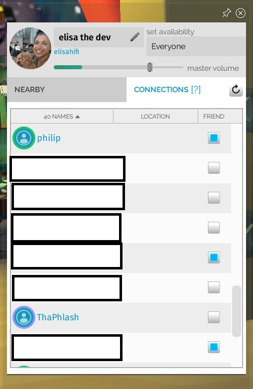
	- A **localhost** user is a someone who is running Interface on the same machine where the server is hosted
		- They do not need to be logged in to have different rights than other user types
		- Localhost permissions override non-user-specific permissions
	- A **logged-in** user is someone that is logged into their High Fidelity account while using Interface  
		*They do not need to be a friend or connection to have server rights*  
		- Permissions that are granted to a specific user override all other permissions
	- **Groups** and **lists** can be made via the [groups registration page](https://highfidelity.com/user/groups)
		- A **group** is a collection of people that voluntarily join
		- A **list** is a collection of people to which a user is added automatically
		- Granting/taking away permissions to a *group* or *list* will copy those permission rights to the users in the group even if you are not friends with them
	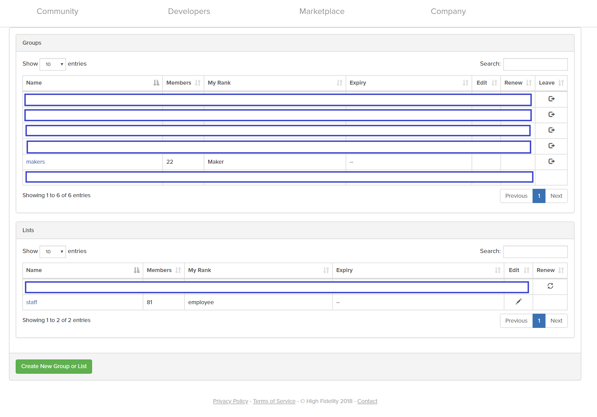
9. Permission definitions:
	- **Connect**: A user is allowed to enter your domain
	- **Lock/Unlock**: A user can lock entities to prevent them from being moved/modified; they can also unlock entities to enable edits
	- **Rez**: A user can create/instantiate ("rez") entities for an unlimited amount of time
		- They will have full access to the Create menu
	- **Rez Temporary**: A user can *temporarily* rez entities that have a default lifetime of 1 hour
		- They will still have full access to the Create menu
	- **Rez Certified**: A user can rez pre-approved and entities and scripts from the Marketplace for an unlimited amount of time
	- **Rez Temporary Certified**: A user can rez pre-approved entities or scripts from the Marketplace with a set lifetime that also defaults to 1 hour
	- **Write Assets**: A user can add assets (models, audio, or other files) to your asset server (your domain's file storage space)
	- **Ignore Max Capacity**: A user can enter a domain even when it has hit the specified capacity limit
	- **Kick Users**: A user is allowed to remove other users from a domain
	- **Replace Content**: A user can change the entire content set of a domain
10. To save your domain settings, click on the “Download Domain Settings” button, which will save your settings to a JSON file
	- You can upload these later using the “Upload Domain Settings” button
	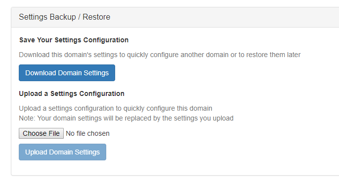

## Modifying Domain Content
1. Click on the “Content” submenu in the server settings top bar to manage your content archives
	- Associated actions:
		- **Restore from here**: Resets the domain to that saved state
		- **Download**: Compresses all of the content in your domain to a downloaded zip file
		- **Delete**: Removes the archive from the saved archives list
	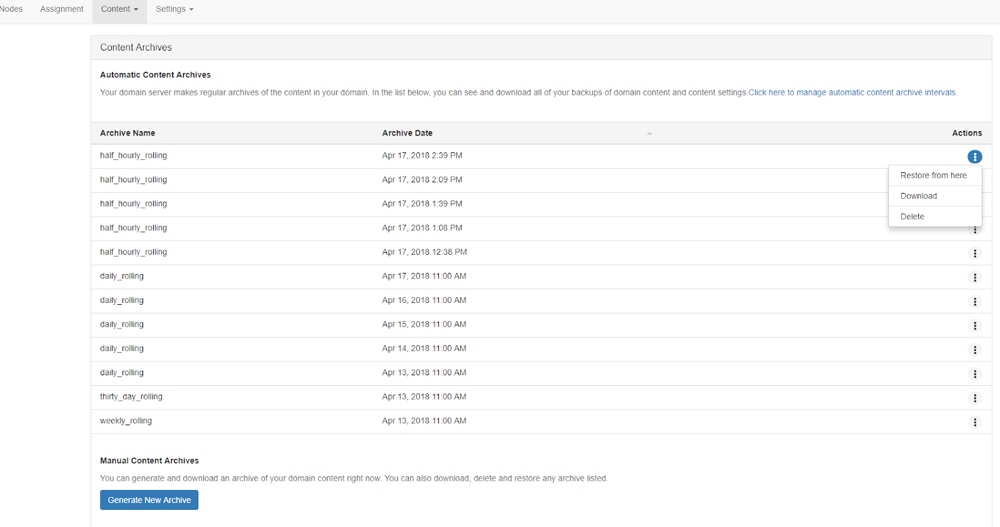
2. Select your archive zip file and choose "Upload Content" to upload a content archive
	
3. Update paths for your domain
	- When specified in Interface's “Go to” application in this format: “domain/pathname”, the user will be taken to a specific part of the domain instead of the default starting point
	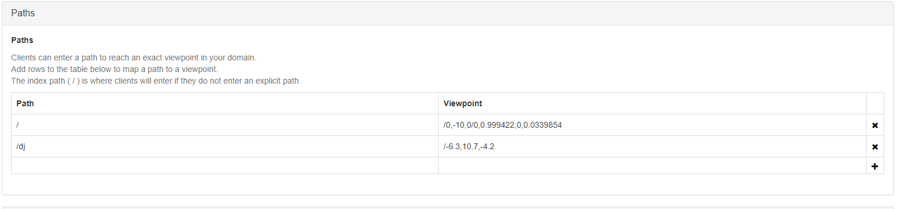
4. Set a script to always run on your domain by adding it to the "Persistent Scripts" table
	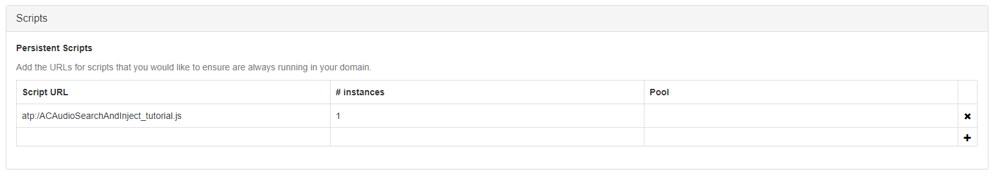
5. Set an audio environment to create a "virtual stage"
	- **Attenuation**: How much quieter sounds get over a distance
		- The default domain attenuation is the amount of noise reduction that is enabled across the domain environment
	- By setting a zone, you can specify axis aligned, 3D boundaries for audio environments that aren't applied to the whole domain
		- **Attenuation coefficients**: How sound is transmitted between zones
			- *When the attenuation coefficient is 0, there is no volume attenuation with someone in another zone; at 1, you won't be able to hear someone in another zone*
	- **Reverb Settings**: Enables echo-like effects
		- **Zone**: The zone that you defined earlier in the table
		- **Reverb Decay Time**: How long you can hear an echo after the initial sound
		- **Wet/Dry Mix**: The percentage mix of the reverb tail relative to the original "dry" signal  
	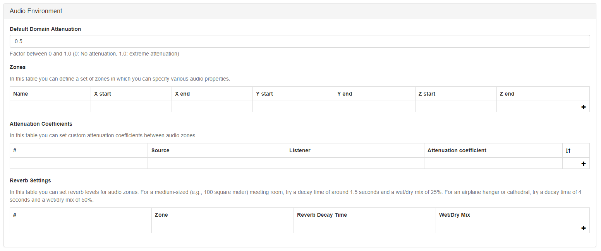

## Filters

**Anyone with connect permissions can make edits to your domain if they are not locked. Using filters is the only way to prevent unwanted edits.**  

Entity filters are specialized javascript functions that allow you to prevent unwanted modifications to your domain entities. They can be applied to a whole server or to specific zones within a domain. Filters work by subscribing to, then intercepting _edit_, _add_, _delete_, and _physics_ packets. Filters then run the user-submitted edits through the rules defined in the filter and either accept or reject them.

Additional filter tidbits:

- Entity filters apply to all users who do not have lock/unlock permissions
- Filters can request the original properties of an edit to compare them to new values, which grants you more flexibility in which edits are approved or not

### Set an entity filter on the whole domain:  

To protect all entities in a domain while granting edit rights, copy the URL to a JavaScript filter script that follows this template:
```
// prevent-all-deletes.js by Brad Hefta-Gaub
(function() {
	function filter() { 
		return false; // all deletes are blocked
	}
	filter.wantsToFilterAdd = false; // don't run on adds
	filter.wantsToFilterEdit = false; // don't run on edits
	filter.wantsToFilterPhysics = false; // don't run on physics
	filter.wantsToFilterDelete = true; // do run on deletes
	filter;
});

```

### Set an entity filter on a specific zone entity:  
Copy the script URL to the "Filter" script property in a zone's properties:  
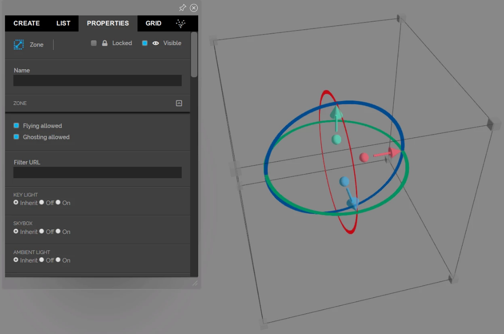
To protect specific entities, follow this template:  
```
// prevent-add-delete-or-edit-of-entities-with-name-of-zone.js by Brad Hefta-Gaub
(function() {
	function filter(properties, type) {	
		var ENTITY_ID = "{the ID of the entity that you want to protect}";
		if (type === Entities.DELETE_FILTER_TYPE) {
			if (properties.id === ENTITY_ID) { return false; }
		}
		return properties;
	}
	filter.wantsToFilterDelete = true; // do run on deletes
	filter;
});

```  

## Conclusion
Though the establishment of your own domain may seem like a big task, following this step-by-step tutorial will hopefully set you in the right direction to creating and securing your own world!
