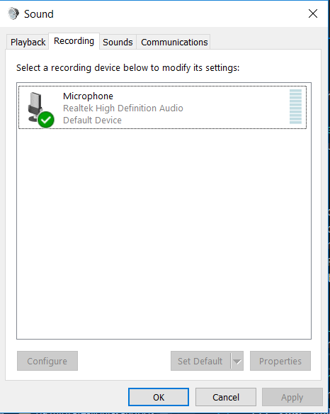
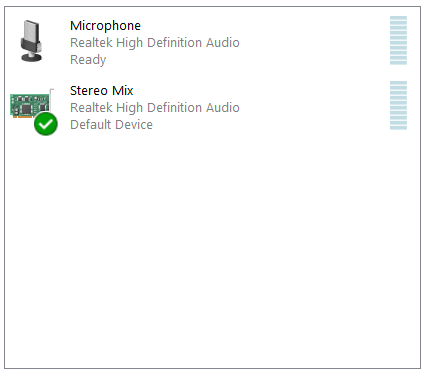
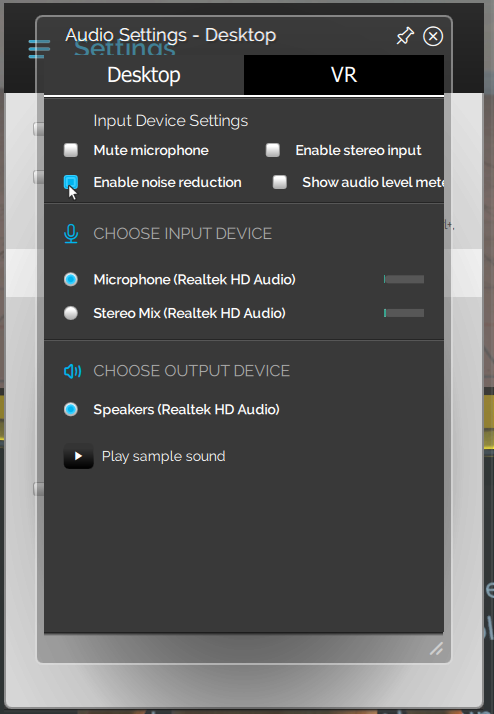

## Overview

This page shows you how to broadcast audio in world.

## Using Stereo Mix to Broadcast Audio
Assuming you cannot stream directly from your mic, we recommend you set up another computer dedicated for streaming, with its own avatar, and use the Stereo Mix device from Windows as the audio input.

>>>>> These instructions work best on a machine with Realtek audio chipsets. 

1. Left-click on the speaker icon and click on **Recording Devices**. 
2. Left-click and choose **Show Disabled Devices**. Certain new releases of Realtek drivers do not have Stereo Mix as a device. If Stereo Mix does not show up after turning on Show Disabled Devices, you can install an older version of the drivers. 
3. Select and enable **Stereo Mix**. This will route any audio coming from your computer's sound system into High Fidelity, as if it were a microphone. 
4. In High Fidelity, open Menu>Settings>Audio and disable noise reduction to prevent the audio cutting out. If you are streaming from a stereo input, enable stereo input here. 
5. Prepare to broadcast audio. Adjust the volume on your own computer to change the volume in High Fidelity. To prevent feedback, mute High Fidelity in the Volume Mixer. Remember, you will not be able to talk while you are broadcasting audio with Stereo Mix.
6. Position the avatar within the domain. This can be tricky, so we recommend giving yourself extra time to prepare.

## Setting up your domain with Audio Zones
You can change the natural attenuation and reverb of an audio source by creating Audio Zones. Audio Zones will allow you to modify the audio effects of different parts of the domain to better fit your style. For more information on Audio Zones, go [here](https://docs.highfidelity.com/create-and-explore/start-working-in-your-sandbox/server-settings-for-your-domain#zones).

## Troubleshooting
+If you cannot find Stereo Mix in your audio devices, check out [this document](https://www.howtogeek.com/howto/39532/how-to-enable-stereo-mix-in-windows-7-to-record-audio/).
+If your computer does not support Stereo Mix, check out some alternatives [here](https://mediarealm.com.au/articles/stereo-mix-setup-windows-10/).
+If your domain visitors hear an echo, ensure that your High Fidelity audio output is muted.