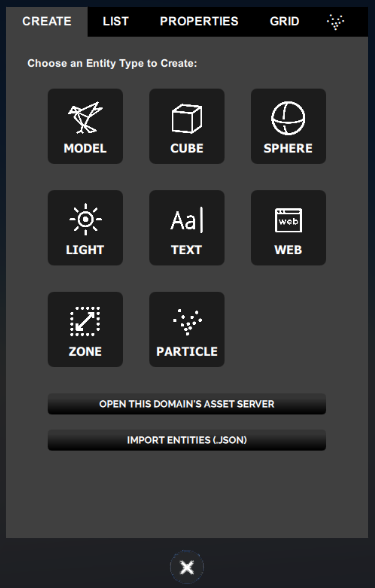
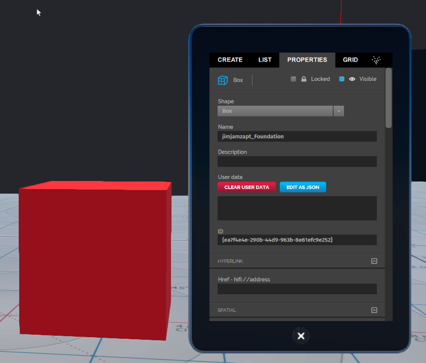
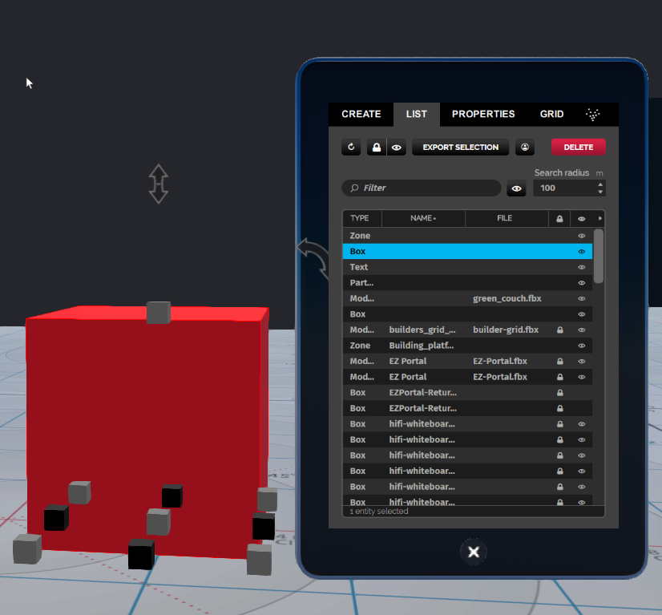
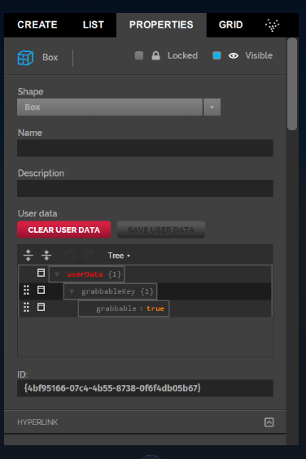
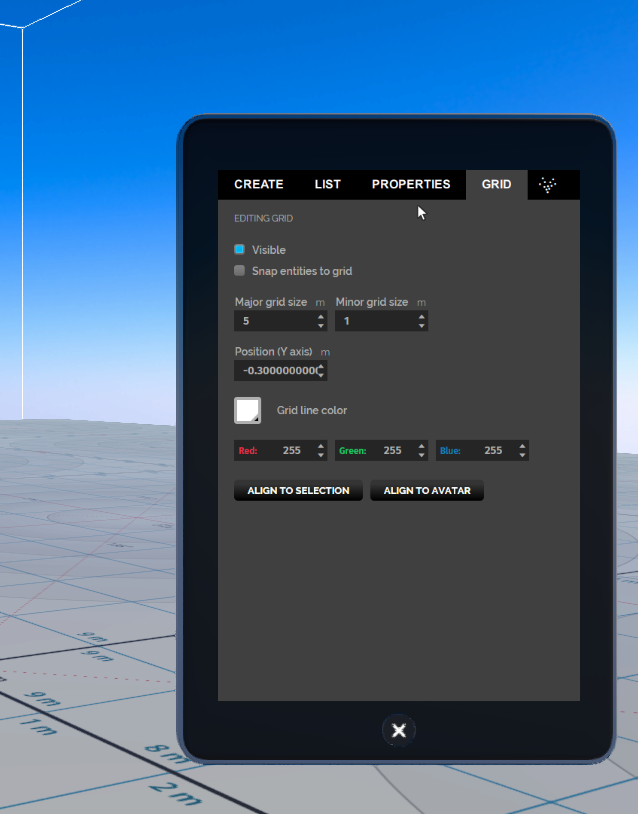

*Learn how you can add, edit, and delete entities in Create Mode*

##Overview

To build anything in High Fidelity, you'll need to acquainted with the Create mode. We'll walk you through the different things you can do with the create button. 

## Introduction

When you click the Create button on the tablet, you are ready to start adding, editing and deleting entities. The create button is controlled by a script called `edit.js`, which you can change to create a new kind of editor, or replace with a different one. `Edit.js` is one of the default scripts that run when you launch the Interface.

> > > > > You can only use the Create mode in domains where you have the permission to build. 

###Start Creating

Turn on Create mode by clicking the Create button on the tablet or HUD. 

In the toolbar or tablet, you should see a button labeled **create**.

To enable create mode, click the **create** button. You can use the mouse or your controller to add, edit and delete an entity. 

### Leave Create Mode

You can exit the Create Mode by closing the window on the tablet. 

### Using Camera Controls When in create Mode

- To zoom in and out from the object in view, move the scroll wheel moved backwards and forwards.
- To pan around the object, click the right mouse button and drag left and right.
- To orbit over and under the object, click the right mouse button and drag up and down.

### Adding Entities Using the create Toolbar

When you click on the Create button, a window opens showing the different types of entities you can use. You can add an entity by clicking on the button for that entity. For instance, if you want to add a cube entity, click on cube. 

Entities can be of the following types:

| Entity Type                          | Description                              |
| ------------------------------------ | ---------------------------------------- |
| [Box](../box-and-sphere-entities)    | Box entities are used to create basic cube shaped entities. These first appear red in color. |
| [Sphere](../box-and-sphere-entities) | Sphere entities are used to create basic sphere shaped entities. These first appear red in color. |
| [Light](../light-entities)           | The Light entity works like a ball or a beam of light and can be used to add local lighting effects and spotlights to an area or spot. |
| [Text](../text-entities)             | The Text entity displays text against a flat plane, similar to a whiteboard or blackboard. The default text says **"some text"**. |
| [Web](../web-entities)               | Web entities display a web page with a specified URL on a plane. |
| [Zone](../zone-entities)             | A Zone entity is a 3-dimensional area that allows you to create a custom lighting environment. |
| [Particle](../particle-entities)     | A particle system entity that can be used to create dynamic effects such as smoke clouds or falling water. |
| [Model Entities](../model-entities)  | A model entity is a 3D model that you can import in-world. |

>>>>> Each entity type has its own set of properties that define the entities appearance and behavior. 

### Edit Entities Using a Mouse or Trackpad

You can edit an entity's position, rotation, and scale using your mouse or trackpad. You can also duplicate and delete entities using the mouse and keyboard.

To edit an entity using the mouse or trackpad, you can select the entity or find it in the List tab in Create mode. 

>>>>>By default, Light entities and Zone entities cannot be selected for editing. To be able to select Light entities, go to **Settings > Advanced Menus**, and then select **Edit Menu > Allow Selecting of Lights**. To select Zone entities, you must click on the Zone entity in the List tab.

You can tell an entity is selected when you see the bounding box and arrows around it. These arrows are the rotate and stretch widgets.

With the entity selected, you can:

- Change the entity's position.
- Change the entity's scale.
- Change the entity's rotation.
- Duplicate the entity.
- Delete the entity.

>>>>> When in create mode your arrow keys move the camera instead of the avatar, you do not need to move the avatar to get a better look. 

#### Change the Entity's Position

Entities can be easily moved around using the mouse, but care must be taken not to accidentally click the *rotate widgets* or the *size widgets*.

- To move the entity across the ground plane, click the entity at a spot where there are no widgets highlighted and hold and drag the mouse.
- To move the entity up and down, use the double arrow at the top.

#### Change the Entity's Scale

Grabbing the black squares at the edges of the entity bounding box enables you to stretch and shrink the object.

- To resize the height only: Grab the little square widget at the top of the entity and drag up or down.
- To resize one side at a time: Grab one of the little square widgets at the bottom edges and drag in or out.
- To resize proportionally across the X and Z axes (ground plane): Grab the little square widgets at the bottom corners and drag in or out.
- To resize proportionally across all three axes: Hold the **Shift** key and grab the little square widgets at the corners and drag in or out.
- You can undo this action by pressing the **CTRL/Z **keys together.

#### Rotating the Entity with the Mouse

Grabbing any of the three curved arrows enables rotation about one axis.

- Grab one of the curved arrows to rotate on that axis.
- Move the mouse closer to the object to snap to whole sizes.
- Move the mouse further away to rotate as free wheel (no snapping).
- You can undo this action by pressing the **CTRL/Z **keys together.

#### Duplicating the Entity with the Mouse

To duplicate an entity:

1. Press and hold the **ALT** key and grab the entity with the mouse.
2. Drag to create a copy.

>>>>> The safest way of doing this is to hold the **ALT** key and grab the up/down arrows and duplicate up.

You can undo this action by pressing the **CTRL/Z** keys together.

#### Deleting an Entity

Press the **Backspace** key to delete the selected entity.

## Editing Entities Using the Create Panel

The *create* panel has three tabs: *Create*, *List*, and *Properties* and *Grid*. Theses tabs allow you to:

- List entities in the domain.
- Create entity properties: Entity properties define an entity's appearance (color, size, position etc.) and behavior (animation, collision, interaction, etc.).
- Expose a grid to assist in layout.

### List the Entities in the Domain

To list all of the entities on the domain, in the *create* panel, click the *List* tab and then click *Refresh* on the top-left corner of the panel. You can filter by entity type and by distance from the current location.

### Edit Entity Properties

Entity properties define an entity's appearance (color, size, position) and behavior (animation, collision, interaction) and much more. The entity type will define the specific set of properties the entity has.

To edit an entity's properties:

1. Select the entity. 
2. Go to **Create > Properties** on your tablet. 

You'll see the properties listed for the selected entity. You can make changes to any of the listed properties if the entity is not locked. If you can't change a property, check the List tab to determine if the entity has been locked.

### Expose a Grid to Assist in Layout

The *Grid* panel is used to expose a grid to assist you with the layout. Using this panel, you can toggle grid visibility, toggle snapping to the grid, and set the grid position, size, and color.

