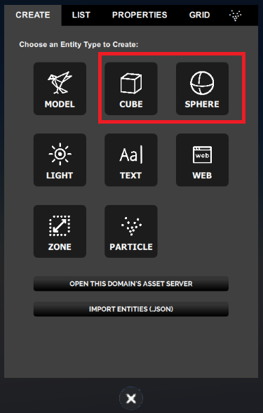
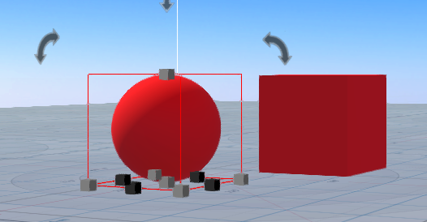
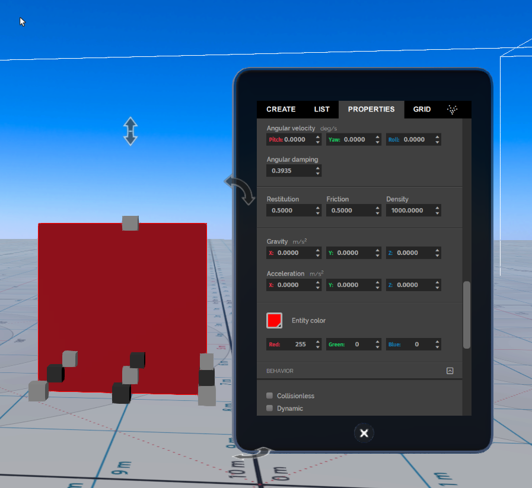
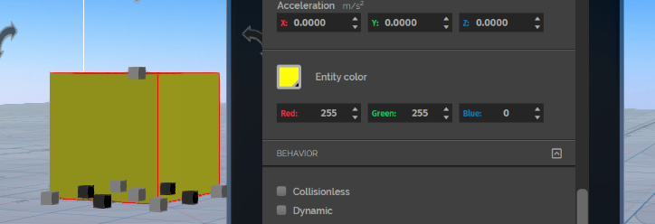

*Learn about box and sphere entities.*

## Overview

This page will detail how you can create box and sphere entities and how you can modify their properties.

## Create a Box or Sphere Entity

Click the Create button on the tablet to enable [Create Mode](../create-mode). Add a box entity by clicking the cube icon, and a sphere entity by clicking the sphere icon.

A Box entity is cube shaped and a Sphere entity is sphere shaped. When Box and Sphere entities are first added, they are red by default.

## Properties

An entity's appearance and behavior are defined by the entity's properties.

Box and Sphere entities have the properties common to all entities. Box entities have one additional Box specific property and Sphere entities have one additional Sphere specific property.

You can view and edit these properties in [Create Mode](../create-mode) by selecting the entity and then selecting the **Properties** tab in the *Create* panel.

## Example: Create a Yellow Cube

To change the color of a cube to yellow:

1. Add a Box entity by going to **Create** and clicking on the cube button.  

2. When you add the cube, the Properties tab opens.

3. Select the cube.

4. Scroll down until you see the Entity color option.

   

   The current values are Red: 255, Green: 0, and Blue: 0.

5. To change the cube's color to yellow, change the Green value to 255.

   

   If you use the carats to change the value, as you increase the value you should see the cube change from red, to orange, to yellow. If you enter in 255, you will see the cube change to yellow as soon as you press enter.
