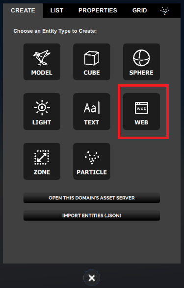
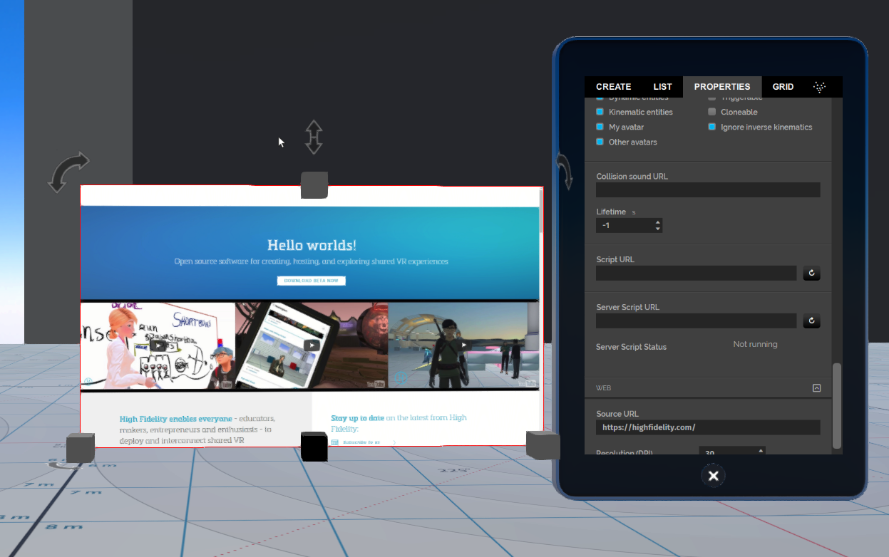
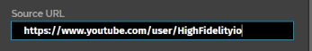
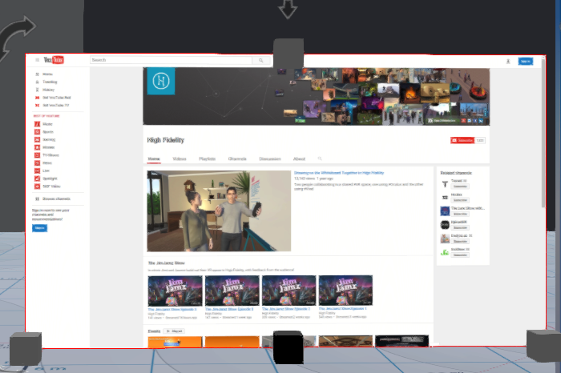

*Learn how to create a web entity.*

## Overview

This page will walk you through you can create a web entity.

## Create a Web Entity

A web entity displays a web page on a plane. Go to **Create** and click the web icon.

A web entity is a flat plane and by default displays the High Fidelity home page.

## Properties

Web entities have the properties common to all entities as well as one additional Web specific property.

> > > > > The web entity is a flat panel. As it has no depth, for the dimension properties, the Z value is ignored.

You can view and edit these properties in [Create Mode](../create-mode) by selecting the entity and then selecting the **Properties** tab.

## Example: Create a Web Entity Displaying the High Fidelity YouTube Channel

To create a web entity that displays the High Fidelity YouTube channel, complete the following steps:

1. Go to **Create** and click on the web icon. A web entity should appear directly in front of you. This entity should display the High Fidelity home page.
2. Select the web entity and then select the **Properties** tab.
3. Scroll down until you see the Source URL option. Enter the High Fidelity YouTube channel URL: https://www.youtube.com/user/HighFidelityio
   
   You should see the new web page load soon as you press enter.
   
   ​Now, you can watch videos in-world and browse the internet.
