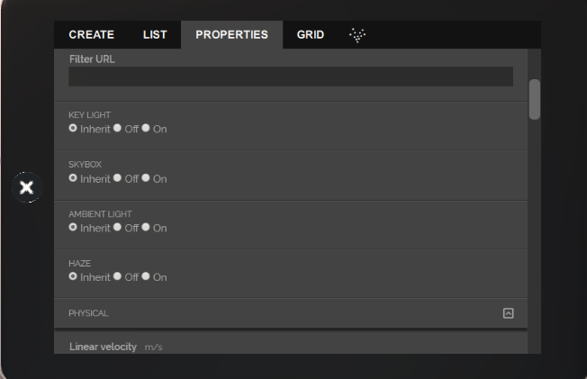
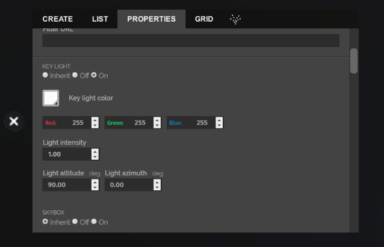
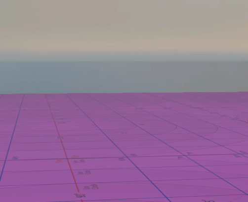
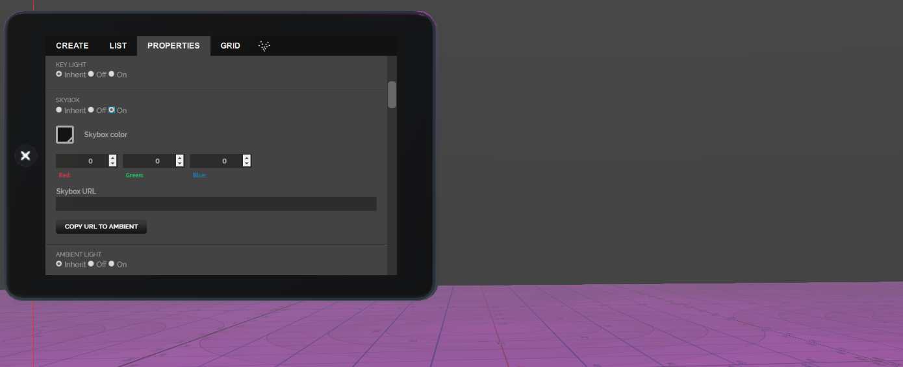
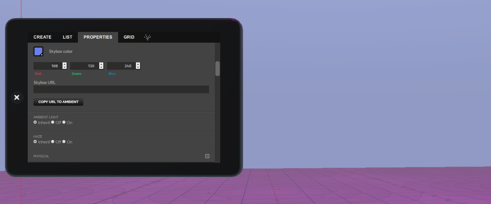
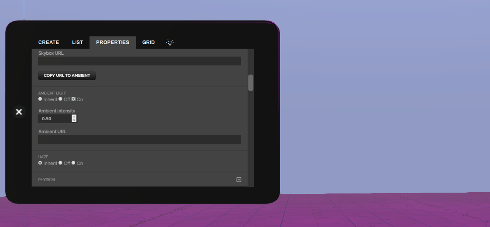
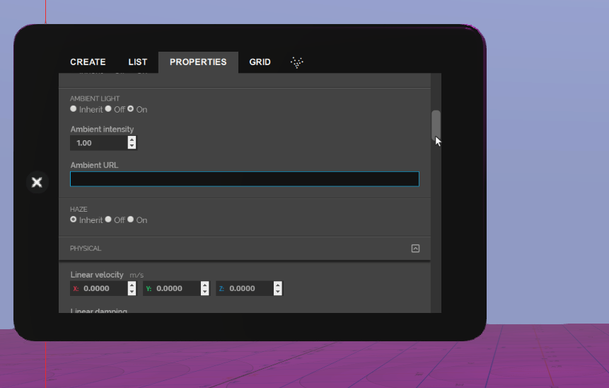
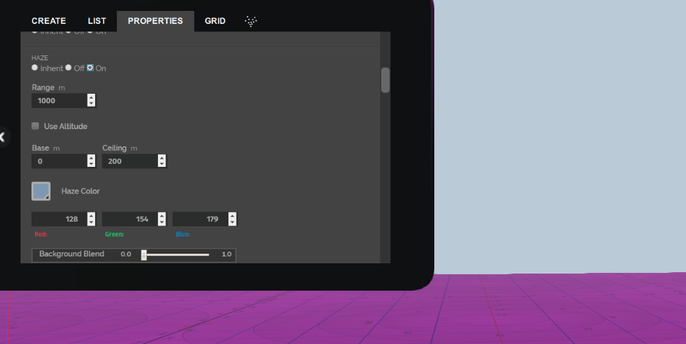
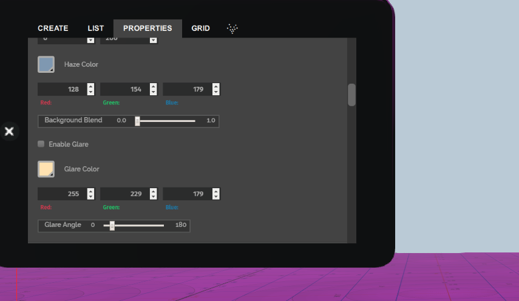

*learn more about zone lighting settings.*

##Overview

This page details the different ways you can change your zone's lighting properties. 

##Introduction

A zone entity has 4 types of lighting parameters:
* Key Light
* Skybox
* Ambient light
* Haze  

Each of these behave differently dependinding on what their mode is. The modes they can be set to are:
* Inherit: If this mode is selected, the parameter inherits the values from the preceeding zone. 
* Off: If this mode is selected, the lighting parameter is turned off. 
* On: If this mode is selected, the lighting parameter is turned on and its values can be set. 

 

#### Keylight

The key light represents a parallel light source (e.g. the sun). The colour can be selected via a colour selector or as RGB components. Light altitude is the angle in degrees above the horizon and the azimuth is relative to the negative axis. Let's create a zone entity to see how this light parameter works. 

* Pull up your tablet and go to **Create**.
* Click **Zone** and scroll down to the light parameters. 
* Change the key light parameter mode to *On*. 
* Change the key light color to pink (#ff03ff) and click OK.  

#### Skybox

The skybox colour modulates the texture of the sky in your domain, which is loaded from a URL. The URL may be copied to the ambient light and is a commonly used approach.
Let's change the skybox information of your domain. You can also do this by changing the skybox URL. 

* In the same zone, change the skybox mode to *On*. You'll see the default properties. 
* Change the skybox color from black to #6c82f0.  
* Click OK and observe the change in the skybox. 

#### Ambient Light 

The ambient light is provided by a cubemap centred around the avatar.  The intensity can be set, as well as the URL.
For example, let's change the ambient intensity to 1. You can also do this by changing the ambient URL.

* In the same zone, change the ambient light mode to *On*. You'll see the default properties. 
* Change the ambient intensity to 1.00. 

#### Haze

The haze effect simulates atmospheric absorption by water vapour and dust. aze has a relatively large number of parameters to simulate the different aspects of atmospheric attenuation. You can modify these properties to see how it affects your domain. 

* **Range:** The range is the horizontal range that visibility is reduced by 95%. In other words, at this range, 95% of a pixel’s colour is the haze colour (the other 5 being the pixel’s original colour).
* **Use Altitude:** If this is checked, then the haze effect will decrease with altitude; otherwise, the haze is constant.  The Base/Ceiling parameters are only used in this mode.
* **Base/Ceiling:** The Base defines the altitude where the haze density is as defined by the Range parameter. The Ceiling defines the altitude where the haze density has decreased by 95%.
* **Haze Color:** This is the colour that is blended into the image as the range to pixels increases.  This is normally a bluish-grey colour.
* **Background Blend:** The background (i.e. the skybox) is very far away. The result of this is that the background image would always be obscured if any level of haze was active. To mitigate this effect, the background image may be blended back into the image. When set to 1.0, the background appears as if haze is not enabled.
* **Enable Glare:** This checkbox enables an additional aspect of haze, the effects of haze on the sun.
* **Glare Color:** When looking away from the sun (i.e. the Keylight direction) the haze will have the haze colour.  This will change to the glare sun as the view direction approaches the sun.
* **Glare Angle:** Defines the (solid) angle from the sun that the haze colour and glare colour are blended 50%.

