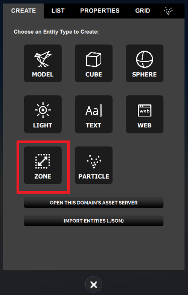
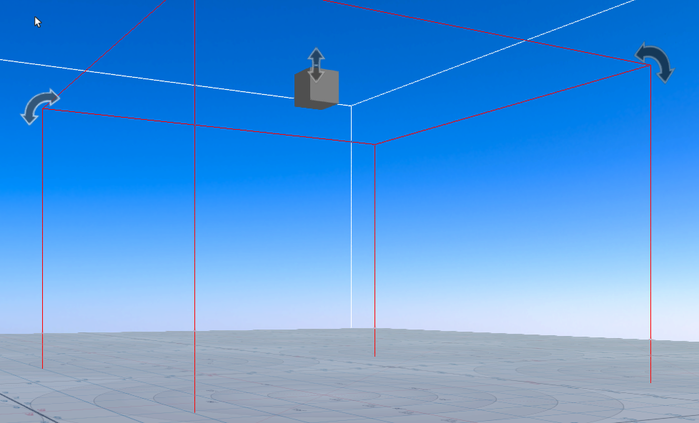
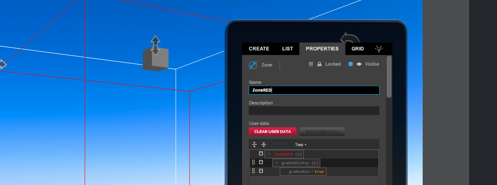
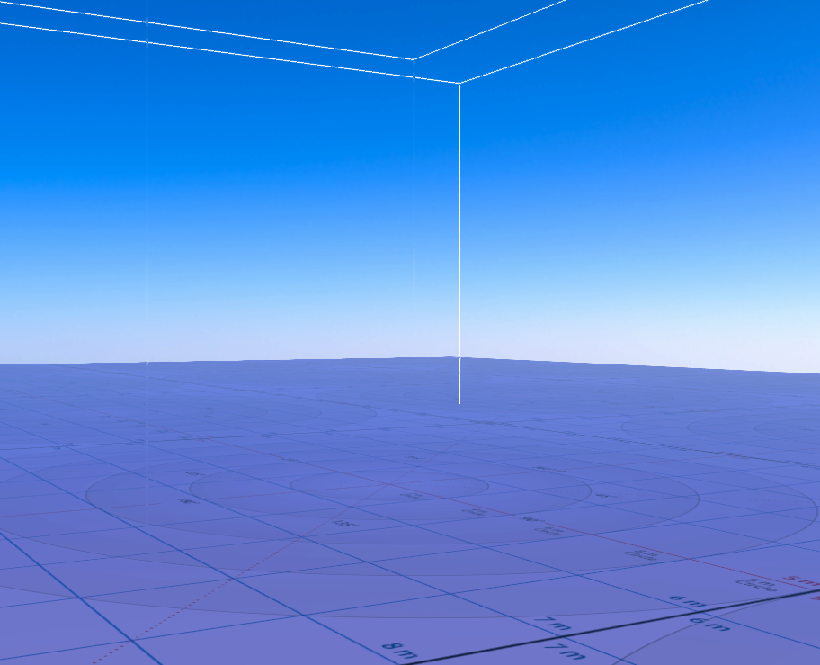
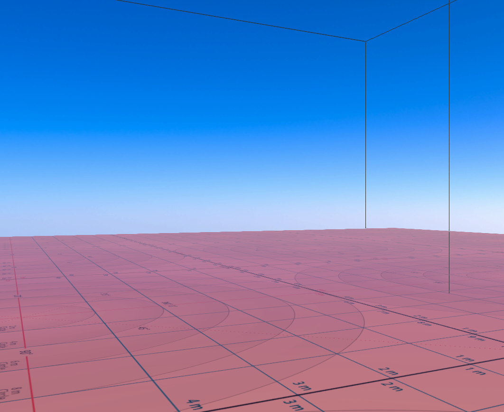

*Create and edit a zone entity.*

## Overview

A zone entity is a 3-dimensional area that allows you to create custom lighting environments. You can define the zone boundaries using shapes and then customize the zone’s light properties such as its intensity, direction and color to create different effects. Let's take a look at how it's done!

## Create a Zone Entity

Go to **Create** and click the zone icon. 

The new zone entity is created at your current location.

You can create multiple zone entities, nested zone entities, adjacent zone entities and overlapping zone entities. Zone entities do not have to be axis aligned.

## Working With Zones

Zones entities can be a bit tricky to work with. By default, zone entities cannot be selected for editing nor will they be visible to select. In addition, zone entities can overlap or be nested. We cover:

- Precedence
- How to make zone entities visible in Create Mode
- How to select zone entities for editing

### Precedence

You can create multiple zone entities, nested zone entities, adjacent zone entities and overlapping zone entities. Each of these zone  entities can have different properties. If zone entities are overlapping, then the smaller zone entity's lighting values will take precedence over the other zone entities. For example, as a user moves through a group of nested zone entities, each with different lighting values set, the user would experience the lighting conditions of the smallest zone entity that they are currently in.

### How to Make Zone Entities Visible in Create Mode

By default, zone entity boundaries are invisible. To make it easier to know exactly where a zone  entity is, you can make the entity's boundaries visible in [Create Mode](../create-mode). To make zone entities visible in edit mode 

1. Select **Settings > Advanced Menus**.

2. Select **Edit Menu > Show Zones in Edit Mode**.

Zone entities will appear as a wireframe shapes.

By default, zone entities are cube shaped, but other shapes are possible and can be set in the properties.

### How to Select Zone Entities for Editing

Unlike other entity types, you cannot simply click on a zone entity in edit mode to select it. To select a zone entity for editing:

- Select the zone entity in the **List** tab.

With the zone entity selected, you can edit theproperties.

## Properties

Zone entities have the properties common to all entities along with a number of zone specific properties.

You can view and edit these properties in **Properties** .

## Example: Create Two Nested Zones with Different Lighting

To help you get a better understanding of zone entities, this example creates two different zone entities, one inside the other, that you can navigate through. For this example, you will:

- Create two zones entities
- Edit the positions and size properties so that one zone entity is inside the other
- Edit the light properties to create two different effects

### Create Two Zone Entities

For this example, you will need to create two zone entities. Complete the following steps:

1. Create a zone entity by selecting the **zone** icon. When you first create a zone, it will be selected. If it is not selected, you can select it using **List** tab. To help keep track of zone entities, you can use the **Name** property.

2. In the **Properties** tab, enter a name into the **Name** property field. Name the first zone, **ZoneRED**.

   

3. Repeat the first two steps to create a second zone entity. Name this second zone, ZoneBLUE. 

 

### Edit the Zone Positions and Sizes so that One is Inside the Other

With two zone entities created, you now need to resize one so that it is smaller than the other. You will also want to position the smaller zone entity inside the larger zone entity.

> > > > > To see the size and position of the zone entities you are working with, select **Settings > Advanced Menus** and then select **Edit Menu > Show Zones in Edit Mode**.

By default, zone entities are created at your current position, so to see the zone entities you just created, you may need to reposition your avatar.

1. Edit one zone  entity to be half the length and width as the other. In the **Properties** tab, for the zone entity named ZoneRED, set the Dimension properties to: **X: 5, Y: 10, Z: 5**

2. If you created the two zone entities without moving your avatar, the zone entities should be positioned in the same place. If not, use the Create Mode tools to position the smaller zone (ZoneRED) inside the larger zone (ZoneBLUE).

    You should now have ZoneRED inside of ZoneBLUE.

### Edit the Zone Entities' Light Properties to Create Two Different Effects

Both zone entities currently use the default lighting properties. If you pass through both zone entities, you won't notice when you have moved into or out of each zone entity. The next step is to set the zone entities' lighting properties so that you have two different light environments. 

The lighting environment for a zone entity can either be set by enabling and setting the stage sun model (a light that simulates sun light) or by setting the keylight (a single point of light) properties. For this example, the keylight properties for each zone entity will be set to create one area lit with red light and one area lit with blue light.

Each zone has a single keylight.

To edit the keylight properties:

1. Select the smaller zone entity (ZoneRED).
2. In the **Properties** tab, scroll down to the *zone* properties, and set the **Keylight Color** property to Red (**Red: 255, Green: 0, Blue: 0**)
3. Select the larger zone entity (ZoneBLUE).
4. In the **Properties** tab, scroll down to the *zone* properties, and set the **Keylight Color** property to Blue (**Red: 0, Green: 0, Blue: 255**)

If you now navigate your avatar through both zone entities you should see the light turn blue as you enter ZoneBLUE and then turn red when you enter ZoneRED.

## Example: Changing the Zone Shape

In the previous example, the zone entity's boundaries were a cube. You can view a wireframe of a zone entity's shape, select **Settings > Advanced Menus** and then select **Edit Menu > Show zones in Edit Mode**.

This is the default shape. However, other shapes are possible. To change a zone entity's shape:

1. Select the zone entity and in the **Properties** tab, scroll down to the Model properties.
2. Set the **Collision shape type** property to the shape you want to use:

   There are four shape types to chose from:

   - None: Will go to the default shape. (Box at the moment)
   - Box: The zone entity's shape is the same than its bounding box.
   - Sphere: The zone entity's shape will be a stretched sphere.
   - Compound: The zone entity's shape will be a convex mesh.

All shapes will be stretched to fit the zone entity's dimensions.

### Generate a Convex Mesh

For people working off of the High Fidelity dev build available on GitHub, you will find a command line tool called `vhacd-util`. This tool will allow you to generate a convex mesh (or a set of convex meshes) from another non-convex model. The tool is located here: `{BUILD_DIR}/tools/vhacd-util/Debug/vhacd-util` The `—help` option will show you the available arguments and what they do.