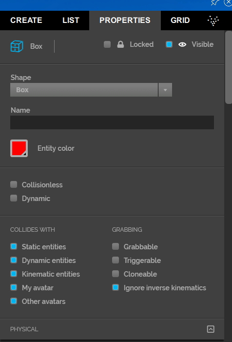
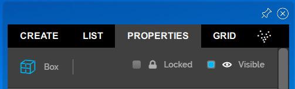
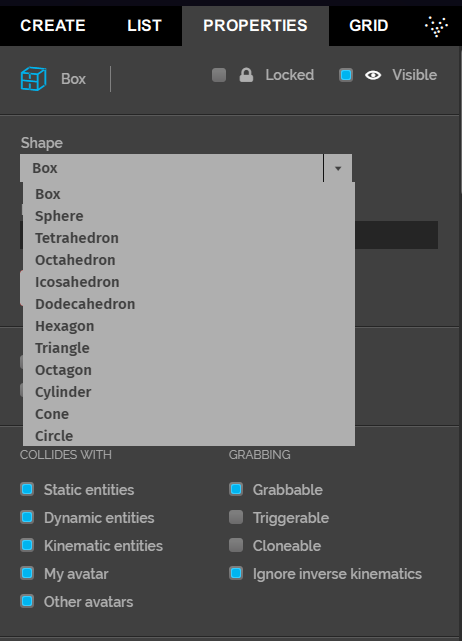
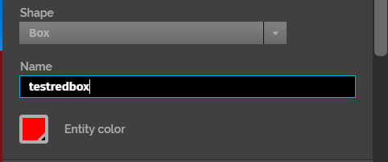
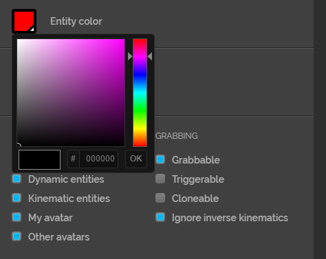
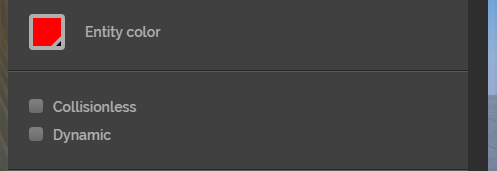
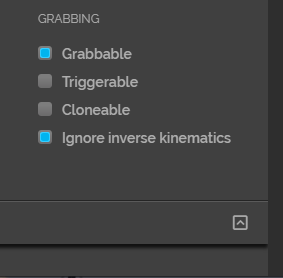
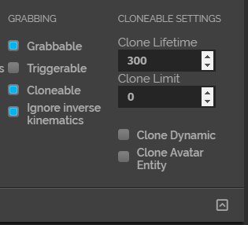

## Overview

*This page takes you through setting up collision and grabbing properties for your entities.*

## Introduction

When you create an entity, it's collision and grabbing properties are the default. You can modify these properties for different entities based on your requirements. 

### Properties

You can take a look at an entity's properties by going to **Create > Properties**, on your tablet or HUD. 

#### Locked

If this checkbox is checked, then the selected entity cannot be edited. 

#### Shape

You can change the shape of an entity by using the drop down menu. 

#### Name

Give your entity a name of your choice by typing it the box under **Name**. 

#### Entity Color

Change the color of your entity by entering its hex value or changing it from the palette. 

#### Collisioness & Dynamic

If you check either of these:
* Collisionless: The entity will not collide with any other entity or avatar. 
* Dynamic: By checking this, you are making the entity dynamic to changes in the physics in a domain. For instance, if you change the gravity in your domain, your dynamic entity will also be affected. On the other hand, once static entites are created, they can only be moved if a user picks one up. Static entities have no gravity and no velocity. 
  

#### Collision Properties

If your entity has Collision properties checked, its behavior when coming in contact with other entities or avatars is changed. On the other hand, if these properties are not checked, the entity will go through other entities and avatars like it's not a solid object. 

The list of checkboxes under **Collides With** determines how your entity behaves upon collision. The default setting is that all checkboxes are checked. 

- **Static Entities:** Your entity will collide with static entities. 
>>>>> If your entity is a static entity, it cannot collide with another static entity. Only dynamic entities can collide with static entities. 

- **Dynamic Entities:** Your entity will collide with dynamic entities. 
- **Kinematic Entities:** Your entity will collide with kinematic entities (they have velocity but are not dynamic).
- **My avatar:** You entity will collide with your avatar. 
- **Other avatars:** Your entity will collide with other user's avatars. 

#### Grabbing Properties

Your entity's grabbing properties determine how it behaves when you or another user interacts with it. By default, **Grabbable** and **Ignore Inverse Kinematics** is checked. 

- **Grabbable:** You or other users can grab this entity. 
- **Triggerable:** Your entity can trigger a method. For instance, you can write a script that triggers when you click on the entity. 
- **Cloneable:** Your entity can be cloned.  You can change the settings in the Cloneable menu to modify your entity's clone.
  - Clone Lifetime: Set how long (in seconds) your clone will exist. 
  - Clone Limit: Set how many clones you can create. 
  - Clone Dynamic: Makes the clone dynamic. 
  - Clone Avatar Entity: An avatar entity doesn't exists in the Entity Server. Instead, it is specific to a user's Interface client. By checking this box, you can specify if a cloned entity is created as an avatar entity. For instance, say you have a coffee shop in your domain. A friend comes to visit and grabs a coffee cup that's been cloned. Now once your friend is done visiting, the cloned entity leaves with her avatar, ensuring there isn't any clutter left behind. This feature ensures that your entity is cloned locally for each avatar. 
- **Ignore Inverse Kinematics:** If this is checked, when you grab the entity, it will follow the movements of your hand controller instead of your avatar hands. This means, if your avatar arms are shorter than your real arms, your entity will be grabbed where the controller is (at a distance from your avatar hands). 

> > > > > Unlocked entities that are grabbable or dynamic can be scaled using your hand controller bumper triggers. 