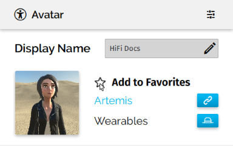
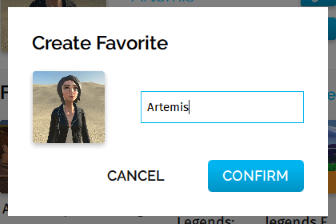

## Overview

When you first use High Fidelity, you will be wearing the default avatar. Your avatar is a representation of you in the metaverse. You can control how your avatar moves and speak to other users in-world using it. 

### The Default Avatar

When you first use High Fidelity, you will be wearing the default avatar. This is the avatar worn by all first-time users and anyone who wishes to continue doing so. 

The default avatar resembles a human, and is bipedal. High Fidelity only supports bipedal avatars. Whether you are using an HMD or are in Desktop mode, you can control your avatar's movements and make its mouth move when you speak. This also allows you to explore the metaverse and interact with other users.

You can make your time in High Fidelity unique by [creating an avatar of your own](../create-avatars). 

### Glossary

As we delve deeper into changing and creating avatars, we may use terminology that you are unfamiliar with, or that is different in the VR industry than other ones (such as gaming). Here are some terms you might see:

* Avatar - A virtual representation of a person or NPC.
* Mesh - The collection of 3D vertices and triangles for the avatar model. Without this, the avatar is invisible.
* Bones - A component of a skeleton that defines a "limb" such as an arm, leg, etc. Each bone may be animated as a separate limb in your avatar.
* Skeleton - A hierarchy of joints.
* Rigging - The process of creating a skeleton of the avatar model.
* Blendshapes - Variations of the topology that defines how the mesh is modified to create various "shapes".
* FST file - The main avatar file, which contains information about the skeleton, blendshapes, FBX file and textures used by an avatar.

### Add to Favorites

Do you have different avatars that you like switching between frequently? The **Add to Favorites** feature lets you bookmark any avatar that you're wearing. All of your favorite avatars are visible on the Avatar window. When you want to switch to a different avatar, simply click on the one you want. You no longer have to go the Marketplace to load one of your favorite avatars or load the file of your choice.

>>>>> This is a local system setting. This means that if you uninstall High Fidelity, delete your Settings, or log in from another system, you will not be able to access your favorite avatars.

Here's how you can add your avatar to your Favorites:

1. In Interface, pull up your tablet or HUD and click on Avatar. 
2. Click the star next to **Add to Favorites**. 
3. Enter a name for your avatar, then click Confirm. 

Now that you've added your avatar as favorite, you can access it anytime from the Avatar app. To do this:

1. In Interface, pull up your tablet or HUD and click on Avatar.
2. Click on the avatar you want to load, then click Confirm.

### Avatar App

Once you are wearing the avatar of your choice, you can pull up your tablet or HUD and click on Avatar to change the settings and manage your Favorites. 