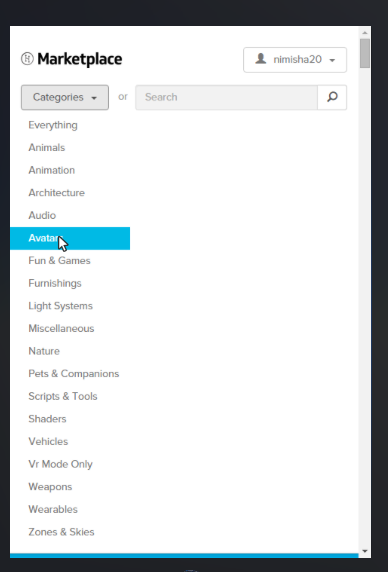
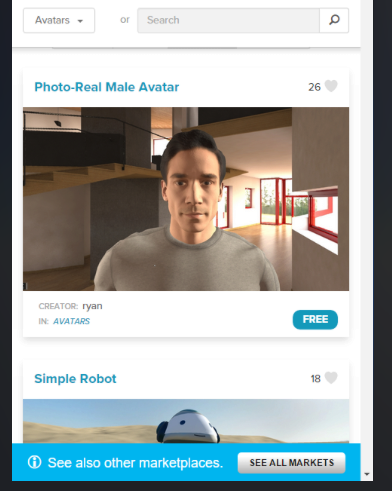
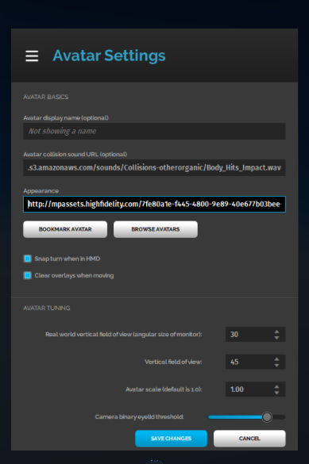
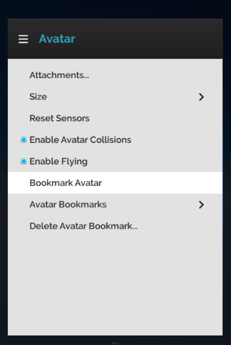

*Learn how avatars work in High Fidelity. *

## Overview

Learn how you can create and upload avatars to High Fidelity. 

## Prerequisites

* You’ll need to [download and install](https://highfidelity.com/download/sandbox) High Fidelity’s Interface and Sandbox. 
* Download and install a 3D Modelling software such as Blender or Maya. 

  ​

## Introduction

When you first use High Fidelity, you will be wearing the default avatar. Your avatar is a representation of you in the metaverse. You can control how your avatar moves and speak to other users in-world using it. 

### The Default Avatar

When you first use High Fidelity, you will be wearing the default avatar. This is the avatar worn by all first-time users and anyone who wishes to continue doing so. 

The default avatar resembles a human, and is bipedal. High Fidelity only supports bipedal avatars. Whether you are using an HMD or are in Desktop mode, you can control your avatar's movements and make its mouth move when you speak. This also allows you to explore the metaverse and interact with other users. 

### How do Avatars Work?

You can have any type of avatar if you have its .fst file. This is responsible for the design and interactions of your avatar. 

You can use any avatar you like, as long as the design is for a biped. There are two ways you can get a new avatar for yourself:

* Get an avatar from the Marketplace
* Upload your own avatar

#### Get an Avatar from the Marketplace 

We and our users have designed multiple avatars that are available for your use in the Marketplace. 

To get an avatar from the Marketplace:

* In Interface, pull up your tablet and go to Market. 
* Search for avatars, or look for avatars under categories. 
* You'll see a list of avatars of different designs available. Click on any one you like and hit **Get**. 
* Your present avatar will be automatically updated to the one you just got from the Marketplace. 

#### Create and Upload Your Own Avatar

You can also create and upload your own avatar. Learn more about how you can create your avatar [here](../create-avatars).

Once you have your avatar's .fst file, you can upload it. 

* In Interface, pull up your tablet and go to Menu > Settings > Avatar. 
* In the Avatar settings window, add the .fst file's URL under the 'Appearance' tab.  
* You can also add a URL for a file that dictates how your avatar reacts when it collides with objects in-world. 
* You can also browse for more avatars in the Marketplace by clicking on "Browse Avatars".
* If you want to access this avatar later, without loading the .fst file information again, you can click on "Bookmark Avatar" to save the current avatar information.

#### Avatar Menu

Once you are wearing the avatar of your choice, you can pull up your tablet and go to Menu > Avatar to change the settings and manage your [avatar bookmarks](https://docs.highfidelity.com/create-and-explore/avatars/bookmark-avatar). 