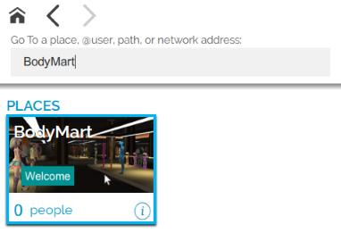
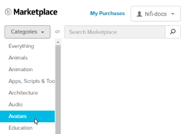
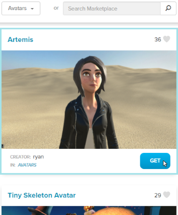
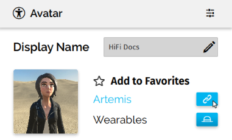

## Overview

There are a number of ways you can get a new avatar for yourself: 

* [Get a free avatar from BodyMart](#get-an-avatar-from-bodymart)
* [Get an avatar from the Marketplace](#get-an-avatar-from-the-marketplace)
* [Use your own custom avatar](#use-your-own-custom-avatar)

### Get an Avatar from BodyMart 
 
 We've designed a number of avatars that are available for your use in BodyMart. 
 
 To get an avatar from BodyMart:
 
 1. In Interface, pull up your tablet or HUD and select GoTo.
 2. Enter BodyMart as the domain address.
 3. Click on BodyMart. 
 4. Walk up to the avatar you like and grab it. You will now be wearing your new avatar. 

### Get an Avatar from the Marketplace

We and our users have designed multiple avatars that are available for your use in the Marketplace. 

To get an avatar from the Marketplace:

1. In Interface, pull up your tablet or HUD and go to Market. 
2. Search for avatars, or look for avatars under categories. 
3. You'll see a list of avatars of different designs available. Click on any one you like and hit **Get** (for free items) or **Buy** (for purchased avatars). 
4. After completing your purchase, click **Wear** to switch to your new avatar. 

### Use Your Own Custom Avatar

You can use an avatar that you created. Learn more about how you can create your avatar [here](../create-avatars).

>>>>>All avatars must be hosted in the cloud before they can be used with High Fidelity. Examples of cloud storage options include Amazon S3, Google Cloud Storage, Github, or Microsoft Azure. Alternatively, you can [add your avatar to the Marketplace](../../../marketplace/sell/add-item) to sell to other users. 

Once you have your avatar's .fst file, you can upload it. 

1. In Interface, pull up your tablet or HUD and click on Avatar. 
2. In the Avatar window, click the link icon next to your current avatar. 
3. Enter the .fst file's URL and click Confirm.
4. If you want to access this avatar later without loading the .fst file information again, you can click on "Add to Favorites" to save the current avatar information.
