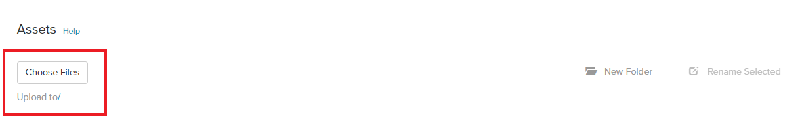
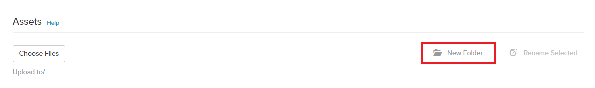
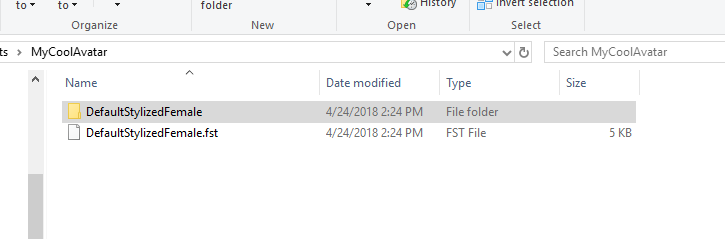
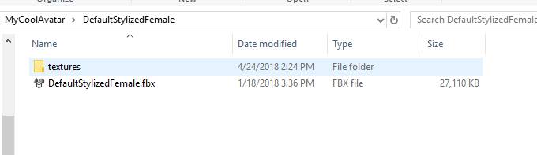
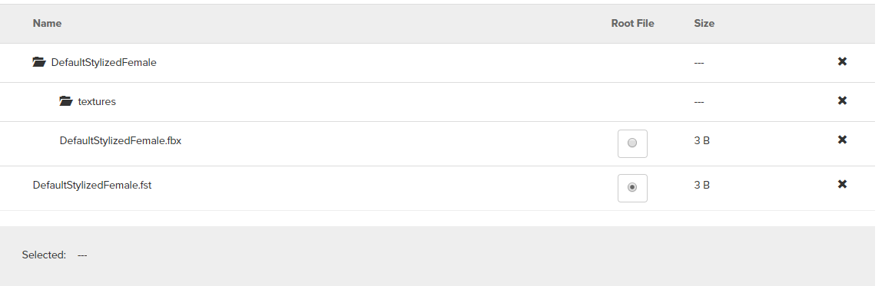
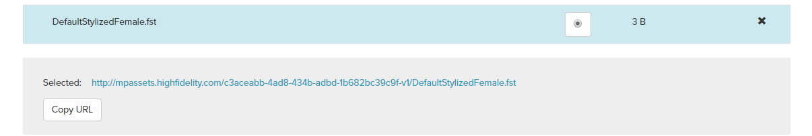
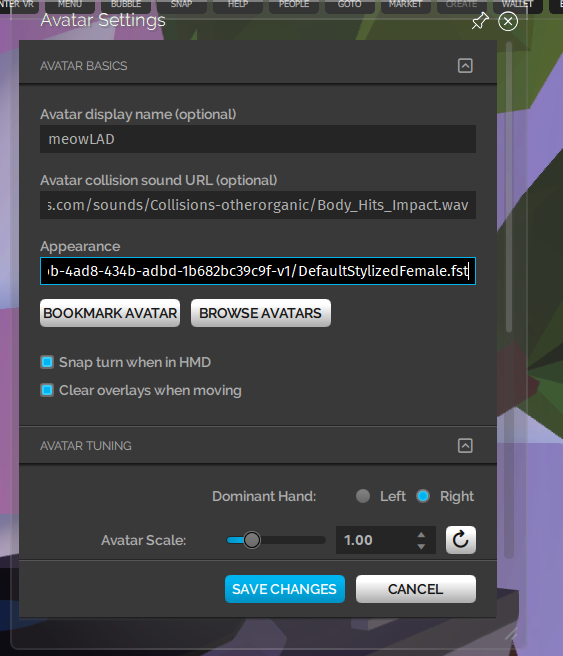

*This page will walk you through creating your own avatar using Adobe Fuse, Mixamo and Blender.*

## Overview

The steps involved in creating your avatar are:

1. Create an avatar in Adobe Fuse.
2. Rig your avatar with Mixamo
3. Make adjustments to model materials using Blender.
4. Package the model in High Fidelity for use as an avatar.

## Software Requirements

For creating your avatar, you will need to:

1. Create an [Adobe account](http://adobe.com/) and download [Adobe Fuse](https://www.adobe.com/products/fuse.html). You can also download Adobe Creative Cloud and download Fuse through the application.
2. Download and Install [Blender](https://www.blender.org/).

## Creating Your Avatar

###Video

Check out this youtube playlist to learn how you can get an avatar from the marketplace and create your own with a custom look.

[plugin:youtube](https://www.youtube.com/watch?v=6NfiH4rdVRM)

### Creating Your Avatar with Fuse

Using Adobe Fuse, you can create a custom avatar. The default heads, torsos, arms and legs in Adobe Fuse can help you start your customization.

1. Launch Adobe Fuse.
2. Pick your default body parts. Once you're done assembling the body, you can customize the avatar. For example, you can customize how the eyebrows are shaped, facial expressions, how long the fingers are and much more.
3. You can choose the clothing you'd like. You can modify these clothing options with materials and colors using the Textures tab in Adobe Fuse.
4. Save your avatar.

### Rig Your Avatar in Mixamo

Mixamo is a rigging system that will rig your model's skeleton. You can rig the avatar you created in Adobe Fuse using Mixamo. The following steps will help animate your avatar.

1. In Adobe Fuse, go to File > Animate with Mixamo.
2. Save your avatar with a name and wait while it is exported to the auto-rigger.
3. The Mixamo page that is opened will have your animated avatar. Ensure that Facial Blendshapes are **enabled** and Skeleton LOD has been set to **standard**.
4. Click **Finish**.
5. Once your avatar has been successfully rigged, click **View in My Assets**.
6. A preview screen will open up. Click **Queue Download**.
7. You'll be prompted to select the format and pose. Select Format as **fbx** and Pose as **T-Pose**. Then click **Queue Download**.
8. You'll be redirected to the Downloads view, where you can select your avatar and click **Download**.

### Modifying Materials and Textures Using Blender

You can use Blender to fix materials and change textures on your avatar.

1. Launch Blender and go to File > Import FBX and choose your avatar's fbx that you just downloaded from Mixamo.
2. From the Outliner, open the 'Armature' tree and then select the top-most item, the Body.
3. Select the Material tab.
4. Click the Specular color (set to white) and make it 100% black.
5. Repeat this step for every avatar item in the Outliner.
6. Starting at the top of the Outliner, select the top-most item in the armature and select the Texture tab.
7. Un-check any mapping to textures that have the name **Specular** and **Gloss**.
8. Repeat this step with every avatar item.

Now you can modify any part of your avatar using Blender. We've included an example below on how you can change eyelash material and texture on your avatar. You can follow similar steps for other avatar items.

**Updating Eyelash Material and Texture For Your Avatar**

1. Save [this texture](http://hifi-content.s3.amazonaws.com/DomainContent/Event%20/Images/mixamo_eyelashes.png) to a directory where you will remember.
2. Select Eyelashes from the Outliner.
3. Select the Materials tab.
4. Click the + button to the right of the material list to create a new material slot.
5. Click the '+ New' button next to the material combobox to add a new material.
6. Rename the new material to **lashes**.
7. With the Eyelashes layer selected in the outliner, and the Lashes material highlighted in the material editor, use the Tab key to go into Edit Mode.
8. Click the ‘Assign' button in the material editor.
9. Scroll down in the Material tab until you see the ‘Transparency' section. Check the Transparency box and change the ‘Alpha' value to 0.00.
10. Set the specular color for the Lashes material to black.
11. While still editing the Eyelashes, select the Texture tab.
12. Click the '+ New' button next to the texture combobox.
13. From the Image section select ‘Open' and find the lashes texture named ‘mixamo_eyelashes' you previously downloaded.
14. Check the 'Show Alpha' option in the Preview section.
15. Make sure the 'Use Alpha' option is checked in the Image/Source area.
16. Scroll down in the Texture tab to the Influence section and check the ‘Alpha’ box.
17. Click the ‘Pack texture’ option to include the texture in the model.
18. Select File/Export/FBX.
19. Change the Path Mode to ‘Copy'.
20. Select the 'Embed Textures' option next to the dropdown options that now say Copy.
21. Give the Avatar a unique name and click the Export FBX button.

### Uploading to High Fidelity

Now you can package your avatar to use it in High Fidelity.

1. Launch High Fidelity’s Interface application.
2. Go to Edit > Package Model as .fst.
3. Click ‘Browse’ under ‘Model File’ and select the FBX that you exported from Blender, then click OK.
4. On the next menu, you have the option to attach a script to the model to produce special effects. For more information about scripting, check out [this tutorial](https://docs.highfidelity.com/learn-with-us/get-started-with-scripting).
5. Click OK on the next menu to export the model.
6. Create a new folder AvatarName_Exported.
7. Select your folder and click ‘Select Folder’.
8. Your output folder should contain a .fst file and a folder with textures in it.
9. Upload your avatar to somewhere publically accessible like a [S3 Bucket](https://aws.amazon.com/s3/) or [DigitalOcean Spaces](https://www.digitalocean.com/products/spaces/)

Or, you can use the following steps to test your avatar by uploading it to the marketplace. If you're happy with the result, you can submit it for review to recieve a [PoP Certificate](https://docs.highfidelity.com/high-fidelity-commerce/basics/pop) and verify that you are the creator of the item. From there, you can either sell it on the Marketplace or use it for yourself. 

1. Go to the marketplace and [add a new item](https://highfidelity.com/marketplace/items/new).
>>> Make sure you have first [created a new high fidelity account](https://highfidelity.com/users/signup).
2. Fill out the name of your avatar for the title.
3. Save the draft.
4. To upload a file and create directories, scroll to the bottom of the page
    a. To create a new directory, choose the "New Folder" button and type in a name.  .  To create a sub-directory, choose a folder first, and then choose create a new folder.  You will see this reflected in the next prompt which asks you to name the folder.
    b. To upload a file, choose the "Choose Files" button and navigate to your newly created folder of packaged Avatar assets.  Make sure to pay attention to the status below the "Choose Files" button that tells you which folder you are uploading to.  To change the "Upload to" folder, click on one of the folders you have created using the method in the above step. 
    .
5. It's important upload your fst, fbx, and texture directory using the same folder structure as your packaged fst.  Please also make sure to match the same upper or lower case of the folder file names:

6. When you are finished with the above steps, to test your avatar, click on the .fst file and get the URL:

7. Now go back to Interface, and in the Settings > Avatar menu, paste into the Appearance field, the url you just copied above:

8. If you like the way it looks, you can submit your draft to the Marketplace!

