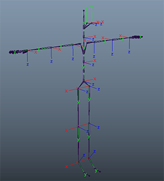

*Learn about High Fidelity's Avatars*.

## Overview

High Fidelity avatars are FBX files, with specific orientations and joints as described below. You can change your avatar by going to **Settings > Avatar > Appearance**, and specifying the URL to your avatar. 

Presently, you need to host your own avatar file somewhere, unless you are using one of the examples found in the marketplace. You can use a marketplace avatar (and also download and explore them as samples to create your own) by going to the marketplace, selecting the 'Avatars' category, and choosing one.

## Reference Pose

>>>>> You can download the standard High Fidelity skeleton [here](http://hifi-content.s3.amazonaws.com/Examples%20Content/skeleton/standard_hifi_skeleton.fbx).
You can also rig to our standards using [Mixamo](https://www.mixamo.com/)

For the Reference pose, we propose a TPose which complies with the specifications below. You may wish to refer to the properly configured example avatar fbx with source files.

- The character must face along the positive direction of the Z-axis.
- The arms must be spread along the X-axis. The left arm should therefore be pointing along the positive direction of the X-axis.
- The top of the character's head must be up, in the positive direction of the Y-axis.
- The character's hands are flat, palms facing the ground, with the thumbs parallel to the X axis.
- The character's feet need to be perpendicular to the legs (with the toes pointing along the Z-axis as shown). The feet must not be rotated around the Y-axis (meaning the toes of the left foot should not point inward toward the right leg or outward away from the right leg).

## Joints

### Joint conventions

- A joint has a "translation" and a "rotation" relative to its parent. The length of the translation vector defines the length of the parent bone. The translation and rotation define the base/origin of the joint.
- The local rotation axis specifies the orientation of the joint's local axis. It lets you specify the primary local axis for the joint which is the axis that points down the bone and that extends from the joint. High Fidelity expects Y down the bone.
- The joint's orientation is the joint's default values when in the reference pose. In Maya, the orientation value is a combination of the joint's "Rotation" value and the joint's "Orientation" value.
- Key frame animations define changes in the joint rotation over time, relative to the "reference pose" (which expresses the zero rotation (by convention) at which the mesh vertices are captured).
- Joints may have "constraints" on changes to their rotation. Regardless of constraint, limbs and extremities are loosely described as having a principle "hinge" axis about which most animations occur. The hinge are important for the IK systemJoint's.
- When you keyframe an object's rotations, Maya calculates the object's orientations between keys by interpolating the rotation values from one key to the next. In Maya, there are two methods of rotation interpolation: Euler and Quaternion. For each animated rotation in your scene, you can specify a rotation interpolation method. The rotation interpolation method you choose for an animated object determines how Maya calculates its rotations.

### Joint Rotation Axis

- +y going down the bone.
- +z going forward on spine and legs, down on arms/hands and up on feet.
- Forearm joints hinge primarily around the z-axis. The other arm and hand joints hinge primarily around the x-axis. (Typically positive angles during animation everywhere except the avatar's right elbow).
- Leg joints hinge around x-axis. (Typically negative angles during animation).
- In Maya: joint rotations can be zero & joint orientations can be non-zero.
- In Blender the joint rotation values can be non-zero.
- For the hand and related controller animation, make sure the middle finger is the first joint in the list of finger joints.

### Default Joint Orientation Values

- Hips = 0,0,0
- Spine = 0,0,0
- Spine1 = 0,0,0
- Spine2 = 0,0,0
- Neck = 0,0,0
- Head = 0,0,0
- HeadTop_End = 0,0,0
- RightEye = 0,0,0
- LeftEye = 0,0,0
- LeftShoulder = 90,90,0
- LeftArm = 0,0,0
- LeftForeArm = 0,0,0
- LeftHand = 0,0,0
- LeftHandMiddle1 = 0,0,0
- LeftHandMiddle2 = 0,0,0
- LeftHandMiddle3 = 0,0,0
- LeftHandMiddle4 = 0,0,0
- LeftHandThumb1 = 0,0,0
- LeftHandThumb2 = 0,0,0
- LeftHandThumb3 = 0,0,0
- LeftHandThumb4 = 0,0,0
- LeftHandIndex1 = -0.07161852612,-0.07161852612,-0.07161852612
- LeftHandIndex2 = 0.0714482688,0.0714482688,0.0714482688
- LeftHandIndex3 = 0,0,0
- LeftHandIndex4 = 0,0,0
- LeftHandRing1 = 0,0,0
- LeftHandRing2 = 0,0,0
- LeftHandRing3 = 0,0,0
- LeftHandRing4 = 0,0,0
- LeftHandPinky1 = 0,0,0
- LeftHandPinky2 = 0,0,0
- LeftHandPinky3 = 0,0,0
- LeftHandPinky4 = 0,0,0
- RightShoulder = 90,-90,0
- RightArm = 0,0,0
- RightForeArm = 0,0,0
- RightHand = 0,0,0
- RightHandMiddle1 = 0,0,0
- RightHandMiddle2 = 0,0,0
- RightHandMiddle3 = 0,0,0
- RightHandMiddle4 = 0,0,0
- RightHandPinky1 = 0,0,0
- RightHandPinky2 = 0,0,0
- RightHandPinky3 = 0,0,0
- RightHandPinky4 = 0,0,0
- RightHandRing1 = 0,0,0
- RightHandRing2 = 0,0,0
- RightHandRing3 = 0,0,0
- RightHandRing4 = 0,0,0
- RightHandIndex1 = 0,0,0
- RightHandIndex2 = 0,0,0
- RightHandIndex3 = 0,0,0
- RightHandIndex4 = 0,0,0
- RightHandThumb1 = 0,0,0
- RightHandThumb2 = 0,0,0
- RightHandThumb3 = 0,0,0
- RightHandThumb4 = 0,0,0
- LeftUpLeg = 0,0,0
- LeftLeg = 0,0,0
- LeftFoot = 51.39617927,0,0
- LeftToeBase = 38.19675833,0,0
- LeftToe_End = 0,0,0
- RightUpLeg = 0,0,0
- RightLeg = 0,0,0
- RightFoot = 51.4549916,0,0
- RightToeBase = 38.19938444,0,0
- RightToe_End = 0,0,0

## Look-at Vectors

The look-at vectors are driven by the z-vector of the eye joints.

The +z axis of the eye joints should go through the center of the pupil, and should continue to do so as the eye joint is rotated.

The eye joints are defined in the FST.

## FK/IK

Currently, we rig the skeleton as an FK rig. In parallel, we are implementing IK techniques for realtime puppeteering.

- For best results when using a Head Mounted Display (HMD), the avatar's height should match that of the user.
- For best results when using a hand controller, the arm length should approximately match that of the user.

## Skinning

- The rig can support smooth skinning, rigged bind or parent constraints.
- You can smooth bind the skin with up to 4 max influences on each vertex.
- We support a single body mesh or multiple meshes for things such as clothing.

## Blendshapes

High Fidelity uses Blendshapes to animate your avatar's face. Blendshapes allow you to specify a new state for your avatar's mesh, and facial positions are animated by moving between the different states of your avatar's expressions. We currently have 2 techniques for driving blendshapes and a third using BinaryVR is in development:

1. DDE and a 2D camera.
2. Audio signal.

For the audio drive solution, we're targeting a phoneme based system that triggers 4 mouth and 2 eye shapes.

- Eye: blink & brow up.
- Mouth: m, o, ah & e.

Blendshape behaviors are defined in your avatar's FST file, and are added to the avatar mesh using a 3D modeling tool like Blender (Shape Keys) or Maya. Adobe's Fuse program and Mixamo pipeline allow you to export blendshapes as part of your FBX, but if you are modeling an avatar from scratch, you will likely need to specify your own facial expressions.

High Fidelity avatars support a number of blendshapes for creating different facial expressions, but the primary ones are:

- EyeBlink_L (left eye blink).
- EyeBlink_R (right eye blink).
- Jaw_Open (open jaw).

Defining more specific blendshapes on your avatar allows your avatar to mimic a wider range of facial expressions. The full list of constants is defined [on GitHub in FaceshiftConstants.cpp.](https://github.com/highfidelity/hifi/blob/master/libraries/shared/src/FaceshiftConstants.cpp)

Once you have added blendshapes to your avatar, you can specify different movements in your avatar's FST file with the following format:

`bs = <blendshape constant> = <your key/blendshape name> = <value for movement, between 0 and 1>`

An example for adding a blendshapes to your FST for an avatar to make them blink (close eyes all the way):

`bs = EyeBlink_L = BlinkLeft = 1`

`bs = EyeBlink_R = BlinkRight = 1`

To view the default blendshapes for the default Being of Light avatar, open the defaultAvatar_full file located in your High Fidelity folder under **resources > meshes**.

## Other Important Points

* Your avatar should be able to make a fist when the user presses the grip button (also other finger compatibility with the Touch and the future knuckle controllers). 
* Your avtar should have clothes included in the mesh to avoid "naked" moments. 
* Remove unused blendshapes or unseen triangles to keep size down.
* Your maximum texture limit should be 1024x1024.
* Average polycount limit: 25k

## Joint Hierarchy and Naming

- Hips
  - Spine
    - Spine1
      - Spine2
        - Neck
          - Head
            - HeadTop_End
        - LeftShoulder
          - LeftArm
            - LeftForeArm
              - LeftHand
                - LeftHandThumb1
                - LeftHandThumb2
                - LeftHandThumb3
                - LeftHandThumb4
                - LeftHandIndex1
                - LeftHandIndex2
                - LeftHandIndex3
                - LeftHandIndex4
                - LeftHandMiddle1
                - LeftHandMiddle2
                - LeftHandMiddle3
                - LeftHandMiddle4
                - LeftHandRing1
                - LeftHandRing2
                - LeftHandRing3
                - LeftHandRing4
                - LeftHandPinky1
                - LeftHandPinky2
                - LeftHandPinky3
                - LeftHandPinky4
        - RightShoulder
          - RightArm
            - RightForeArm
              - RightHand
                - RightHandThumb1
                - RightHandThumb2
                - RightHandThumb3
                - RightHandThumb4
                - RightHandIndex1
                - RightHandIndex2
                - RightHandIndex3
                - RightHandIndex4
                - RightHandMiddle1
                - RightHandMiddle2
                - RightHandMiddle3
                - RightHandMiddle4
                - RightHandRing1
                - RightHandRing2
                - RightHandRing3
                - RightHandRing4
                - RightHandPinky1
                - RightHandPinky2
                - RightHandPinky3
                - RightHandPinky4
  - LeftUpLeg
    - LeftLeg
      - LeftFoot
        - LeftToeBase
          - LeftToe_End
  - RightUpLeg
    - RightLeg
      - RightFoot
        - RightToeBase
          - RightToe_End

