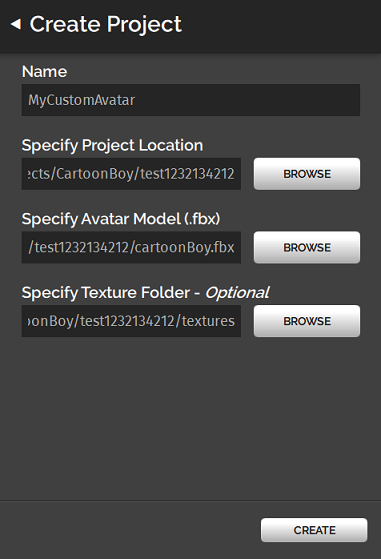

## Overview

The steps involved in creating your avatar are:

1. Create an avatar with 3D character modeling tool such as Adobe Fuse. Alternatively, you can download an avatar for use from an external source such as TurboSquid or CGTrader.
2. Rig and animate your avatar with an animation tool such as Mixamo. If your avatar is already rigged, you can skip this step.
3. Fine tune your avatar using a tool such as Blender or Maya. (*Optional*)
4. Package the model in High Fidelity for use as an avatar.

>>>>>You do not need to design an avatar using Adobe Fuse. You can also download avatars for use from other external sources such as TurboSquid or CGTrader. If you get an avatar from somewhere else, use the [High Fidelity Avatar Exporter for Unity](/unity-extension) to map the avatar's skeleton and package it for use with High Fidelity.

Check out [this YouTube playlist](https://www.youtube.com/playlist?list=PLoe9GsfO1mjlIQh0kSBm5tmjtN4MwxOTM) for one way to create and customize your own avatar. Here, we use Adobe Fuse to create our avatar, Mixamo to rig our avatar automatically, and Blender to adjust the rendering on our avatar. We also have written instructions on the same process: 

* [Create an Avatar with Fuse](fuse-tutorial)
* [Rig Your Avatar in Mixamo](mixamo-tutorial)
* [Modify Materials and Textures Using Blender](blender-tutorial)

### Package Your Avatar in High Fidelity 

Once you've created your custom avatar, you can package it for use in High Fidelity. 

1. In Interface, go to **Edit > Avatar Packager**. 
2. In the Avatar Packager window that opens, click 'New Project'. If you've previously packaged your avatar and would only like to update it with the latest changes you've made, click 'Open Project'.
3. In the **Create Project** window, fill in the following details:
   1. Name: The name you want for your avatar. 
   2. Project Location: The folder path you choose to save your packaged avatar's files. 
   3. Avatar Model: Your avatar's FBX file.
   4. Texture Folder: If your avatar has textures in a separate folder, specify the folder location. If your avatar's textures are embedded in the FBX, you do not need to specify anything.  
>>>>> Your textures folder should be in your project folder and should not be compressed. You can also use folders within your textures folder as long as your FBX file refers to the one you wish to use.
4. Click 'Create'.
5. Click 'Upload' to upload your avatar's files to High Fidelity's servers. 
>>>>> If you make any changes to your custom avatar later, you will need to update it through this packager to see your changes. To update, select your project and click Open Project in step 1. Choose the project you wish to update, and go through the same steps to update your avatar. 
6. Once your avatar is uploaded to the servers, click 'View in Inventory' to view your custom avatar. 
7. Click Wear to try out your new avatar! 
8. You can view your avatar in the Marketplace. It is currently in Draft mode.

You will need to submit it for review to [make your avatar available for purchase on the Marketplace](../../../marketplace/sell/add-item#add-your-avatar).