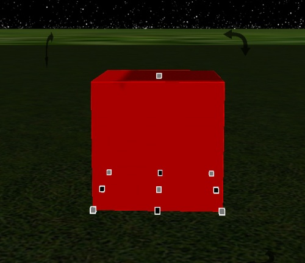
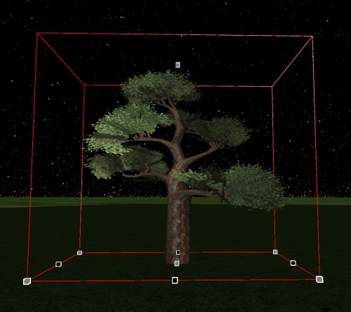
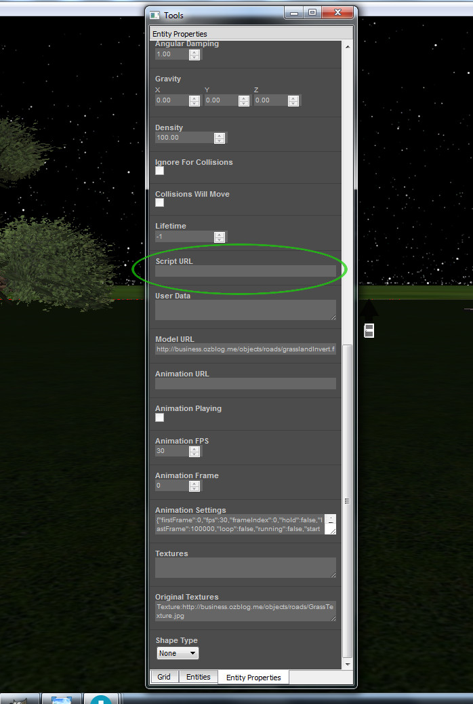

*Learn how to create avatar-entity interactions.*

## Overview

Entities register mouse clicks, hovers, collision by other entities and interactions by Avatars.

We will be dealing with the interactions by Avatars. When an avatar comes in contact with an entity, it enters the bounds of that entity and will trigger **Entities.enterEntity()**, and when the avatar leaves the bounds of the entity it triggers **Entities.leaveEntity()**, so we have two new states to play with.

## Entity Bounding Box

The bounding box (or bounds) is the frame that is around the outside of the entity, in the case of a simple box the bounds are the exact size and shape of the entity.




But in the case of more complex mesh objects the bounds might be much larger than the actual mesh model. So you must take this into account when working out where the bounding box of the entity extends to, until High Fidelity has full mesh collision layers.

*Entities.enterEntity() occurs when the avatar contacts the bounding box, not the model.*



## Creating an Interaction When an Avatar Touches an Entity

The following script uses **Entities.enterEntity** function to trigger something when an avatar comes into contact with the bounds of an object.

- Start by creating a simple box entity by clicking the box icon on the entities panel.

- Move back a bit so you can see the red box.

- Click the power button at the top of the entiy icons panel.

- Now click the box to select it.

- Click the Entity Properties tab at the bottom of the entities window to open the properties.

- Reset the size by clicking **Reset to Natural Dimensions**.

- Scroll down the entity properties panel until you find Script URL


  

- Copy the following script and paste it into the Script URL and hit return.

```
 1 (function(){
 2 function change(entityID) {
 3     Entities.editEntity(entityID, { angularDamping: 0});
 4     Entities.editEntity(entityID, { angularVelocity: { x: 0, y: 60, z: 0} });
 5     Entities.editEntity(entityID, { color: { red: 255, green: 100, blue: 220} });
 6 }
 7 this.enterEntity = function(entityID) {
 8     print(\"enterEntity(\"+entityID.id+\")\");
 9     change(entityID);
10 };
11 this.leaveEntity = function(entityID) {
12     print(\"leaveEntity(\"+entityID.id+\")\");
13     Entities.editEntity(entityID, { angularDamping: 0.5});
14     Entities.editEntity(entityID, { color: { red: 255, green: 190, blue: 20} });
15 };
16 })

```

- Now click the power off button for Entities.

As you move your avatar close to the entity it will respond on contact. The entity will change to a pink color and start turning slowly. It will continue while you are within the bounds of the entity.

Move your avatar back a bit and as soon as your avatar is outside the bounds it will change to a yellow color and slow down to stop spinning.

A full range of entity parameters are controllable with these functions, entities can be used as invisible sensors or expanded to cover an entire building with the functions running while you are inside, and stop when you walk out.