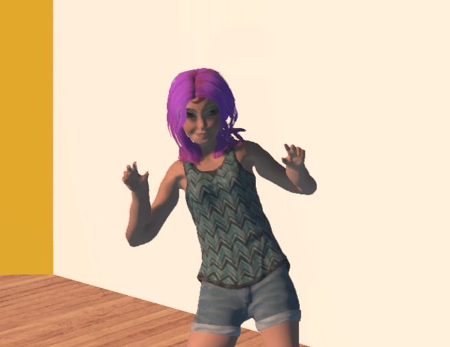

## Overview

No matter how you [created your custom avatar](../), you must convert your FBX model to FST before using that avatar in High Fidelity. This process is called *packaging your avatar*.

### Generate an FST File
High Fidelity provides a built-in tool that will create an FST file that will animate our avatar in VR. 

1. In Interface, go to Edit > Package Model as fst.
2. Click Browse and locate the FBX file for your avatar. Click OK. 
3. The Set Model Properties window lets you map the FBX properties with everything that High Fidelity needs to know to create your avatar. If you use Mixamo, these will be set automatically for you and you do not need to make any changes. Here, you can also attach external textures or scripts to your avatar. Click OK.
>>>>>Scripts let you produce special effects for your avatars. For more information, check out [Get Started with Scripting](https://docs.highfidelity.com/learn-with-us/get-started-with-scripting).
4. Browse to the folder where you want to save your avatar files. We recommend creating a new directory for each avatar. 

At this point, your avatar has been created! After hosting the avatar in the cloud or the Marketplace, [switch to it](../change-avatar#use-your-own-custom-avatar) and adopt your new look. 
