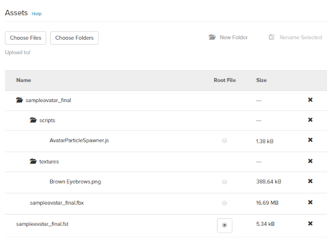

## Overview
Before you can use a custom avatar, you must first host its FST and FBX files in a place that is publicly accessible to High Fidelity.  You can use any cloud platforms including Amazon S3, Google Cloud Storage, Microsoft Azure, Dropbox, etc. If you don't have any other place to host it, you can host your avatar for free on the Marketplace even if you do not intend to sell your avatar to others.

If you have not yet done so, make sure that you have [packaged your model](../package-avatar) prior to hosting it, so that it can be used in High Fidelity. 

## Host Your Avatar On The Marketplace

You can host your avatar for free using the Marketplace. The Marketplace contains a file system which you can use privately, without showing or selling your avatar. To do so, you'll need to upload your avatar files and keep the submission in Draft mode.

1. Go to [https://highfidelity.com/marketplace/items/new](https://highfidelity.com/marketplace/items/new) to create a new item. If you're not logged in, you will be prompted to do so.
2. Enter a name for your avatar.
3. Under Categories, select 'Avatars'.
4. Click 'Save Draft'.
5. Scroll down to the Assets section. 
6. Click 'Choose Files' and navigate to where your avatar is saved on your computer. Select your FST file, click 'Open' and wait for it to upload.
7. In the Assets section, click 'New Folder'. 
8. Give the folder the same name as your fst file name. For example, if your avatar's FST file is `artemis-v3.fst`, then your folder name should be `artemis-v3`. Click 'OK'.
9. Click on the folder you just created. 
10. Click 'Choose Folder' and navigate to where your avatar is saved on your computer. Select the folder for your avatar, click 'Upload' twice and wait for it to upload.
11. Scroll back to the top of the page and click 'Save Draft'. 

>>>>>Do not click "Submit for Review" unless you wish to sell your avatar on the Marketplace.

To locate the URL for your avatar:
1. Go to [https://highfidelity.com/marketplace](https://highfidelity.com/marketplace). If you're not logged in, you will be prompted to do so.
2. Click on your user name, then on 'My Items'.
3. Locate your avatar in Draft mode and click on it. 
4. Click 'Edit'.
5. Scroll down to the Assets section.
6. Click on the FST file. Below it, click the 'Copy URL' button.

This is the URL you will use when you [change your avatar](../change-avatar) in High Fidelity.