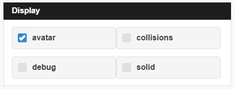
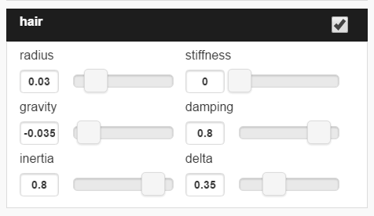
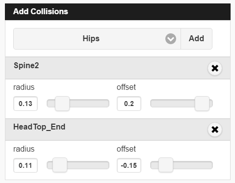
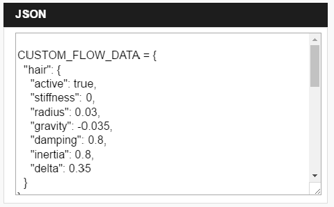

## Overview
You can simulate physics on your avatar's hair, clothes, and body parts with a little bit of scripting and the help of High Fidelity's [**Flow**](https://hifi-content.s3.amazonaws.com/luis/flowFiles/flow.js) script technology.

The Flow script simply mimics the natural movement of hair and other attachments on your avatar. You can manipulate and change how Flow interacts with your avatar using the [**Flow App**](https://hifi-content.s3.amazonaws.com/luis/flowFiles/flowApp.js). In order to use the Flow App, your avatar must contain flow threads. A **Flow Thread** is a set of threads with at least one joint that comply with the following rules:
1.  The first joint is connected to an existing avatar joint (“Hips” for example).
2.  Every “Flow Joint” should be named **flow\_[TYPE]\_[INDEX]**.
    * **TYPE** defines a group of joints that share a common physics setup and **INDEX** is an integer. For example, if the thread is used to simulate a skirt, all the “skirt” joints should be named flow_skirt_01, flow_skirt_02, etc.
3. There is added support for SIM joints using **sim[TYPE][INDEX]**


### Flow App
After you ensure that you have the proper flow threads, run the [**Flow app**](https://hifi-content.s3.amazonaws.com/luis/flowFiles/flowApp.js) to enable flow for your avatar. 

!!! See [**this document**](https://docs.highfidelity.com/create-and-explore/all-about-scripting/run-scripts) for more information on how to run a script or app in High Fidelity.

Below are details and descriptions of the Flow app's functionality that will help you control and manipulate your avatar's flow. 

#### Display Panel
##### This panel helps visually debug your Flow script. 

* **Avatar**: This setting will hide or display the avatar mesh.
* **Collisions**: This option allows you to activate or deactivate collisions.
* **Debug**: Debug will either display or hide the debug shapes.
* **Solid**: The Solid feature will enable either a solid or wireframe display for debug shapes.

#### Joints Panel
##### This panel manages all motion related to joints. 

- **Radius**: The Radius determines the thickness of segments and knots (needed for collision testing).
- **Gravity**: This sets the Y-value of the gravity vector which represents the direction of gravity as it relates the flow thread.
- **Stiffness**: Use the Stiffness option to change how stiff each thread is.
- **Damping**: Damping helps you determine the amount of joint oscillation.
- **Inertia**: The Inertia control will change the rotational velocity.
- **Delta**: Delta controls the time between each integration step. 

#### Collisions Panel
##### This panel manages collision spheres.
Every collision sphere is positioned using an existing avatar joint and offset.

- **Radius**: This option will control the collision sphere radius.
- **Offset**: Use the Offset option to change the Y-value of the offset vector along the joint.

*The maximum amount of collisions is defined by the global COLLISION_SHAPES_LIMIT = 4.*

#### JSON Panel
##### This panel displays the output data structure with your avatar's flow configuration. 


This data can be copied and pasted into the [**Flow**](https://hifi-content.s3.amazonaws.com/luis/flowFiles/flow.js) script between the lines:
```javascript
// CUSTOM DATA STARTS HERE
 
Erase existing code and paste new code here

// CUSTOM DATA ENDS HERE
```
You can now run the modified **Flow** script to see your work in action. 

#### Avatar Examples
[This is a list of avatars](https://hifi-content.s3.amazonaws.com/jimi/avatar/Mannequin/hairTest/mannequinHairTest8.fst) rigged appropriately to use with **Flow**.


