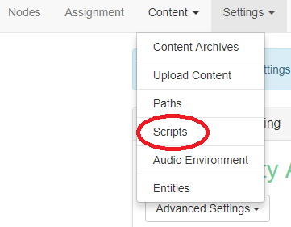
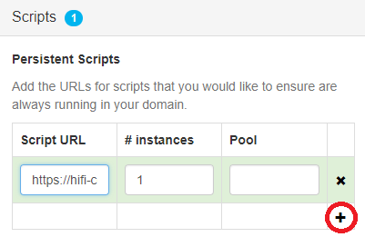

## Overview
Assignment Client (AC) scripts are scripts that run persistently in a domain and aren't affected by other scripts. For example, in order to add rain or a friendly greeter to your domain, you would need to run a script on an [Assignment Client](https://docs.highfidelity.com/get-started/what-is-high-fidelity/architecture#functions-of-the-assignment-clients) so that it would continue to execute as long as your Sandbox is running, even when you're not in High Fidelity. 

## Assignment Client Scripts
 Assignment Client (AC) scripts can be run in your domain or any domain where you have the appropriate permissions. Because AC scripts run on an assignment client that executes separately from the Interface, the script will continue to run until you either remove the script from the domain or you shut down the domain (Sandbox) entirely. 

 >>>>> AC scripts require specific functionality before they can access certain entities in the domain. High Fidelity has a robust set of [APIs](https://docs.highfidelity.com/api-reference) to help you create your own AC scripts.

Below is an example of an Assignment Client script that counts the number of entities found in a domain using High Fidelity’s [EntityViewer API](https://docs.highfidelity.com/api-reference/namespaces/entityviewer).

```javascript
var SEARCH_CENTER = {x: 0, y: -10, z: 0};
var SEARCH_RADIUS = 100;

var isInitialized = false;
var timeout = 1000;

var update = function(deltaTime) {
    if (!isInitialized) {
        if (Entities.serversExist() && Entities.canRez()) {
            EntityViewer.setPosition(SEARCH_CENTER);
            EntityViewer.setCenterRadius(SEARCH_RADIUS);
            EntityViewer.queryOctree();

            Script.setTimeout(function(){
                var foundEntities = Entities.findEntities(SEARCH_CENTER, SEARCH_RADIUS).length;

                print("AC Script found: " + foundEntities + " entities within " + SEARCH_RADIUS + "m of " + JSON.stringify(SEARCH_CENTER));
    
            }, timeout);
         
            isInitialized = true;
            Script.update.disconnect(update);
        }
    }
};

Script.update.connect(update);
```

## How to Add an Assignment Client Script
 Once you've written and hosted your script, you need to add it to a domain, either your own or one where you have permissions to run an AC script.

1. In your browser, go to: **[http://localhost:40100](http://localhost:40100)**
2. From the homepage, go to Content > Scripts.
3. Under the **Persistent Scripts** section, press **+** then paste the URL to your script under **Script URL**. 
4. Finally, click **Press and Restart** in the upper right corner of the screen. 

Now, every time you enter that domain, the AC script will be running.
