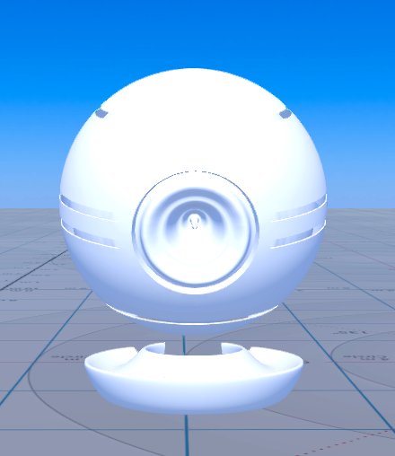
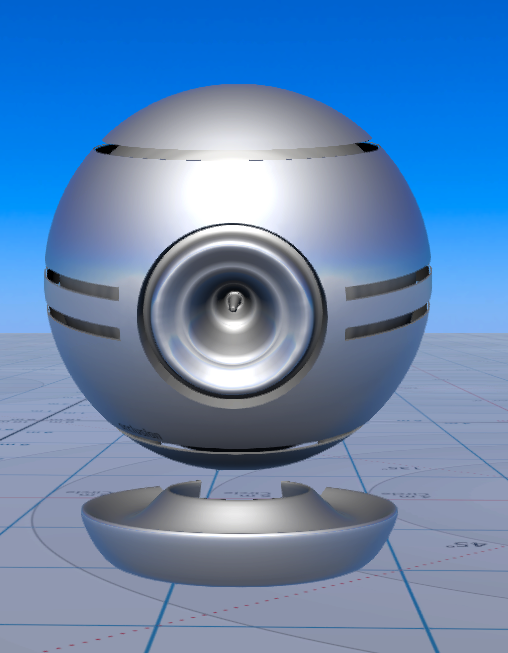
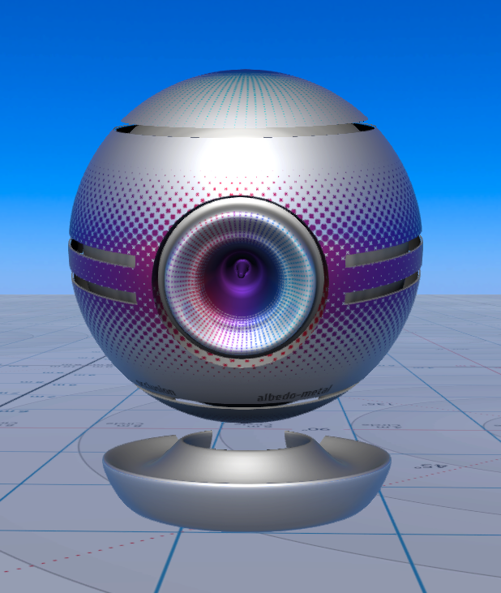
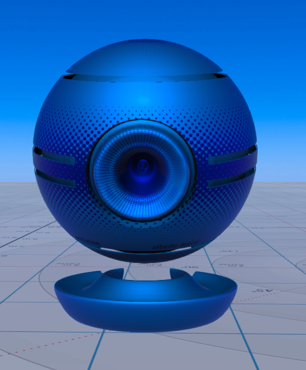
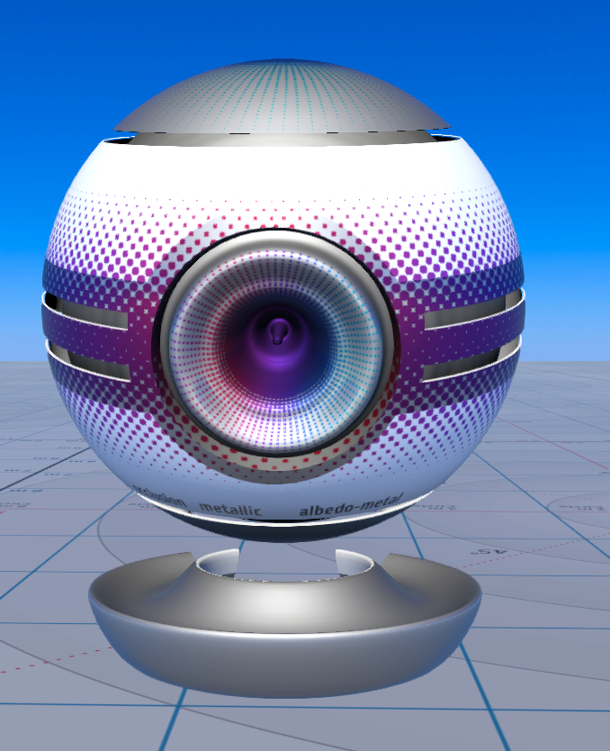
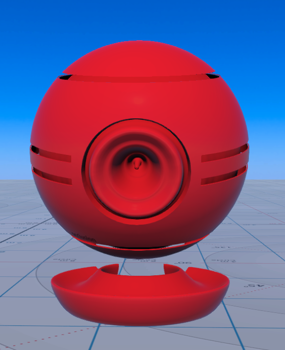
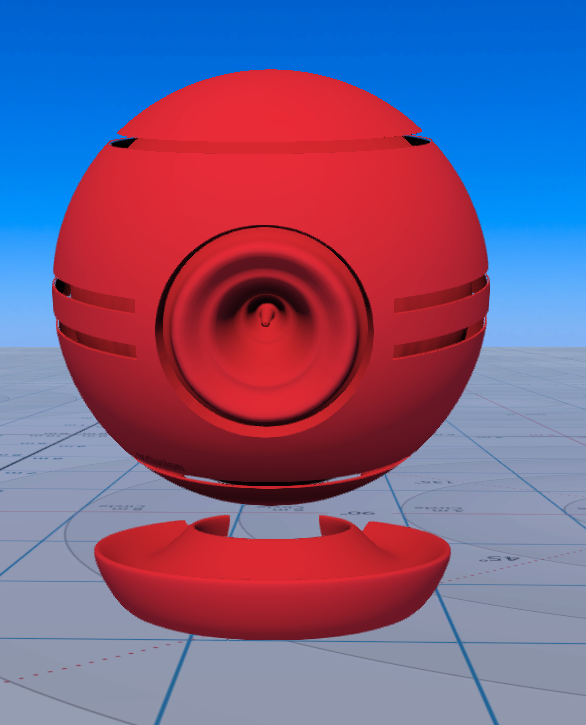
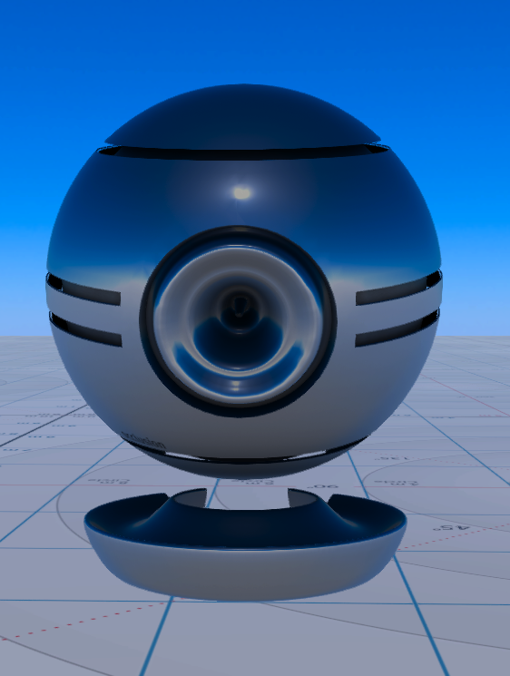
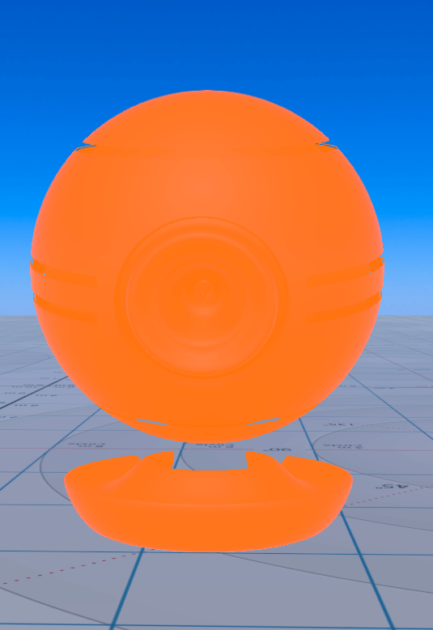
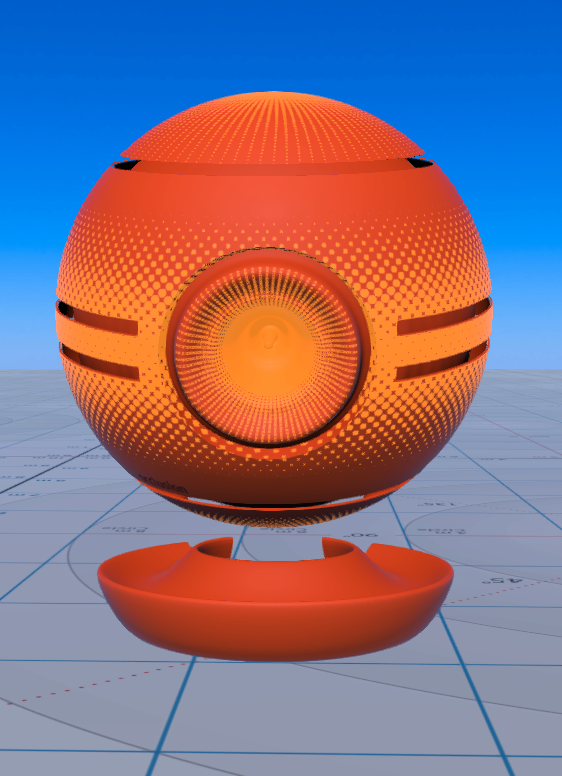

##PBR Materials Guide for High Fidelity

The following table details the different types of materials High Fidelity supports and the properties of those materials. The properties are determined by the value or map of material channels.

>>>>> We don't support TGA files yet. You can use PNG files as they work best with High Fidelity. 

| Material Type                   | Model File Name                          | Model Image                    | Channel Value or Map               |
| ------------------------------- | ---------------------------------------- | ------------------------------ | ---------------------------------- |
| Default                         | [hifi.fbx](https://github.com/highfidelity/hifi_tests/blob/master/assets/models/material_matrix_models/fbx/blender/hifi.fbx?raw=true) |              | Check channel details [here](#t1)  |
| Occlusion Map                   | [hifi_ao.fbx](https://github.com/highfidelity/hifi_tests/blob/master/assets/models/material_matrix_models/fbx/blender/hifi-ao.fbx?raw=true) |               | Check channel details [here](#t2)  |
| Albedo Value                    | [hifi_albedoV_ao.fbx](https://github.com/highfidelity/hifi_tests/blob/master/assets/models/material_matrix_models/fbx/blender/hifi_albedoV_ao.fbx?raw=true) |                | Check channel details [here](#t3)  |
| Albedo Map                      | [hifi_albedoM_ao.fbx](https://github.com/highfidelity/hifi_tests/blob/master/assets/models/material_matrix_models/fbx/blender/hifi_albedoM_ao.fbx?raw=true) |                | Check channel details [here](#t4)  |
| Albedo Value Blend Map          | [hifi_albedoVM_ao.fbx](https://github.com/highfidelity/hifi_tests/blob/master/assets/models/material_matrix_models/fbx/blender/hifi_albedoVM_ao.fbx?raw=true) |               | Check channel details [here](#t5)  |
| Metallic Albedo Value           | [hifi_metallicV_albedoV_ao.fbx](https://github.com/highfidelity/hifi_tests/blob/master/assets/models/material_matrix_models/fbx/blender/hifi_metallicV_albedoV_ao.fbx?raw=true) |            | Check channel details [here](#t6)  |
| Metallic Albedo Map             | [hifi_metallicV_albedoM_ao.fbx](https://github.com/highfidelity/hifi_tests/blob/master/assets/models/material_matrix_models/fbx/blender/hifi_metallicV_albedoM_ao.fbx?raw=true) |            | Check channel details [here](#t7)  |
| Metallic Albedo Value Blend Map | [hifi_metallicV_albedoVM_ao.fbx](https://github.com/highfidelity/hifi_tests/blob/master/assets/models/material_matrix_models/fbx/blender/hifi_metallicV_albedoVM_ao.fbx?raw=true) |           | Check channel details [here](#t8)  |
| Metallic Map Albedo Value       | [hifi_metallicM_albedoV_ao.fbx](https://github.com/highfidelity/hifi_tests/blob/master/assets/models/material_matrix_models/fbx/blender/hifi_metallicM_albedoV_ao.fbx?raw=true) |            | Check channel details [here](#t9)  |
| Metallic Map Albedo Map         | [hifi_metallicM_albedoM_ao.fbx](https://github.com/highfidelity/hifi_tests/blob/master/assets/models/material_matrix_models/fbx/blender/hifi_metallicM_albedoM_ao.fbx?raw=true) |           | Check channel details [here](#t10) |
| Roughness Value Ramp            | [hifi_roughnessV00_albedoV_ao.fbx](https://github.com/highfidelity/hifi_tests/blob/master/assets/models/material_matrix_models/fbx/blender/hifi_roughnessV00_albedoV_ao.fbx?raw=true) |        | Check channel details [here](#t11) |
| Roughness Value Ramp            | [hifi_roughnessV25_albedoV_ao.fbx](https://github.com/highfidelity/hifi_tests/blob/master/assets/models/material_matrix_models/fbx/blender/hifi_roughnessV25_albedoV_ao.fbx?raw=true) |        | Check channel details [here](#t12) |
| Roughness Value Ramp            | [hifi_roughnessV50_albedoV_ao.fbx](https://github.com/highfidelity/hifi_tests/blob/master/assets/models/material_matrix_models/fbx/blender/hifi_roughnessV50_albedoV_ao.fbx?raw=true) |        | Check channel details [here](#t13) |
| Roughness Value Ramp            | [hifi_roughnessV75_albedoV_ao.fbx](https://github.com/highfidelity/hifi_tests/blob/master/assets/models/material_matrix_models/fbx/blender/hifi_roughnessV75_albedoV_ao.fbx?raw=true) |        | Check channel details [here](#t14) |
| Roughness Value Ramp            | [hifi_roughnessV100_albedoV_ao.fbx](https://github.com/highfidelity/hifi_tests/blob/master/assets/models/material_matrix_models/fbx/blender/hifi_roughnessV100_albedoV_ao.fbx?raw=true) |       | Check channel details [here](#t15) |
| Metallic Roughness Value Ramp   | [hifi_roughnessV00_metallicV_albedoV_ao.fbx](https://github.com/highfidelity/hifi_tests/blob/master/assets/models/material_matrix_models/fbx/blender/hifi_roughnessV00_metallicV_albedoV_ao.fbx?raw=true) |   | Check channel details [here](#t16) |
| Metallic Roughness Value Ramp   | [hifi_roughnessV25_metallicV_albedoV_ao.fbx](https://github.com/highfidelity/hifi_tests/blob/master/assets/models/material_matrix_models/fbx/blender/hifi_roughnessV25_metallicV_albedoV_ao.fbx?raw=true) |   | Check channel details [here](#t17) |
| Metallic Roughness Value Ramp   | [hifi_roughnessV50_metallicV_albedoV_ao.fbx](https://github.com/highfidelity/hifi_tests/blob/master/assets/models/material_matrix_models/fbx/blender/hifi_roughnessV50_metallicV_albedoV_ao.fbx?raw=true) |   | Check channel details [here](#t18) |
| Metallic Roughness Value Ramp   | [hifi_roughnessV75_metallicV_albedoV_ao.fbx](https://github.com/highfidelity/hifi_tests/blob/master/assets/models/material_matrix_models/fbx/blender/hifi_roughnessV75_metallicV_albedoV_ao.fbx?raw=true) |   | Check channel details [here](#t19) |
| Metallic Roughness Value Ramp   | [hifi_roughnessV100_metallicV_albedoV_ao.fbx](https://github.com/highfidelity/hifi_tests/blob/master/assets/models/material_matrix_models/fbx/blender/hifi_roughnessV100_metallicV_albedoV_ao.fbx?raw=true) |  | Check channel details [here](#t20) |
| Roughness Map                   | [hifi_roughnessM_albedoV_ao.fbx](https://github.com/highfidelity/hifi_tests/blob/master/assets/models/material_matrix_models/fbx/blender/hifi_roughnessM_albedoV_ao.fbx?raw=true) |          | Check channel details [here](#t21) |
| Metallic Roughness Map          | [hifi_roughnessM_metallicV_albedoV_ao.fbx](https://github.com/highfidelity/hifi_tests/blob/master/assets/models/material_matrix_models/fbx/blender/hifi_roughnessM_metallicV_albedoV_ao.fbx?raw=true) |     | Check channel details [here](#t22) |
| Normal Map                      | [hifi_normalM_albedoV_ao.fbx](https://github.com/highfidelity/hifi_tests/blob/master/assets/models/material_matrix_models/fbx/blender/hifi_normalM_albedoV_ao.fbx?raw=true) |           | Check channel details [here](#t23) |
| Bump Map                        | [hifi_normalB_albedoV_ao.fbx]()          |                           | Check channel details [here](#t24) |
| Metallic Normal Map             | [hifi_normalM_metallicV_albedoV_ao.fbx](https://github.com/highfidelity/hifi_tests/blob/master/assets/models/material_matrix_models/fbx/blender/hifi_normalM_metallicV_albedoV_ao.fbx?raw=true) |      | Check channel details [here](#t25) |
| Metallic Bump Map               | [hifi_normalB_metallicV_albedoV_ao.fbx]() |                           | Check channel details [here](#t26) |
| Emissive Value                  | [hifi_emissiveV_albedoV_ao.fbx](https://github.com/highfidelity/hifi_tests/blob/master/assets/models/material_matrix_models/fbx/blender/hifi_emissiveV_albedoV_ao.fbx?raw=true) |            | Check channel details [here](#t27) |
| Emissive Map                    | [hifi_emissiveM_albedoV_ao.fbx](https://github.com/highfidelity/hifi_tests/blob/master/assets/models/material_matrix_models/fbx/blender/hifi_emissiveM_albedoV_ao.fbx?raw=true) |            | Check channel details [here](#t28) |
| Opacity Value                   | [hifi_opacityV_albedoV_ao.fbx]()         |                           | Check channel details [here](#t29) |
| Opacity Mask Map                | [hifi_opacityM_albedoV_ao.fbx]()         |                           | Check channel details [here](#t30) |
| Opacity Alpha Map               | [hifi_opacityA_albedoV_ao.fbx]()         |                           | Check channel details [here](#t31) |
| Opacity Value Albedo Map        | [hifi_opacityV_albedoM_ao.fbx](https://github.com/highfidelity/hifi_tests/blob/master/assets/models/material_matrix_models/fbx/blender/hifi_opacityV_albedoM_ao.fbx?raw=true) |           | Check channel details [here](#t32) |
| Opacity Mask Map Albedo Map     | [hifi_opacityM_albedoM_ao.fbx]()         |                           | Check channel details [here](#t33) |
| Opacity Alpha Map Albedo Map    | [hifi_opacityA_albedoM_ao.fbx]()         |                           | Check channel details [here](#t34) |

| Material Type                            | Textures Introduced | Albedo Value (sRGB) | Albedo Map (sRGB)   | Metallic Value [0,1] | Metallic Map [0,1] | Roughness Value [0,1] | Roughness Map [0,1] | Normal Map (xyz) | Normal Map (bump) | Opacity Value [0,1] | Opacity Mask Map | Opacity Alpha Map | Occlusion Map [0,1] | Emissive Value (sRGB) | Emissive Map (sRGB) | Scattering Value [0,1] | Scattering Map [0,1] | Material Type Value (lit, unlit) |
| ---------------------------------------- | ------------------- | ------------------- | ------------------- | -------------------- | ------------------ | --------------------- | ------------------- | ---------------- | ----------------- | ------------------- | ---------------- | ----------------- | ------------------- | --------------------- | ------------------- | ---------------------- | -------------------- | -------------------------------- |
| Default                   |                     | HifiWhite           |                     | 0                    |                    | 0.9                   |                     |                  |                   | 1                   |                  |                   |                     | black                 |                     |                        |                      | lit                              |
| Occlusion Map             | occlusion.png       | HifiWhite           |                     | 0                    |                    | 0.9                   |                     |                  |                   | 1                   |                  |                   | occlusion.png       | black                 |                     |                        |                      | lit                              |
| Albedo Value              |                     | HifiBlue            |                     | 0                    |                    | 0.9                   |                     |                  |                   | 1                   |                  |                   | occlusion.png       | black                 |                     |                        |                      | lit                              |
| Albedo Map                | albedo-nonmetal.png | HifiWhite           | albedo-nonmetal.png | 0                    |                    | 0.9                   |                     |                  |                   | 1                   |                  |                   | occlusion.png       | black                 |                     |                        |                      | lit                              |
| Albedo Value Blend Map    |                     | HifiBlue            | albedo-nonmetal.png | 0                    |                    | 0.9                   |                     |                  |                   | 1                   |                  |                   | occlusion.png       | black                 |                     |                        |                      | lit                              |
| Metallic Albedo Value     |                     | HifiSilver          |                     | 1                    |                    | 0.25                  |                     |                  |                   | 1                   |                  |                   | occlusion.png       | black                 |                     |                        |                      | lit                              |
| Metallic Albedo Map       | albedo-metal.png    | HifiWhite           | albedo-metal.png    | 1                    |                    | 0.25                  |                     |                  |                   | 1                   |                  |                   | occlusion.png       | black                 |                     |                        |                      | lit                              |
| Metallic Albedo Value Blend Map |                     | HifiSilver          | albedo-metal.png    | 1                    |                    | 0.25                  |                     |                  |                   | 1                   |                  |                   | occlusion.png       | black                 |                     |                        |                      | lit                              |
| Metallic Map Albedo Value | metallic.png        | HifiSilver          |                     |                      | metallic.png       | 0.25                  |                     |                  |                   | 1                   |                  |                   | occlusion.png       | black                 |                     |                        |                      | lit                              |
| Metallic Map Albedo Map  |                     | HifiWhite           | albedo-metal.png    |                      | metallic.png       | 0.9                   |                     |                  |                   | 1                   |                  |                   | occlusion.png       | black                 |                     |                        |                      | lit                              |
| Roughness Value Ramp (V00) |                     | HifiRed             |                     | 0                    |                    | 0                     |                     |                  |                   | 1                   |                  |                   | occlusion.png       | black                 |                     |                        |                      | lit                              |
| Roughness Value Ramp (V25) |                     | HifiRed             |                     | 0                    |                    | 0.25                  |                     |                  |                   | 1                   |                  |                   | occlusion.png       | black                 |                     |                        |                      | lit                              |
| Roughness Value Ramp (V50) |                     | HifiRed             |                     | 0                    |                    | 0.5                   |                     |                  |                   | 1                   |                  |                   | occlusion.png       | black                 |                     |                        |                      | lit                              |
| Roughness Value Ramp (V75) |                     | HifiRed             |                     | 0                    |                    | 0.75                  |                     |                  |                   | 1                   |                  |                   | occlusion.png       | black                 |                     |                        |                      | lit                              |
| Roughness Value Ramp (V100) |                     | HifiRed             |                     | 0                    |                    | 1                     |                     |                  |                   | 1                   |                  |                   | occlusion.png       | black                 |                     |                        |                      | lit                              |
| Metallic Roughness Value Ramp (V00) |                     | HifiSilver          |                     | 1                    |                    | 0                     |                     |                  |                   | 1                   |                  |                   | occlusion.png       | black                 |                     |                        |                      | lit                              |
| Metallic Roughness Value Ramp (V25) |                     | HifiSilver          |                     | 1                    |                    | 0.25                  |                     |                  |                   | 1                   |                  |                   | occlusion.png       | black                 |                     |                        |                      | lit                              |
| Metallic Roughness Value Ramp (V50) |                     | HifiSilver          |                     | 1                    |                    | 0.5                   |                     |                  |                   | 1                   |                  |                   | occlusion.png       | black                 |                     |                        |                      | lit                              |
| Metallic Roughness Value Ramp (V75) |                     | HifiSilver          |                     | 1                    |                    | 0.75                  |                     |                  |                   | 1                   |                  |                   | occlusion.png       | black                 |                     |                        |                      | lit                              |
| Metallic Roughness Value Ramp (V100) |                     | HifiSilver          |                     | 1                    |                    | 1                     |                     |                  |                   | 1                   |                  |                   | occlusion.png       | black                 |                     |                        |                      | lit                              |
| Roughness Map            | roughness.png       | HifiRed             |                     | 0                    |                    |                       | roughness.png       |                  |                   | 1                   |                  |                   | occlusion.png       | black                 |                     |                        |                      | lit                              |
| Metallic Roughness Map   |                     | HifiSilver          |                     | 1                    |                    |                       | roughness.png       |                  |                   | 1                   |                  |                   | occlusion.png       | black                 |                     |                        |                      | lit                              |
| Normal Map               | normal.png          | HifiGreen           |                     | 0                    |                    | 0.25                  |                     | normal.png       |                   | 1                   |                  |                   | occlusion.png       | black                 |                     |                        |                      | lit                              |
| Bump Map                 | bump.png            | HifiGreen           |                     | 0                    |                    | 0.25                  |                     |                  | bump.png          | 1                   |                  |                   | occlusion.png       | black                 |                     |                        |                      | lit                              |
| Metallic Normal Map      | normal.png          | Copper              |                     | 1                    |                    | 0.25                  |                     | normal.png       |                   | 1                   |                  |                   | occlusion.png       | black                 |                     |                        |                      | lit                              |
| Metallic Bump Map        | bump.png            | Copper              |                     | 1                    |                    | 0.25                  |                     |                  | bump.png          | 1                   |                  |                   | occlusion.png       | black                 |                     |                        |                      | lit                              |
| Emissive Value           |                     | HifiBlack           |                     | 0                    |                    | 0.25                  |                     |                  |                   | 1                   |                  |                   | occlusion.png       | HifiOrange            |                     |                        |                      | lit                              |
| Emissive Map             | emissive.png        | HifiBlack           |                     | 0                    |                    | 0.25                  |                     |                  |                   | 1                   |                  |                   | occlusion.png       |                       | emissive.png        |                        |                      | lit                              |
| Opacity Value            |                     | HifiBlue            |                     | 0                    |                    | 0.25                  |                     |                  |                   | 0.5                 |                  |                   | occlusion.png       | black                 |                     |                        |                      | lit                              |
| Opacity Mask Map         | albedo_mask.png     | HifiBlue            |                     | 0                    |                    | 0.25                  |                     |                  |                   |                     | albedo_mask.png  |                   | occlusion.png       | black                 |                     |                        |                      | lit                              |
| Opacity Alpha Map        | albedo_alpha.png    | HifiBlue            |                     | 0                    |                    | 0.25                  |                     |                  |                   |                     |                  | albedo_alpha.png  | occlusion.png       | black                 |                     |                        |                      | lit                              |
| Opacity Value Albedo Map |                     | HifiWhite           | albedo.png          | 0                    |                    | 0.25                  |                     |                  |                   | 0.5                 |                  |                   | occlusion.png       | black                 |                     |                        |                      | lit                              |
| Opacity Mask Map Albedo Map |                     | HifiWhite           | albedo_mask.png     | 0                    |                    | 0.25                  |                     |                  |                   |                     | albedo_mask.png  |                   | occlusion.png       | black                 |                     |                        |                      | lit                              |
| Opacity Alpha Map Albedo Map |                     | HifiWhite           | albedo_alpha.png    | 0                    |                    | 0.25                  |                     |                  |                   |                     |                  | albedo_alpha.png  | occlusion.png       | black                 |                     |                        |                      | lit                              |
