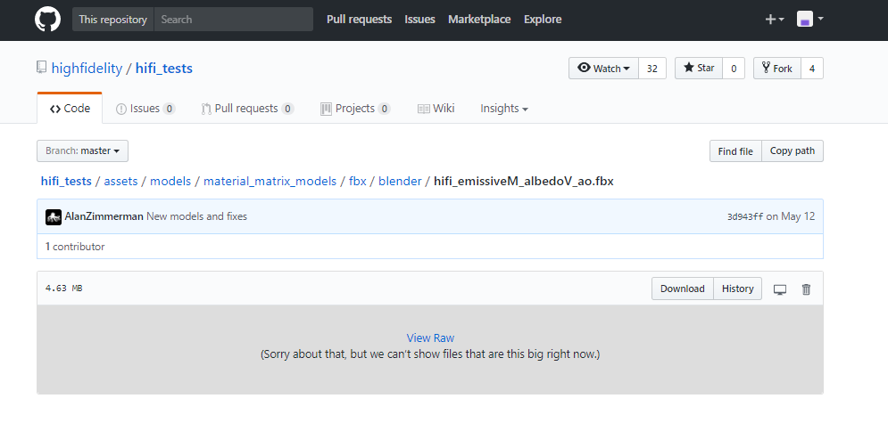

##Overview
This page will describe the types of materials supported by High Fidelity.

##Introduction
High Fidelity supports certain types of materials. Whenever you are creating models in 3D modeling software, you can look up this guide to ensure that your content looks exactly as you wanted in High Fidelity.

The materials supported in High Fidelity are **Physically-based Rendering (PBR)** materials. This means that materials reflect or absorb light like how they would (approximately) in real life. A PBR objects shading approximately resembles what it would look like in the real world.

###Material Channels

The different properties that make a type of material are called material channels. For instance, one type of material channel will determine the color of the material, and another will determine how rough it is. You can determine the value of each property in two ways:
- **Setting a Value**: The value of a channel is a value set on a slider. Setting a value is like turning off or turning on a switch. For instance, if you look at your phone, some parts of it are shiny and some are matte. When you use value, the entire object reflects that value. If you want different parts of an object to reflect varied roughness, you'll need to use a map.
- **Using a Map**: The map is an image which you can import to define a property. For instance, your phone may have a case that is matte, but the rest of your phone is shiny. You can use a map to set the case as matte and the phone as shiny. You can't do this by setting a value.

All materials in High Fidelity have the following properties (channels) that determine how it looks:

| Channel Type  | Description                              | Value        | Map         |
| ------------- | ---------------------------------------- | ------------ | ----------- |
| Albedo        | This channel defines the material's color. You can pick any color value of your choice. | sRGB         | sRGB        |
| Metallic      | This channel determines if the material is metallic or not.You cannot have a material that is half metallic, it is either metallic or it isn't. | [0,1]        | [0,1]       |
| Roughness     | This determines how rough/matte or glossy/shiny an object is, using brightness levels. | [0,1]        | [0,1]       |
| Normal        | Normal is a channel that renders an object like there is actual geometry. For instance, normal would add bumps and other irregularities to a stone or ridges to a sea-shell. | xyz          | bump        |
| Opacity       | Opacity determines if an object is transparent or opaque. | [0,1]        | mask, alpha |
| Occlusion     | This property approximates the shading to be as natural as possible. This means that it will reproduce how objects interact with light. | ---          | [0, 1]      |
| Emissive      | This channel controls the amount of light being reflected from an object. | sRGB         | sRGB        |
| Scattering    | Scattering determines how light will behave when it hits human skin. This channel details how light is reflected or absorbed by human bodies. | [0,1]        | [0,1]       |
| Material Type | This channel decides if an object is lit or unlit. | [lit, unlit] | ---         |

###Material Types in High Fidelity
High Fidelity supports a certain number of material types. We have created a model corresponding to each type of material. There are two ways you can upload these models to your domain in High Fidelity:

**Upload .fbx files**:
- Go to the [repo](https://github.com/highfidelity/hifi_tests/tree/master/assets/models/material_matrix_models/fbx/blender) where the models are stored.
- Click on one of the files. 
- Right-click on "View Raw" and copy the link address.
- In Interface, pull up your tablet and go to "Create".
- Choose a Model Entity and import using the URL you copied.

**Load the Material Matrix Script**
- Find the Material Matrix script [here](https://github.com/highfidelity/hifi_tests/blob/master/assets/models/material_matrix_models/material_matrix.js).
- Click on Raw. You'll be redirected to a URL which displays the script.
- Copy this URL.
- In Interface, pull up your tablet and go to "Menu > Edit > Running Scripts".
- Under Load Scripts, click "From URL".
- Enter the URL you copied and click OK.
- The script will run and add all the models showcasing different material types.

You can look through our guide to the different types of materials we support in the [next page](../materials/pbr-materials-guide).