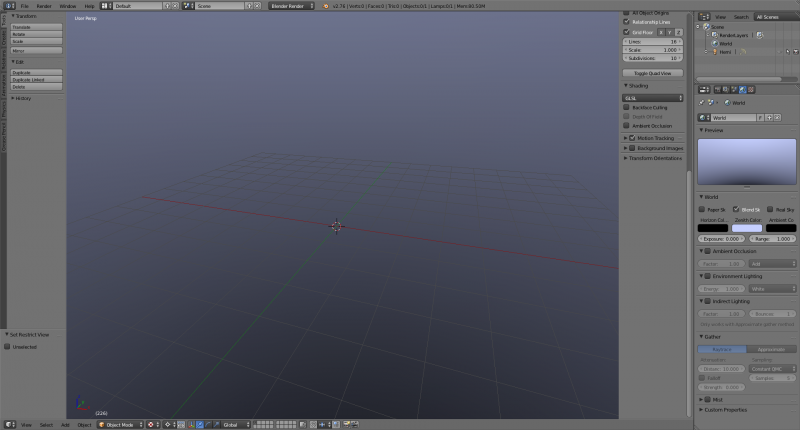
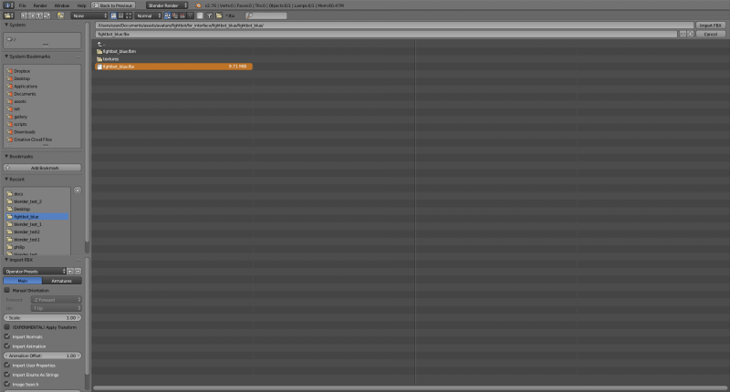
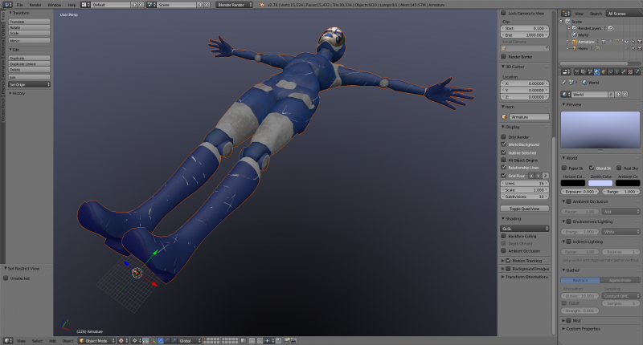
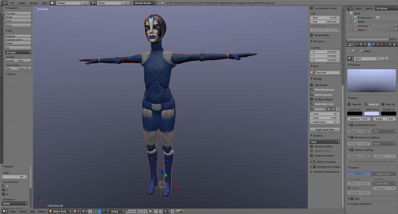
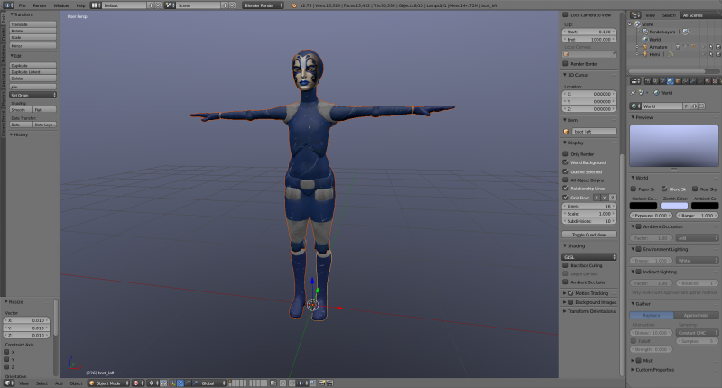
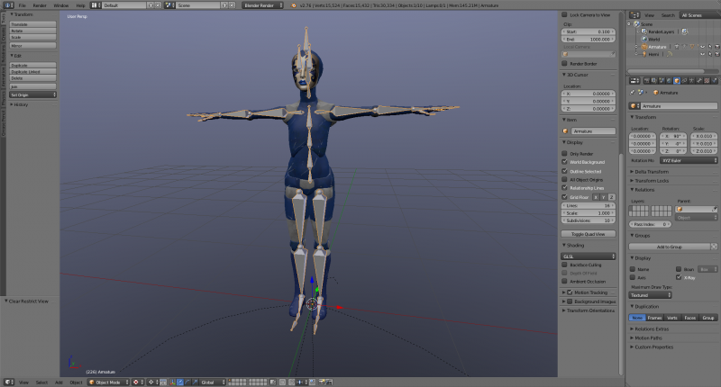
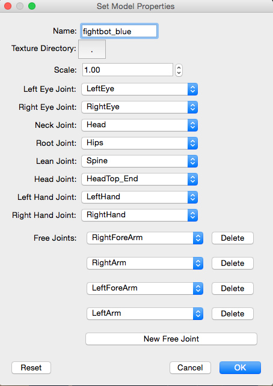
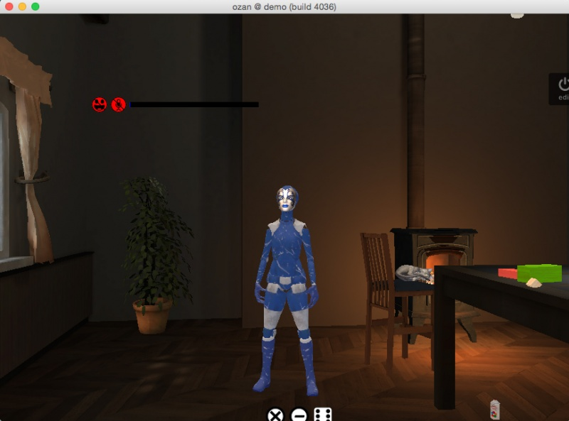

A common way to create avatars in High Fidelity is to take Mixamo avatars, customize them in [Blender](https://www.blender.org/) and then upload to High Fidelity. However, you’ll need to adjust the orientation and scale before uploading. Here’s a snapshot of the **Blender workflow**.

## Import Your FBX File

Open Blender and import the .fbx with the default import settings.

## Orient and Scale the Model

Because Blender is Z-Up, rotate the mesh 90 degrees along the x-axis.

Because Blender units are in meters and High Fidelity currently expects the avatar in centimeters, scale the mesh down to a value of “.01”.

## Export File

Select the content of the scene and export it as an FBX. In the export setting, select the armature and mesh and set the “Path Mode” to “Copy” and toggle the icon to embed the textures.

## Package the Model for High Fidelity

