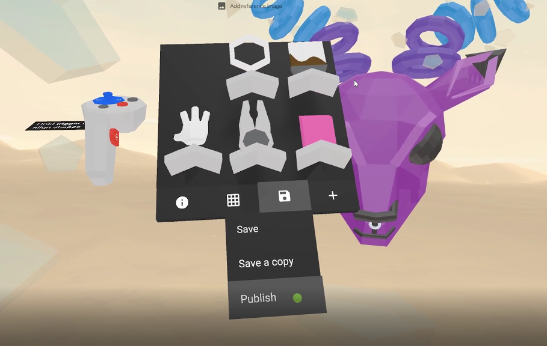
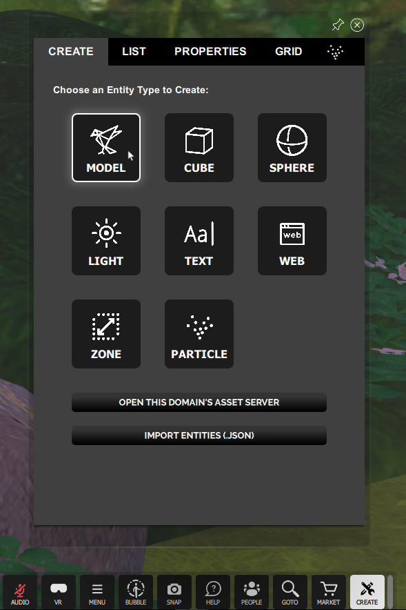
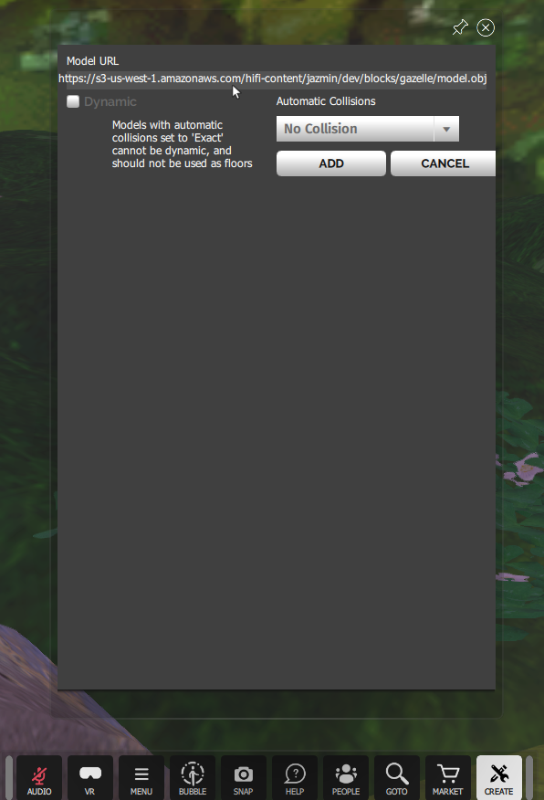
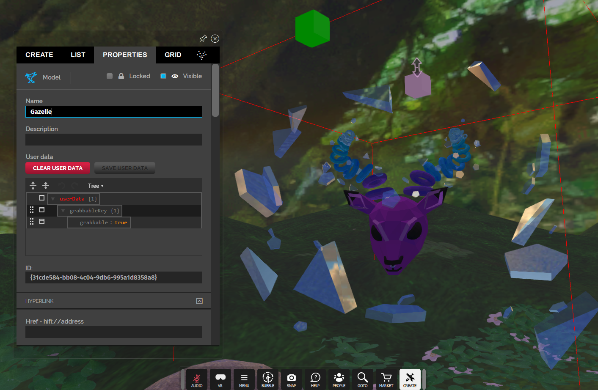
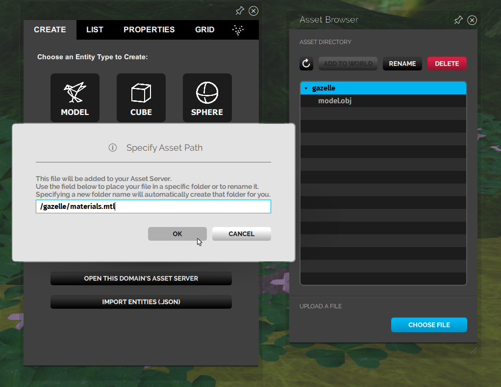
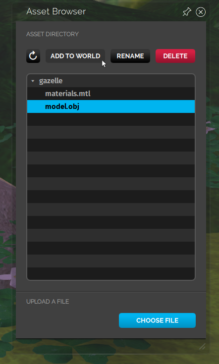

*Learn how to import 3D models created with Blocks into High Fidelity.*

## Overview

This page details how you can import a model from Blocks into High Fidelity.

## Introduction

If you're interested in 3D modelling in virtual reality, you can checkout [Blocks](https://vr.google.com/blocks/). Blocks lets you create models easily regardless of your experience.

You can create something on [Blocks through Steam](http://store.steampowered.com/app/533970/Blocks_by_Google/) or download it for the headset you are using.

###Importing Your Model

1. Once you finish creating  your model, you can [publish it](https://vr.google.com/u/0/objects/2qIpIn0ZDjZ). 
2. Download your model from the Google Blocks website where it is published. 
3. Extract the zipped folder containing .obj and .mtl files. 
4. You can import the model into High Fidelity in two ways: Using a Hosting Service or Using Your Asset Server.
   - **Using  a Hosting Service**:
     + Upload the .obj and .mtl files to the hosting service you use. 
     + Copy the .obj's link to paste in High Fidelity. 
     + Open Interface and pull up your tablet.
     + Go to Create and select Model under the Create tab that opens.
     +  Paste the model URL you copied earlier in step 5. 
     + Click Add to see the model in High Fidelity! 
   - **Using Your Asset Server**:
     +  In Interface, pull up your tablet.
     +  Go to Create and Click "Open this Domain's Asset Server". 
     +  In the Asset Browser that opens up, click "Choose File" and select your .mtl and .obj files from their location. 
     +  When you select and add the files, make sure to specify a folder name before the "/". Here, we typed "gazelle" to create a new folder. This can be a new or existing folder. Add both file paths and click OK.
     +  In the Asset Browser, select the .obj file and click "Add to World". 
     +  Select "Add" on the window that opens up. Your Blocks model will be added to your domain. 
