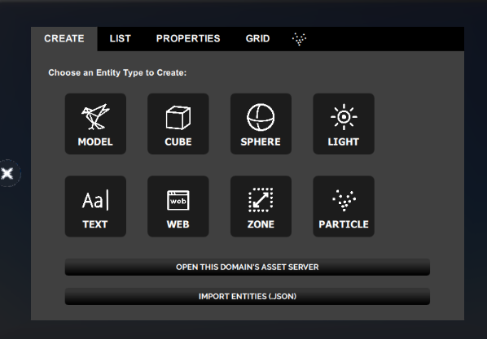
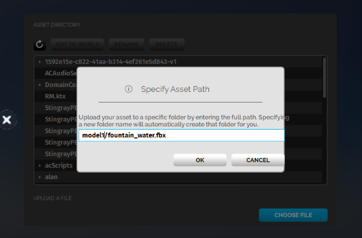

Now that you're ready to upload your item to Marketplace, you'll need the right assets.  

## Uploading Your Item's Assets

We want to upload a model of water fountain to Marketplace. We have the .fbx file for the model but no .JSON file that defines the model's properties. To get the .JSON asset:

- In Interface, pull up your tablet and go to **Create**. 
- Click ''Open this Domain's Asset Browser Now". The Asset Browser window will open and show you the list of assets in the current domain. 
- Click the "Choose File" button. 
- Select your .fbx file and click 'Open'.
- Specify the asset path. Here, you can specify a folder for your .fbx file. We've created and named our folder 'model1'. 
- Back in the Asset Browser window, find your folder and .fbx file and click 'Add to World'. 
- In the pop-up window that opens, you can specify the collision properties of your model. Click 'Add'. 
- You'll see the model appear before you. 
- Once you see the model, you can select the model and go to the properties in **Create**. 
- You can specify the properties you want the model to have here. 
- Once you're done editing the properties, go to **Edit > Export Entites**. 
- Select a destination folder for your model and it's .JSON file that contains its information (properties, URL and more). 
- You'll see both files in the folder you specified. 

### Some important points:
1. Use only content which you are legally entitled to. Since everything on the Marketplace is [Creative Commons](https://creativecommons.org/licenses/), be sure that all and any content you are using is compatible with the respective license.
2. Do not use a code obfuscator, our review team needs to be able to read your scripts.
3. Audio should sound clean and be 32 bit, 48 khz wav files.
4. If your item is an object that must be rezzed by a script, attach that script to a dummy object, export it as a .JSON and use that as your main file.
5. All entities must have a name, even if they are invisible or simple primitives.
6. Please use English in your package description, support text, and code comments.
7. If needed, you may use HTML tags in your description text.
8. We recommend to link to your website, email, social media or other resource.
