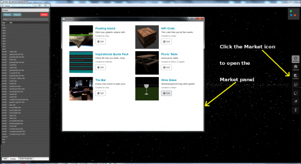
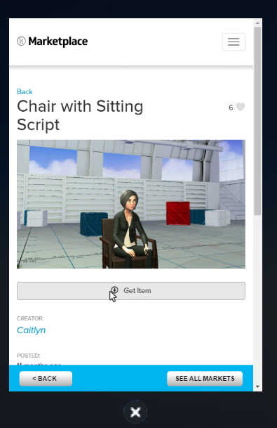

High Fidelity's Marketplace is the beginning of a complete object registration, ownership and distribution system.

No form of payment has yet been implemented, so everything posted is free to "Get" by anyone. You can also see who created the marketplace asset. 

For now, the marketplace allows users to upload content the creator wishes to be made freely available to other High Fidelity users. Anything posted to the High Fidelity marketplace is reviewed before it is available to others to protect against unauthorized copying and distribution.

## Buying from the Marketplace

1. In Interface, open up your tablet. 
2. Go to Market. 
3. Browse to find the item you wish to get.  
4. It will appear in the domain you are in (if you have access to add entities to it). 

There is no concept of personal inventory in High Fidelity, so all items are simply placed in world using this method any time you need. This means you can either leave your item in your domain or delete and get items again as needed.

