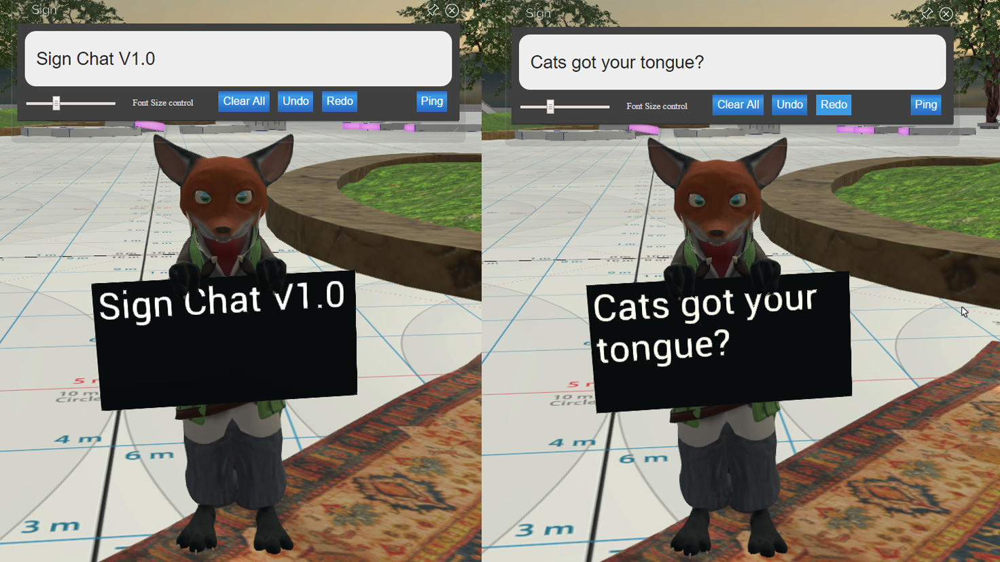
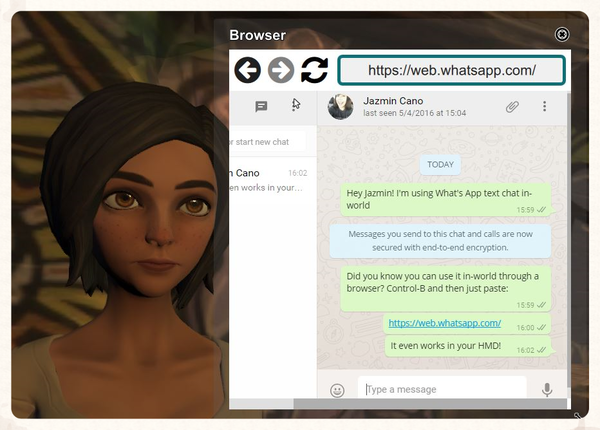

You may be wondering why text chat is missing from the basic interface. We didn't add it (yet) as a default, because we couldn't see a great design that would work for both HMD and desktop users. Most HMD users can't very easily type, and so creating something that made chat a requirement for everyone didn't make sense to us. But we do expect that desktop users will want chat, and we will likely build something in the future. However, High Fidelity's extensible open-source scripting and UI gives you the ability to create the features you want, including text **chat**. There are some great scripts for chat that have already been built by community members, and a few are described below.

There are plenty of alternative approaches, but the three scripts detailed below are popular. You can also find other clever solutions to text chat in the [[High Fidelity community forum](https://forums.highfidelity.com/)], some are similar to the approaches detailed here and others taking advantage of the power of IRC.

## HiFi Local Chat by ctrlaltdavid

The alpha user ctrlaltdavid has created and contributed a HiFi Local Chat script, which is clean, reliable, and well written.

To run the script from High Fidelity, use the following URL in **Edit > Open and Run Script from URL**: `http://ctrlaltstudio.com/downloads/hifi/scripts/chat.js`

David’s script will start running and you’ll see a text chat window pop-up, enabling you to chat with other folks in the same domain who are running the same script. If text chat’s important to you, you might want to add this to your default scripts so it’s always there.

## COM Script Version 1 by AlphaVersionD

AlphaVersionD has authored an equally powerful and friendly script, except it runs on a domain and is therefore immediately accessible to everyone who visits. They needn’t install or run anything! This means, as a domain operator, you can give your visitors access to text chat by default!

To install COM Script on your domain, follow these steps:

1. Make a Zone Entity
2. Paste this URL in the "scripts" section of said Zone Entity:
3. [http://metaversecafes.com/HighFidelity/QueenCity/A_2016_Q_wab/AQUI/COM_v1.0.js](http://metaversecafes.com/HighFidelity/QueenCity/A_2016_Q_wab/AQUI/COM_v1.0.js)
4. Close the Edit panel.
5. Throw a chat party!

## Sign Post Chat

Cat got your tongue?

Having a hard time getting others to use the same chat system? This simple tool allows you to communicate with HMD users with using a simple entity, that behaves as a sign with of text.

It is available in the [marketplace](../../../marketplace/buy).

## Running Other Chat Applications in a Local Web Browser

You can also launch a local web browser inside High Fidelity by pressing **Ctrl-B** and then run WhatsApp Web, Slack, and other popular browser-based chat applications. It works great, even in your HMD. While it might not be ideal for random chat encounters, it can be quite handy when larger groups (like colleagues and classmates) need a way to keep in touch without breaking immersion.

