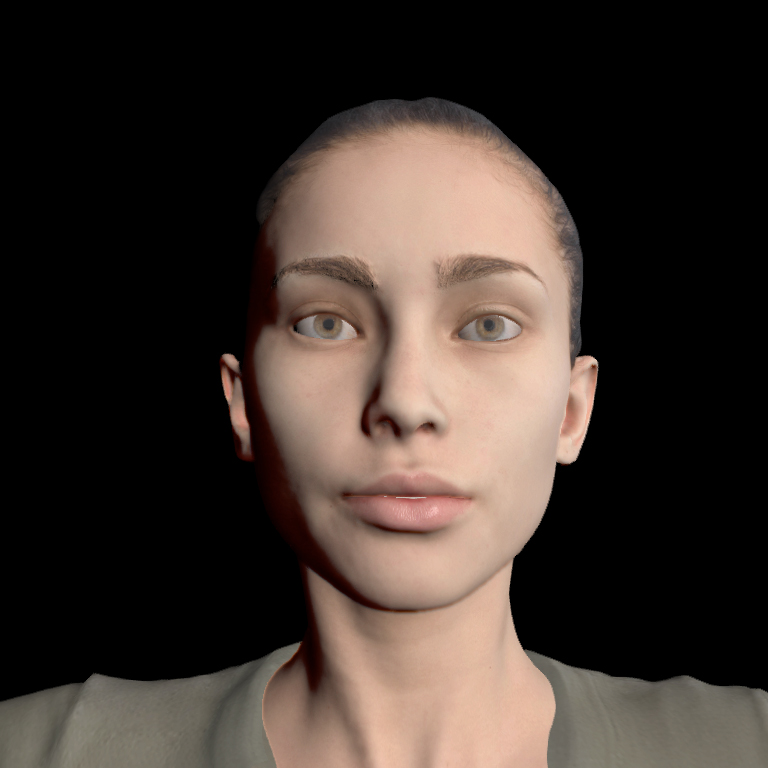

**Subsurface Scattering** (SSS) is the diffuse reflection caused by light entering a material, being absorbed, scattered, and eventually exiting the material. It's critical for surfaces like paper, marble, wax, and realistic skin. It's noticeable when light passes through a thin translucent object and, more importantly, it causes the diffusion of light within the shallow top layer of skin. For this first implementation of SSS High Fidelity is exclusively targeting the light diffusion effect.

## What is the High Fidelity Material Definition?

The High Fidelity avatar material is defined in two areas:

1. In standard FBX materials like Blinn, Stingray, etc.
2. In the avatar's associated FST file.

The FST file describes the mapping between SSS values and the FBX material. The SSS definition is composed of a "scattering value" and a "scattering map". By setting the scattering value and map, you can influence how light scatters on the geometry. The scattering value is a 0-1 number which sets the amount of scatter. The scattering map is gray scale image that masks the areas of scatter. It is based on the geometry's UV map (similarly to the other textures of the material).

## What is the Subsurface Scattering Definition Syntax?

The SSS definition uses a JSON syntax and includes JSON objects with name/value pairs. The JSON entry should include the name of the existing FBX material and its the scattering value.

Example: `materialMap = { "body_mat": { "scattering": 1.0 } }`

Optionally, you can include scattering map URL.

Example: `materialMap = { "body_mat": { "scattering": 1.0, "scatteringMap" : "" } }`

## How do you Create a Subsurface Scattering Effect?

To create the SSS effect on an avatar, do the following:

1. Create an FBX-based avatar with a supported skin material, e.g. Blinn, Stingray.
2. Create a scattering map for the subsurface scattering in Photoshop or equivalent.
3. Use [Interface](https://wiki.highfidelity.com/wiki/Interface) to package the avatar and generate the FST.
4. Add a description of the SSS to the FST using the JSON syntax.
5. Link to your avatar's FST in Interface.

## Scattering Effect Examples

Here's an example of the scattering effect. The left image has no scattering and the right image has scattering. You can see the red diffuse reflection along the shadow line.

|  |  |
| ---------------------- | ------------------- |
|                        |                     |

Here's an example of the skin map effect. The left image has no skin map and the right has a map. You can see the red diffuse reflection is masked out of the hair line.

|  | |
| ---------------------------------------- | ---------------------------------------- |
|                                          |                                          |

## FST Examples

Here are examples of two FSTs that contain scattering definitions.

+ **Matthew.fst** - [https://hifi-public.s3.amazonaws.com/sam/models/skinRenderingTest/matthew/matthew.fst](https://hifi-public.s3.amazonaws.com/sam/models/skinRenderingTest/matthew/matthew.fst)

+ **Priscilla.fst** - [https://hifi-public.s3.amazonaws.com/sam/models/skinRenderingTest/priscilla/priscilla.fst](https://hifi-public.s3.amazonaws.com/sam/models/skinRenderingTest/priscilla/priscilla.fst)

+ debugDeferredLighting.js
  * A developers [debug script](http://rawgit.com/highfidelity/hifi/3d57a3a86a94bda5498bb315c700006584d725fc/scripts/developer/utilities/render/debugDeferredLighting.js
) which allows you to toggle the material properties in realtime.