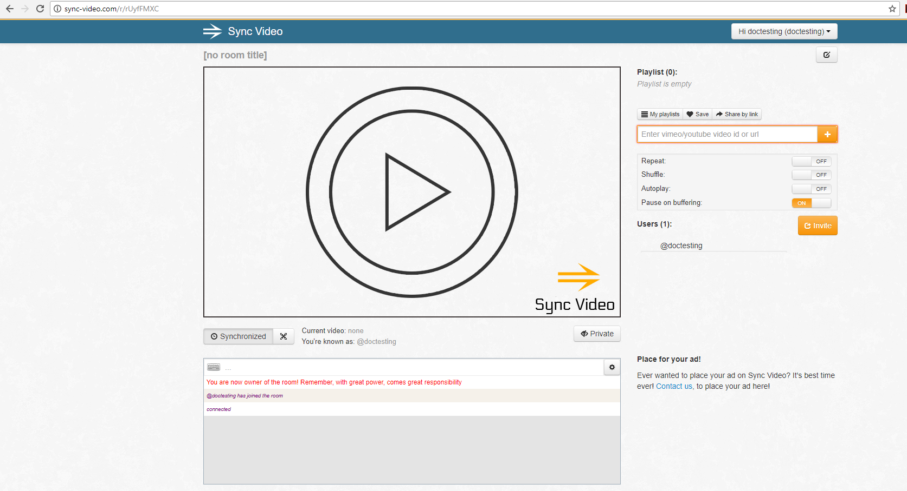
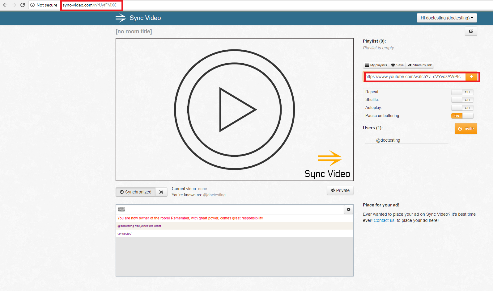
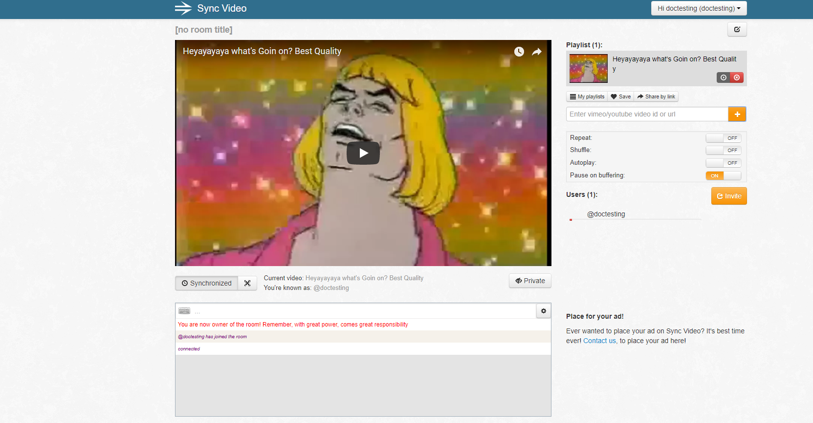
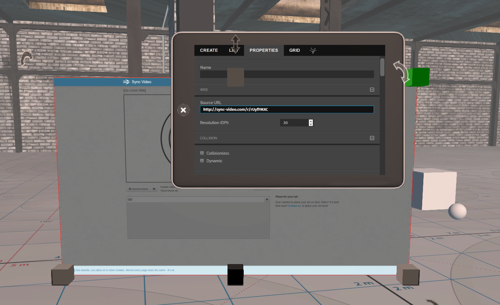
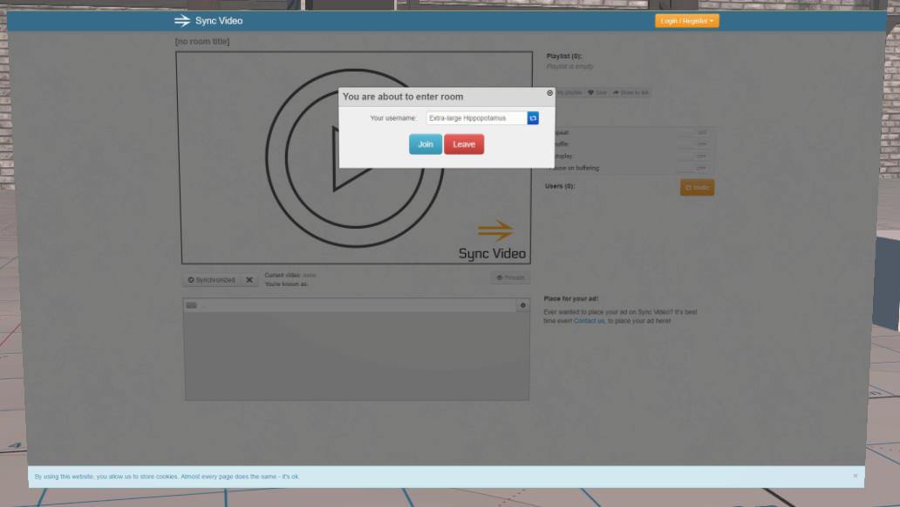
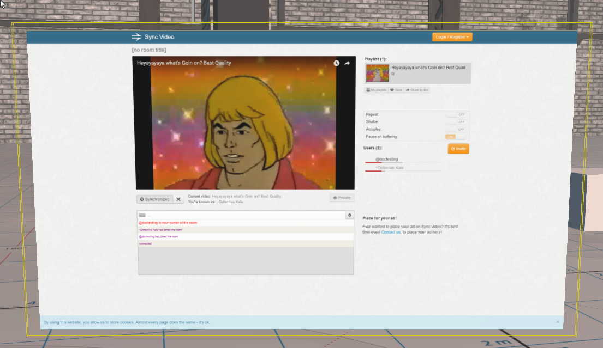

*Learn how you can share a synced video and watch videos at the same time as your friends (in High Fidelity).*

##Introduction
If you've ever wanted to watch a video simultaneously with your friends, you can now do that in High Fidelity using a syncing service called [Sync Video](http://sync-video.com/). Additionally, you can follow [these instructions](https://docs.highfidelity.com/create-and-explore/start-working-in-your-sandbox/streaming/streaming-video) to stream using Screenleap.

###Syncing and Sharing Videos

- Go to [http://sync-video.com/](http://sync-video.com/ ) and click "Create new room". 
- You will be redirected to a page where you can add a link for a video (YouTube or Vimeo only). 
- Now, just copy the URL of the webpage. This is the link you will need to share with other users.   
- Add a video link and press "Play".  

To watch the video in High Fidelity:

- In High Fidelity, pull up your tablet and click "Create".
- Add a web entity by clicking "Web" and changing the source link to the copied Sync Video URL. 
- Exit "Create" mode and click "Join" on the popup in the web entity to watch the video. 
- You will be watching the video simultaneously with the video being played in Sync Video. 