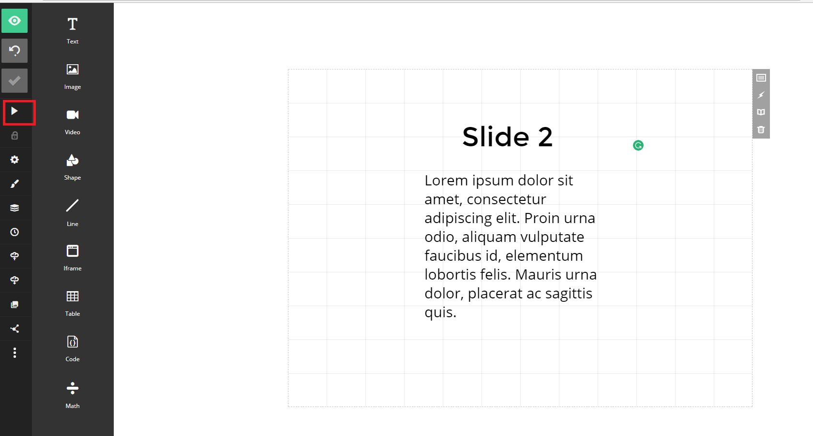
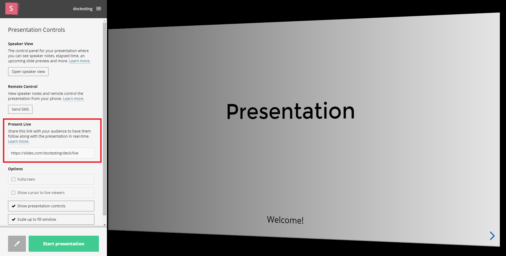
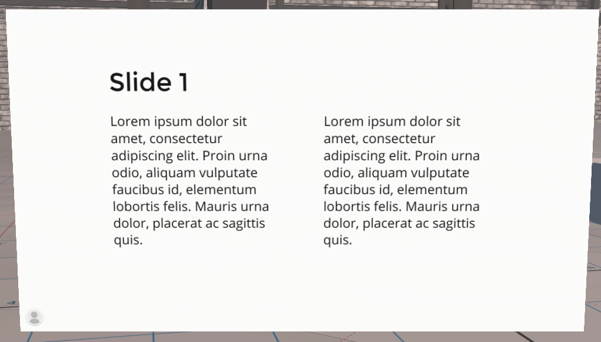

*Learn how you can share a synced presentation and watch it at the same time as other users, in High Fidelity.*

##Introduction
If you've ever wanted to share a presentation to other users in High Fidelity, you can now do so using a syncing service called [Slides](https://slides.com/).  Additionally, you can follow [these instructions](https://docs.highfidelity.com/create-and-explore/start-working-in-your-sandbox/streaming/streaming-video) to stream using Screenleap.

###Syncing and Sharing Presentation

- Go to [https://slides.com/](https://slides.com/), sign up and create your presentation. 
- Once you're done creating your presentation, click "Present". 
- In the window that opens, copy the URL under the "Present Live" section on the left. 

To watch the presentation in High Fidelity:

- In High Fidelity, pull up your tablet and click "Create".
- Add a web entity by clicking "Web" and changing the source link to the copied Slides Present Live link. 
- Exit "Create" mode and watch the presentation live. 
