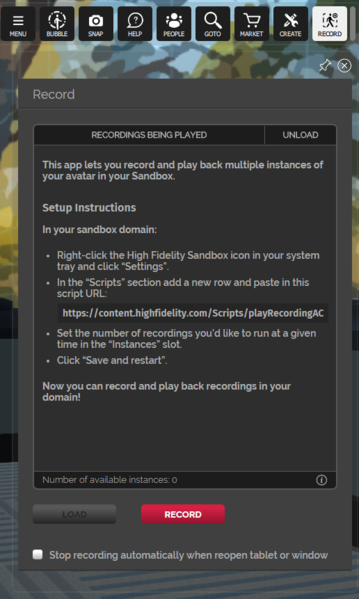
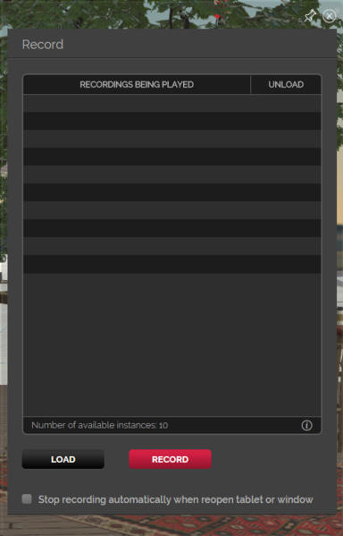
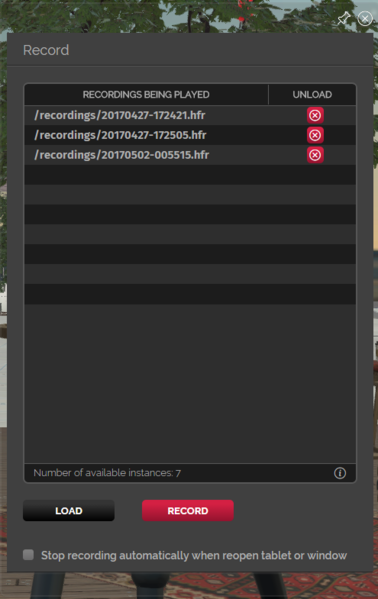

The Record app lets you record yourself and watch a bot replay the recording in a loop. You can use this app to record short videos of your avatar.

We’ll walk you through getting the app, setting it up and using it.

## Get the Record App

To get the record app, pull up your tablet and:

- Go to Home (your Sandbox).
- Go to Marketplace.
- Download the Record App.
- Click "Yes" for "Would you like to run this script."
- Pull up your tablet again.
- Open the new Record app.

## Before You Use the App

Before you use the record app, learn how to set up your assignment clients.

Set up your assignment clients:

- Right click your High Fidelity Sandbox icon.
- Click Settings.
- Click Scripts on the left menu.
- Click the “+” button.
- Under Script URL, paste: [https://content.highfidelity.com/Scripts/playRecordingAC.js](https://content.highfidelity.com/Scripts/playRecordingAC.js).
- Under # instances, put 1 (or more).
- Click Save and Restart on the left menu.

## App Menu

The following lists the menu items in the app and how you can use them.

- Recordings Being Played: This gives you the list of recordings currently being played in the domain.
- Unload: You can stop playing a recording using unload. Click “x” to stop playing a recording.
- Number of Available Instances: This is the number of assignment clients available to play a recording. When this number reaches 0, add more instances of playRecordingAC.js in your domain settings.
- i: This gives you information on how to set up assignment clients.
- Load: This will load a recording of your choice from ATP.
- Record: Starts recording.
- Stop recording automatically when reopen tablet or window: Check this if you want to stop recording as soon as you reopen your tablet. This would be particularly useful if you’re using an HMD.

## How to Create a Recording

Now that you know how the app works, its menu items and have set it up, you can start creating recordings. To create a recording, you have to:

- Click on Record.
- After a 3 second countdown, begin acting!
- Click Stop to finish recording.

Once done, your recording will replay right in front of you to see what it looks like!

The recordings you create are saved as a .hfr (High Fidelity Recording) file your domain’s ATP under the folder “recordings”.

### Load a Recording

You can click "Load" to load a recording you previously made from ATP.

### Rename or Permanently Delete a Recording

If you want to rename or permanently delete a recording, go to **Edit > Asset Browser** and find the recording under the folder “recordings”. Remember, once you delete the recording, you won't be able to view it again. Recordings use UTC time as their file names.

Are you ready to start recording? Check out the record app now in the Marketplace in High Fidelity.
